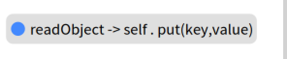
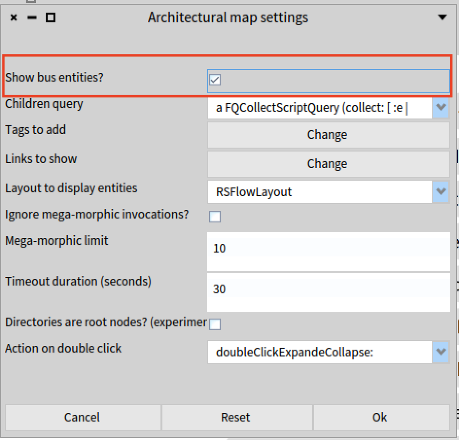
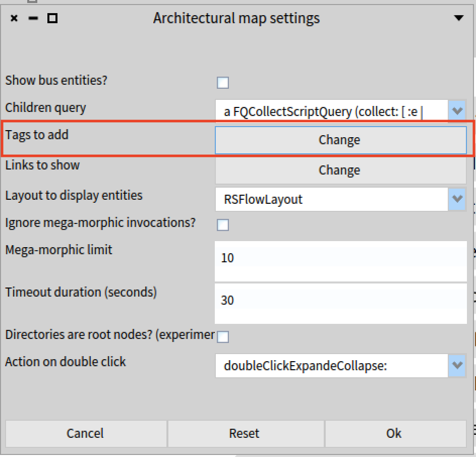
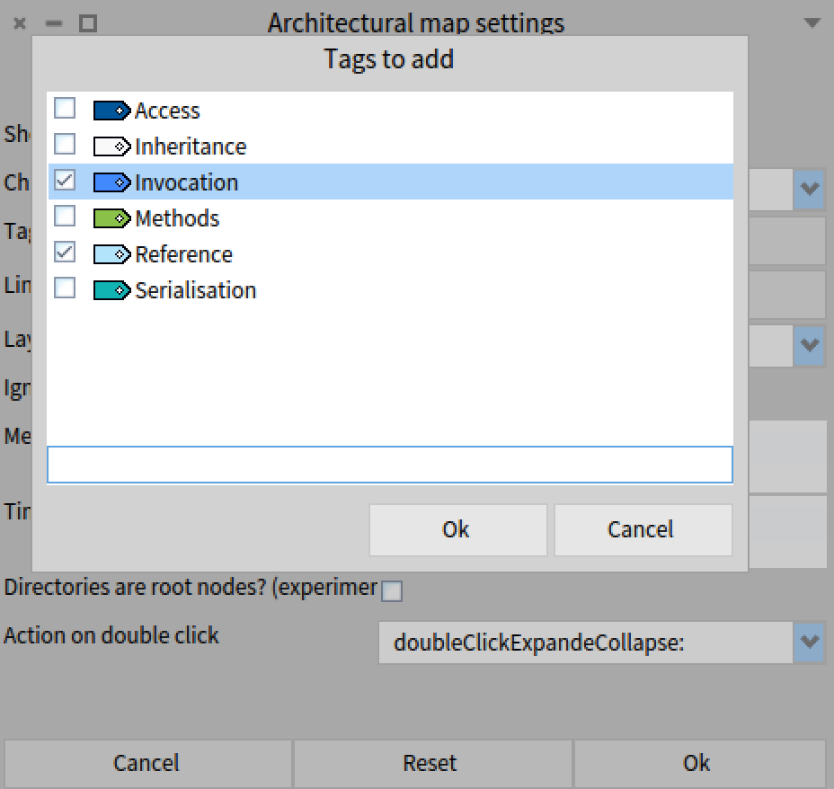

Moose-Security is a project that aims to prevent vulnerabilities in software and real-world application. It allows the analysis of libraries for detecting code fragments that may be vulnerable. Moose-Security offers two key features: detecting vulnerabilities within a library and comparing different library versions to track their evolution and pinpoint how vulnerabilities are introduced or removed. Although Moose-Security allows currently to analyse only java applications, it will be adapted to consider other languages such as python and Pharo. In this post we will introduce these features with examples and discuss the project’s future direction.

## Understanding « Vulnerability »

Before explaining each feature, it's important to understand what we call a "vulnerability".

A vulnerability is defined as a flaw in a software resulting from a weakness that can be exploited, adversely affecting the confidentiality, integrity or availability of one or more components. This flaw might be a method exploitable by an attacker to redirect its behaviour. For example, an attacker may be able to enchain methods to control the application, or to gain access to unauthorised data storage, etc. Deserialization attacks are one example of such
vulnerabilities.


## Detecting vulnerabilities in a library
To detect potential vulnerabilities in an application or a library with moose- Security, we need parse it to obtain a Moose model. We can use VerveineJ to convert it into a JSON or mse file.

### Detecting vulnerabilities in a library: example of Jenkins
1. Retrieve a specific Jenkins version From [Github](https://github.com/jenkinsci/jenkins/tree/master). For the next steps of this example, we will take this version of [Jenkins](https://github.com/jenkinsci/jenkins/releases/tag/jenkins-2.440.3-rc).

2.  Parse the library: refer to the VerveinJ [repository](https://github.com/moosetechnology/VerveineJ) to understand how to parse a library.
3. Import the parsed library into Moose:

{: .img-fill }

4. Ensure the Moose-project is imported into Moose, in a playground take the script below:


```st
Metacello new
baseline: 'MooseSecurity';
repository: 'github://moosetechnology/Moose-Security:main/src';
load.
```

With the loaded Moose model of the Jenkins library and the Moose-security
package, we can check for vulnerabilities in this Jenkins version using a simple
script in a playground:

```st
jenkins := MooseModel root at: 1.
SEVulnerabilityTagger tagAndVisualizeTags: jenkins.
```


The detection process generates an architectural map, showcasing entities
(methods, classes, invocations, etc.) that may be vulnerable.


{: .img-fill }


### Architectural map
The architectural map represents entities visually, using tags to classify them.
For instance, a « Serialisation » tag indicates the presence of vulnerabilities
related to the deserialisation attacks. By double-clicking on this tag, we can
view associated entities of the same category, indicating vulnerability. For each
category, we associate a color. For instance, the blue color is associated to the
Serialisation tag.

{: .img-fill }

{: .img-fill }

Some method marked as red, have some arrows pointing to others methods,
indicating that these methods invoke other methods. For example, the method
AtomicFileWriter.write calls the method FileChannelWriter.write.

{: .img-fill }

Furthermore, the map can reveal vulnerabilities related to socket attacks or file
management issues. The map, also displays references between entities, such
as method vulnerable to a socket attack calling another vulnerable to a
serialization attack.

{: .img-fill }


## Comparing library versions
To observe the evolution of a library and identify how vulnerabilities are
introduced or patched, Moose-Security offers a comparaison feature.

### Example with Commons-Collections library

We can take two versions of the Commons-collections library: Commons-
collections-3.0 (CC0) and Commons-collections-3.1 (CC1).

1. Parse these versions with VerveineJ.

2. Import these versions into Moose

{: .img-fill }

3. If necessary, import Moose-Security

```st
Metacello new
baseline: 'MooseSecurity';
repository: 'github://moosetechnology/Moose-Security:main/src';
load.
```

In a playground, we can compare the two versions:

```st
commonsCollections0 := MooseModel root at: 1.
commonsCollections1 := MooseModel root at: 2.
diffModels := SEDiffBetweenTwoModels new.
diffModels baseModel: commonsCollections0 targetModel:
commonsCollections1.
```

> Note : Please make sure the index in the root its the good in relation to the Json
file imported (in our case, CC0 is at index 1 and CC1 is at index 2). You can
check by clicking to right corner of the moose playground on the icon «
models ».


This comparaison, based on FamixDiff, generates two architectural maps: one
for added entities and one for removed entities. Added entities are entities
present in version 3.1 but not in version 3.0, while removed entities are entities
present in version 3.0 but not in version 3.1. Each map highlights the entities
considered vulnerable.

Unlike the previous feature, this comparaison not only identifies vulnerable
categories but also creates sub-categories to classify each vulnerable entity by
type. This means vulnerable methods are grouped together, vulnerable
invocations are grouped with other vulnerable invocations, and so on.

Added entities:

{: .img-fill }

Removed entities:

{: .img-fill }


Let’s present the results and their visual meanings:

The architectural maps representing all entities considered as vulnerable. An
entity is represented by a rectangle with the name of what it describes.
For example:

{: .img-fill }

This is an entity representing an inheritance between the ‘TransformedMap’
class and the ‘AbstractMapDecoractor’ class.

{: .img-fill }

And this is an entity representing an invocation where ‘readObject’ calls the
‘put’ method contained within the same class.

Each entity represented in each architectural map is considered as vulnerable.
This means that whatever the entity describes is considered vulnerable-
whether it is a method, a method that invokes a vulnerable method, a class
inheriting a vulnerable class with a vulnerable method, etc.


To differentiate the entities and what they represent, we have created sub-
categories. The circle to the left of the entity name represents the color
associated with the category or the sub-category. For instance, the entity that
representing inheritance is colored white, meaning that all entities representing
inheritance will have the same color.


This is another entity representing an inheritance between the ‘Noop’ class and
the ‘Object’ Class:

{: .img-fill }

However, we have a small issue with the colors across the architectural maps.
The color of each sub-category differs from one architectural map to another.
For instance, this entity, in the removed vulnerable entities, is represented by
the color blue and belongs to the sub-category of an invocation.

).png){: .img-fill }

This entity, in added vulnerable entities, also represents an invocation but is
shown in orange.

{: .img-fill }

It’s a bug we need to fix in order to simplify understanding.


In the current representation, entities representing a class, method or attribute
are shown with a cercle colored according to the tag indicating a vulnerability.
Other entities representing inheritance, implementation, invocations, or access
are colored based on the sub-category they represent. We must need to fix this
by ensuring that all entities are colored according to their sub-categories,
rather than having some entities marked by the vulnerability tag and others by
their sub-categories.


For instance, this entity in the added entities has the color of the Serialisation
tag:

{: .img-fill }

>Note: when an entity is dotted, it means the entity describes an element
containing additional information. In this case, the entity represents the
‘MultiKeyMap’ class, and when we double-click on it, we can see what this
class contains, such as methods, comment, etc.

{: .img-fill }

Sometimes an entity who has a multicolored square, indicating it has children
with one or multiple tags. For example, the method ‘Noop.transform’ is tagged
with both « serialization » and « methods ». Consequently, the class Noop
(also tagged as « serialisation ») has a multicolored square.


{: .img-fill }


{: .img-fill }

{: .img-fill }

Contrary to the previous feature, the result doesn’t get the categories(and sub-
categories) immediately. (its can be an improvement for the future). However,
we can achieve a more effective representation, similar to the first example with
Jenkins, by making some modifications in the architectural maps settings.

In the settings of the architectural map (such as removed entities) we can
choose to display only certain categories or sub-categories:

{: .img-fill }

We disabeling show bus entities, thus we can show entities regrouping by
categories.


{: .img-fill }

By clicking the button « change» we can choose which tag we want to display.

{: .img-fill }

Select some sub-categories (Access, Inheritance, Invocation, Methods,
Reference) or categories (here we have only Serialisation).
Note: Some sub-categories are missing, such as implementation, due to bugs
that occur when we try to filter when there is an implementation. (Perhaps a
method could be added to ‘FamixJavaImplementation’ to identify if the current
entity is of this type).


{: .img-fill }

{: .img-fill }

After selected our preferences, we accept the modification by clicking on
« OK » and then we can show the result on the architectural map.


{: .img-fill }

{: .img-fill }

The same representation applies added entities:


{: .img-fill }


{: .img-fill }

If we display the serialisation tag in the architectural map of removed entities,
we can identify all vulnerable entities in the CC0 model. Similarly, displaying the
serialisation tag in added entities will highlight all vulnerable entities in the CC1
model, as if detecting them for a single model (as described in the previous
section).

In the settings, simply deselect ‘show bus entities’ and check the ‘serialisation’
tag to see the results.


All vulnerable entities in the model CC0:

{: .img-fill }

All vulnerable entities in the model CC1:

{: .img-fill }

Moreover, a tag can also have a multicolored square when it is displayed on the
architectural map. That means all entities belonging to this category also have
another tag ( they belong to another category or sub-category).

Bellow its the representation of the sub-category « Methods » for removed
entities:

{: .img-fill }

{: .img-fill }


{: .img-fill }

{: .img-fill }

We can see the same with « Methods » sub-category of added entities:


{: .img-fill }

{: .img-fill }


{: .img-fill }

{: .img-fill }


## Future direction
The comparaison should be improved by allowing us to choose what we want to
select as entities. Because currently we have only added and removed entities,
but we can also include options to select specific entities, such as moved
entities (classes moved from one package to another ) or identity entities
(entities unchanged between versions). We should find a way to represent them
in a single architectural map to avoid creating a separate map for each case, for
fear that it could become unmanageable.


As observed in this post, there are some bugs, particularly with sub-categories.
These need to be improved by organizing the categories into sub-categories.
Currently, sub-categories are represented at the same level as categories, but
they should be nested within categories. This adjustment will provide a clearer
understanding, especially when dealing with multiple vulnerability types. We
should also standardize the colors of sub-categories and review the types of
sub-categories we want to include.


This post has outlined the features of Moose-security for detecting
vulnerabilities and comparing library versions. Future enhancements will focus
on providing more detailed entity selection and improved representation of
changes between versions.