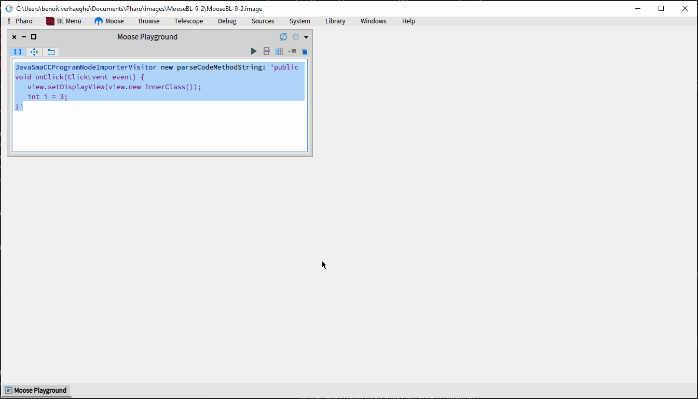

# FAST-Java <!-- omit in toc -->

FAST-Java is a [FAST](FAST) meta-model used to represent AST of a Java class or method.
It comes with a meta-model, an importer, and tools to manipulate and explore models.

- [FAST-Java meta-model](#fast-java-meta-model)
- [Usage](#usage)
  - [Installation](#installation)
  - [Import](#import)
  - [Export to Java code](#export-to-java-code)
- [Tools](#tools)

## FAST-Java meta-model

{: .img-fill }

[Full Image](https://raw.githubusercontent.com/moosetechnology/FAST-JAVA/v3-doc/fast-java.svg)

## Usage

### Installation

FAST-Java comes with an importer defined with the [SmaCC](https://github.com/j-brant/SmaCC) parser.
To install it, execute the following script:

> It can take time

```st
Metacello new
    baseline: 'FASTJava';
    repository: 'github://moosetechnology/FAST-Java:3/src';
    load: 'smacc'.
```

This script installs the [FAST](FAST) project, the SmaCC project, the FAST-Java project, and all the dependencies.

### Import

The FAST-Java importer allows one to import AST of a method or of a class.
To import method, one **must** use the method `parseCodeMethodString:`, whereas, to import class, one **must** use the method `parseCodeString:`.

For example, the following script import the method `onClick`

```st
JavaSmaCCProgramNodeImporterVisitor new parseCodeMethodString: 'public void onClick(ClickEvent event) {
  view.setDisplayView(view.new InnerClass());
}'
```

### Export to Java code

As it is impossible to create a model from a code snippet, it is also possible to regenerate the Java code from an existing FAST-Java model.
To do so, one can use the `FASTJavaExportVisitor`.

This tool uses as input any node of the AST and export the corresponding code.

The following snippet present an example of `FASTJavaExportVisitor` usage.

```st
model := JavaSmaCCProgramNodeImporterVisitor new parseCodeMethodString: 'public void onClick(ClickEvent event) {
  view.setDisplayView(new InnerClass());
}'.

methodNode := (model allWithType: FASTJavaMethodEntity) anyOne.

FASTJavaExportVisitor new export: methodNode.
 "'public void onClick(ClickEvent event) {
  view.setDisplayView(new InnerClass());
}
'"
```

## Tools

One nice way to explore a FAST model is to use the source code and the tree extensions of the inspector.
It allows one the navigate in a FAST model and see the code corresponding to each node.

To use it, execute the code to create a model with <kbd>Ctrl</kbd>+<kbd>I</kbd>.
It opens an inspector on the imported model.

Then, select a method entity.
On the right-hand pane of the inspector, select the *Tree* tab, on the left-hand pane, select the source code extension.
The source code is highlighted and the area selected corresponds to the entity selected in the right-hand panel.

{: .img-fill }
