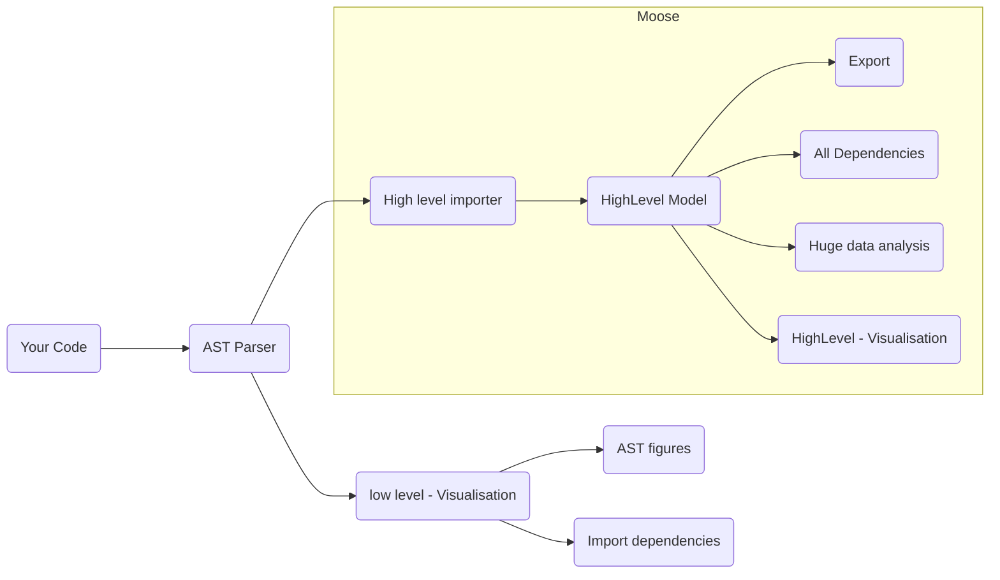

We want to analyse a programming language that is not supported by Moose *yet*, but we do not know how to start?
This is a page that you **definitly** should read.
We present the most important aspect that one must not forgot when it comes to support a new language (or other).

- [What do you want?](#what-do-you-want)
- [A basic process when dealing with model](#a-basic-process-when-dealing-with-model)
- [Tool suite to deal with a new language](#tool-suite-to-deal-with-a-new-language)
  - [AST parser](#ast-parser)
  - [High level importer](#high-level-importer)
  - [Creating a meta-model](#creating-a-meta-model)

## What do you want?

The first question you should asked yourself is, what do you want to analyse?

Depending on the subject, we will not contribute in the same way.
For instance, analysing Java code is not the same as analysing Swing Application, or analysing how developers work with Java.
And when thinking about analysing Java code, you might want to understand how classes interact with each other, or how modules you conceived interact with each others.

## A basic process when dealing with model

## Tool suite to deal with a new language

### AST parser

The AST parser is one of the mandatory tool.
If you wanna analyse something that is a not a programming language, such as a Git project for example, you need to find the API. It can looks like a web API (rest for example), or a library call API.

First, consider using an existing parser instead of creating a new one.
For instance, in Java we use `JDT`, for the C programming language `CDT` of eclipse, and for TypeScript `ts-morph`.

Also, the more challengind part is the `symbolic resolution` of the code.
You should look for AST parser that have this feature enabled.

If you have no AST Parser existing, you can use a parser generator inside Pharo. We advice you two options:

- [SmaCC](https://books.pharo.org/booklet-Smacc/) if you have an existing grammar
- [PetitParser2](https://kursjan.github.io/petitparser2/) in other cases

### High level importer

Once you have your AST parser, you can create a High level importer.
This step should be performed at the same time as [Creating a meta-model](#creating-a-meta-model) one.
It consists on:

- generating the model you want in a [Moose accepted file format](https://modularmoose.org/moose-wiki/Users/fileFormat).
- Or, if you work within Pharo, creating the model directly using Pharo code.

In the **first case**, you have two options:

- you can create entities and export to the file format. This is the common way to work and would allow fast analysis.
- Or, you can implement [Fame](https://modularmoose.org/moose-wiki/Developers/Fame), the meta-meta-model used in Moose. Then, this meta-meta-model can be used to create generic code that would generate meta-model in your programming language, or generate easily model in the Moose file format. For instance, one can found Fame implementation for [Java](https://github.com/moosetechnology/FameJava) and [Pharo](https://github.com/moosetechnology/Fame).

### Creating a meta-model

To create a meta-model in Moose, we first advice you to draw it on some piece of paper or tables!
It is an common advice, it is important for us to remind you that!

Also, remember, you first want to represent the entities you will use for your analysis.

To create the metamodel in pharo, you should look at the [full documentation](https://modularmoose.org/moose-wiki/Developers/CreateNewMetamodel).
If it is your first meta-model, you can look for the [Coaster Meta-model tutorial](https://modularmoose.org/2021/02/15/Coasters.html).
Finally, use the [UMLDocumentor](https://modularmoose.org/2023/09/26/new-UMLDocumentor.html) to *see* your meta-model.
