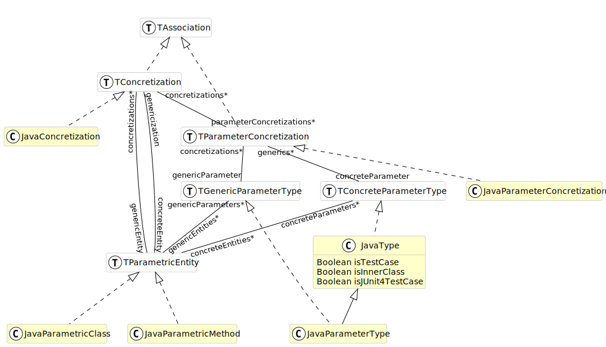

# Predefined Entities / Traits in FamixNG <!-- omit in toc -->
{: .no_toc}

To analyze a system in a given programming language, Moose must have a meta-model for that language.
For example, for Java the meta-model defines that Java programs have classes, containing methods, invoking other methods, etc.
The meta-model describes the entities that compose a program in the given language and how they are related.

On another page, we explain how to [define a meta-model](create-new-metamodel): create new entities, define relationships, properties, etc.
On this page, we present the library of predefined entities that is part of FamixNG and helps declaring new entities by offering typical properties / relationships that are needed.

In FamixNG, recurrent properties are modeled into traits.
New entities are created as classes composed from these existing traits.
Some common entities (like Packages) are also proposed, precomposed with common traits.
Here we list all currently available traits.

FamixNG is under continuous development, and the library of available traits is subject to change.
The following should nevertheless help users make sense of the more than 130 traits available.

We will first present the different [Association Traits](#categories-of-trait) that are used, some adding very specific properties, some working in group,...
Then we will show how some of these [traits are composed](#putting-it-all-together) to make more complex entities.
We finish by presenting the traits for [modelling genericity](#genericity) which is a complex issue.

## Categories of traits

First, one can divide the set of traits into four categories:
- [Association Traits](#association-traits)
- [Technical Traits](#technical-traits)
- [Property Traits](#property-traits)
- [Terminal Traits](#terminal-traits)

They are described as follows:

### Association Traits

Association traits model the fact that an entity is used (referred to) in the source code.
Such a reference creates an association between the using entity (refers to) and the entity that is used (is referred to).
This includes the four associations of the old Famix: Inheritance, Invocation (of a function or a method), Access (to a variable), and Reference (to a type).

Associations should be thought of as n-to-m relationships between entities.
For that reason, they are reified into their own traits.
Associations define two roles (`from` and `to`) to identify both ends of the association.
Using an association involves:
- defining a class representing the association (for example, Access, using the trait FamixTAccess)
- defining two classes at each end of the association (for example, Function using the trait FamixTWithAccess, and Variable using the trait FamixTAccessible).

There are five full-fledged associations in FamixNG:

- `FamixTAccess`, from: `FamixTWithAccess`, to: `FamixTAccessible`
<details></details>
- `FamixTInheritance`, from: `FamixTWithInheritance`, to: `FamixTWithInheritance`
<details></details>
- `FamixTInvocation`, from: `FamixTWithInvocation`, to: `FamixTInvocable`, for OO programs, there is an extra receiver: `FamixTInvocationReceiver`
<details></details>
- `FamixTReference`, from: `FamixTWithReferences`, to: `FamixTReferenceable`
<details></details>
- `FamixTTraitUsage`, from: `FamixTWithTrait`, to: `FamixTTrait`
<details></details>

To these five we added two more specialized "associations":
`DereferencedInvocation` (call of a pointer to a function in C) and `FileInclude` (also in C).
These do not reify the association as a separate entity, but they might do so in the future.
For now there are only two traits to put at each end of the relationship:

- `FamixTDereferencedInvocation` and `FamixTWithDereferencedInvocations`
<details></details>
- `FamixTFileInclude` and `FamixTWithFileInclude`<details></details>

### Technical Traits

Technical traits do not model programming language entities but are used to implement Moose functionalities.

Currently, this includes several types of `FamixTSourceAnchors` that allow recovering the source code of the entities.
A typical `FamixTSourceAnchor` contains a filename, and start and end positions in this file.<details></details>

*Technical traits* may also implement software engineering metric computation (`TLCOMMetrics`), or ways to model the programming language used (all `SourceLanguage`), or be  used to implement the generic [MooseQuery engine](https://moosequery.ferlicot.fr/).<details></details>

### Property Traits

Property traits model composable properties that source code entities may possess.
Some examples are `FamixTNamedEntity` (entities that have a name), `FamixTTypedEntity` (entities that are statically typed), or a number of entities modeling ownership: `FamixTWithGlobalVariables` (entities that can own `FamixTGlobalVariables`), `FamixTWithFunctions` (entities that can own `FamixTFunctions`), ... 

There are 46 *property traits* currently in FamixNG including 38 traits modeling ownership of various possible kinds of entities (`FamixTWith...`).

### Terminal Traits

 Terminal traits model entities that can be found in the source code such as `Functions`, `Classes`, `Exceptions`, ...
These entities are often defined as a composition of some of the *property traits*.
For example, `FamixTClass` is composed of: `FamixTInvocationsReceiver` (class can be receiver of static messages), `FamixTPackageable`, `FamixTType` (classes can be used to type other entities), `FamixTWithAttributes`, `FamixTWithComments`, `FamixTWithInheritances`, `FamixTWithMethods`.

The name *terminal trait* refers to the fact that they can be used directly to create a programming language concept (a class, a package), whereas *property traits* are typically composed with other traits to make a meaningful programming language concept.

There are 38 such *terminal traits* currently in FamixNG.

## Putting it all together

We now present UML diagram that show how Association and Property traits are used to create the Terminal traits.
These UML diagrams give an idea how to combine all traits to create a meta-model for a given programming language.

### Inheritance in context

For the first example we show how we model inheritance in the FamixJava meta-model:
- `TClass` uses `TWithInheritances`, ie. a generic class may have inheritance relationships
- `FamixJavaClass` uses `TClass`, ie. a Java class has all properties of the generic class defined in Famix. Note that a Java class also has other properties not shown here.
- `FamixJavaInheritance` uses the trait `TInheritance` to represent an inheritance relationship.

```plantuml!
hide empty members
skinparam class {
  BackgroundColor white
  ArrowColor black
  BorderColor darkGray
}
class FamixJavaInheritance <<(C,white)>> #FFFFCC {
}
class TClass <<(T,white)>> #FFFFCC {
  Boolean isTestCase
  Number weightOfAClass
}
class TWithInheritances <<(T,white)>> #CCFFFF {
  Number subclassHierarchyDepth
  Number hierarchyNestingLevel
  Number numberOfSubclasses
  Number numberOfDirectSubclasses
}
class FamixJavaClass <<(C,white)>> #FFFFCC {
}
class TInheritance <<(T,white)>> #CCFFFF {
}
TInheritance <|.. FamixJavaInheritance
TWithInheritances <|.. TClass
TClass <|.. FamixJavaClass
TWithInheritances "subclass" -- "superInheritances*" TInheritance
TWithInheritances "superclass" -- "subInheritances*" TInheritance
```

That way, a `FamixJavaClass` has `superInheritances` and `subInheritances` propperties containing `FamixJavaInheritance` objects.

### Invocation in context

We now look at how invocations are used.
For simplification we did not put the FamixJava entities, but there is a `FamixJavaMethod` directly using `TMethod` and we saw `FamixJavaClass` using `TClass` in the previous example:
- `TWithStatements` uses `TWithInvocations`, ie. an entity with statements (eg. a function, a procedure, a method,...) may have invocations
- `TMethod` uses `TWithStatements` and thus can make invocations
- `TMethod` uses `TInvocable` and thus can receive invocations
- `TClass` uses `TInvocationsReceiver` because classes may receive (static) messages

```plantuml!
hide empty members
skinparam class {
  BackgroundColor white
  ArrowColor black
  BorderColor darkGray
}
class TInvocation <<(T,white)>> #CCFFFF {
}
class TClass <<(T,white)>> #FFFFCC {
  Boolean isTestCase
  Number weightOfAClass
}
class TWithStatements <<(T,white)>> #FFFFFF {
  Number numberOfStatements
}
class TMethod <<(T,white)>> #FFFFCC {
}
class TInvocable <<(T,white)>> #CCFFFF {
}
class TWithMethods <<(T,white)>> #FFFFFF {
  Number numberOfAbstractMethods
  Number numberOfMethods
  Number weightedMethodCount
  Number tightClassCohesion
}
class TInvocationsReceiver <<(T,white)>> #CCFFFF {
}
class TWithInvocations <<(T,white)>> #CCFFFF {
  Number numberOfOutgoingInvocations
}
TWithMethods <|.. TClass
TInvocationsReceiver <|.. TClass
TWithInvocations <|.. TWithStatements
TInvocable <|.. TMethod
TWithStatements <|.. TMethod
TInvocation "outgoingInvocations*" -- "sender" TWithInvocations
TMethod "methods*" --o "parentType" TWithMethods
TInvocation "receivingInvocations*" -- "receiver" TInvocationsReceiver
TInvocation "incomingInvocations*" -- "candidates*" TInvocable
```

### Reference in context

References are relationship between methods (`TWithStatements`) and types (`TType`` are `TReferenceable`)

Additionally, the diagram shows how variables (`TStructuralEntity`) and methods (`TMethods` using `TWithStatements`) are `TTypedEntity` which have a property `declaredType` pointing to a `TType` also.
This property does not use the `TReference` association because it is a 1-to-n relationship.

```plantuml!
hide empty members
skinparam class {
  BackgroundColor white
  ArrowColor black
  BorderColor darkGray
}
class TType <<(T,white)>> #FFFFCC {
}
class TAttribute <<(T,white)>> #FFFFCC {
  Number hierarchyNestingLevel
}
class TStructuralEntity <<(T,white)>> #FFFFFF {
}
class TParameter <<(T,white)>> #FFFFCC {
}
class TWithParameters <<(T,white)>> #FFFFFF {
  Number numberOfParameters
}
class TTypedEntity <<(T,white)>> #FFFFFF {
}
class TWithReferences <<(T,white)>> #CCFFFF {
}
class TReference <<(T,white)>> #CCFFFF {
}
class TReferenceable <<(T,white)>> #CCFFFF {
}
class TWithLocalVariables <<(T,white)>> #FFFFFF {
}
class TWithMethods <<(T,white)>> #FFFFFF {
  Number numberOfAbstractMethods
  Number numberOfMethods
  Number weightedMethodCount
  Number tightClassCohesion
}
class TClass <<(T,white)>> #FFFFCC {
  Boolean isTestCase
  Number weightOfAClass
}
class TWithAttributes <<(T,white)>> #FFFFFF {
  Number numberOfAttributes
}
class TWithStatements <<(T,white)>> #FFFFFF {
  Number numberOfStatements
}
class TLocalVariable <<(T,white)>> #FFFFCC {
}
class TMethod <<(T,white)>> #FFFFCC {
}
TStructuralEntity <|.. TLocalVariable
TReferenceable <|.. TType
TTypedEntity <|.. TStructuralEntity
TStructuralEntity <|.. TAttribute
TStructuralEntity <|.. TParameter
TType <|.. TClass
TWithAttributes <|.. TClass
TWithMethods <|.. TClass
TWithReferences <|.. TWithStatements
TTypedEntity <|.. TMethod
TWithLocalVariables <|.. TMethod
TWithParameters <|.. TMethod
TWithStatements <|.. TMethod
TReference "incomingReferences*" -- "referredType" TReferenceable
TType "declaredType" -- "typedEntities*" TTypedEntity
TParameter "parameters*" --o "parentBehaviouralEntity" TWithParameters
TWithLocalVariables "parentBehaviouralEntity" o-- "localVariables*" TLocalVariable
TAttribute "attributes*" --o "parentType" TWithAttributes
TWithMethods "parentType" o-- "methods*" TMethod
TWithReferences "referencer" -- "outgoingReferences*" TReference
```

### Access in context

Finally, we look at the access relationship and how it is used.
Accesses are made from methods (`TMethods` using `TWithStatements`, itself using `TWithAccesses`) to variables (`TStructuralEntity` uses `TAccessible`).

```plantuml!
hide empty members
skinparam class {
  BackgroundColor white
  ArrowColor black
  BorderColor darkGray
}
class TAttribute <<(T,white)>> #FFFFCC {
  Number hierarchyNestingLevel
}
class TStructuralEntity <<(T,white)>> #FFFFFF {
}
class TParameter <<(T,white)>> #FFFFCC {
}
class TWithParameters <<(T,white)>> #FFFFFF {
  Number numberOfParameters
}
class TWithAccesses <<(T,white)>> #CCFFFF {
}
class TWithLocalVariables <<(T,white)>> #FFFFFF {
}
class TWithMethods <<(T,white)>> #FFFFFF {
  Number numberOfAbstractMethods
  Number numberOfMethods
  Number weightedMethodCount
  Number tightClassCohesion
}
class TClass <<(T,white)>> #FFFFCC {
  Boolean isTestCase
  Number weightOfAClass
}
class TWithAttributes <<(T,white)>> #FFFFFF {
  Number numberOfAttributes
}
class TAccessible <<(T,white)>> #CCFFFF {
  Number numberOfLocalAccesses
  Number numberOfAccesses
  Number numberOfGlobalAccesses
  Number numberOfAccessingMethods
  Number numberOfAccessingClasses
}
class TWithStatements <<(T,white)>> #FFFFFF {
  Number numberOfStatements
}
class TAccess <<(T,white)>> #CCFFFF {
  Boolean isRead
  Boolean isWrite
  Boolean isReadWriteUnknown
}
class TLocalVariable <<(T,white)>> #FFFFCC {
}
class TMethod <<(T,white)>> #FFFFCC {
}
TAccessible <|.. TStructuralEntity
TStructuralEntity <|.. TAttribute
TStructuralEntity <|.. TParameter
TWithAttributes <|.. TClass
TWithMethods <|.. TClass
TWithAccesses <|.. TWithStatements
TStructuralEntity <|.. TLocalVariable
TWithLocalVariables <|.. TMethod
TWithParameters <|.. TMethod
TWithStatements <|.. TMethod
TWithAccesses "accessor" -- "accesses*" TAccess
TAccessible -- "accessors*" TWithAccesses
TWithLocalVariables "parentBehaviouralEntity" o-- "localVariables*" TLocalVariable
TParameter "parameters*" --o "parentBehaviouralEntity" TWithParameters
TWithMethods "parentType" o-- "methods*" TMethod
TAttribute "attributes*" --o "parentType" TWithAttributes
TAccessible "variable" -- "incomingAccesses*" TAccess
```

## Genericity

(note: the same meta-model is also described in this [blog post](https://modularmoose.org/posts/2023-07-13-parametric)).

Genericity in OO languages allows to define a class, an interface, or a method which will apply to several not specified types.
For example in Java a Map associates keys of an unspecified type to values of another unspecified type.
Map is a generic interface, (also called parametric interface, this is the term we use in Famix).
The definition of Map in Java looks like this: `interface Map<K,V>` where K and V are the ParameterTypes of the ParametricInterface.

Generic types can then be made concrete by specifying some or all their ParameterTypes.
For example we could create a StringMap with `class StringMap<V> implements Map<String,V>`.
In this new type, the ParameterType K is made concrete by setting it to be String.
The StringMap type is still generic because V is not concrete.
StringMap is a generic type with only one ParameterType: V.

Methods can also be GenericEntities when the type of one parameter, or the return type of the method is a ParameterType.
For example in Java, the get(key) method (in Map) is generic because the type of the key is K, a ParameterType and it returns a value of type V, another ParameterType: `public V get(K key)'.

In Famix the meta-model for genericity is the following:



- a `TParametricEntity` represents an entity that has `TGenericParameterType`s (like Map having parameter types K and V in the example above);
- the same `TParametricEntity` may also have `TConcreteParameterType`s (like String for StringMap above);
- in the case of Java, `TParametricEntity` is used by `JavaParametricMethod`, `JavaParametricClass` and `JavaParametricInterface`;
- a `TConcretization` is an association between two `TParametricEntity`s (like between Map and StringMap above);
- a `TParameterConcretization` is an association between a `TGenericParameterType` (like K above) and a `TConcreteParameterType` (like String above);
- a  `TParameterConcretization` (association between ParameterTypes) is linked to a `TConcretization` (association between ParametricEntities);
- in the case of Java, any `JavaType` can be used as a  `TConcreteParameterType`
