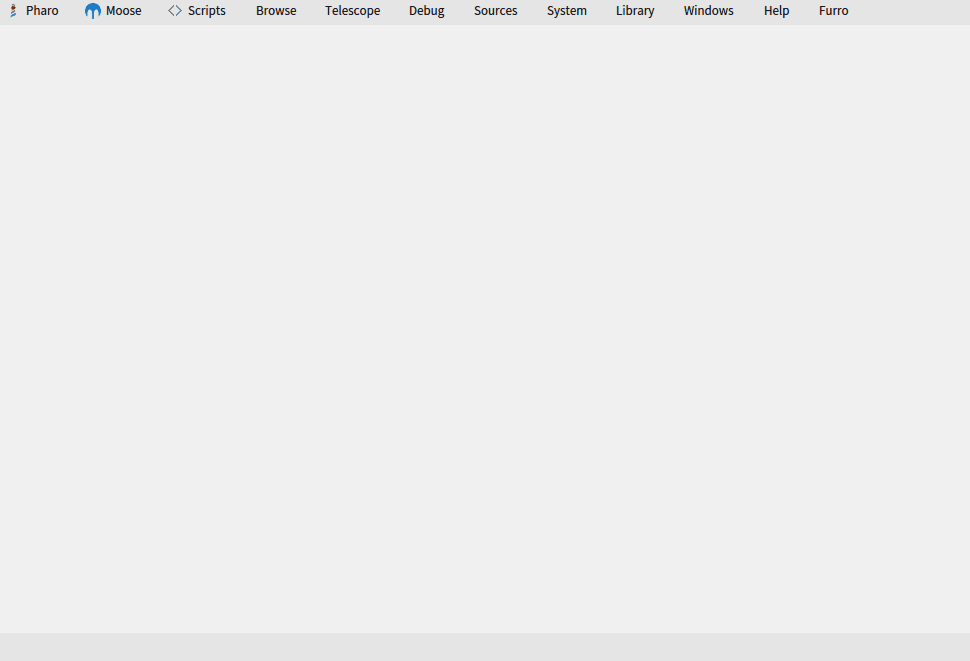

# Importing and exporting models <!-- omit in toc -->

The first step in the process of analysis is the generation of a model of a given target system or set of data.
Moose can handle multiple types of data and data sources.
This chapter provides a short guide for how to deal with these.

- [Importing and exporting from and to files](#importing-and-exporting-from-and-to-files)
  - [Importing and exporting with JSON](#importing-and-exporting-with-json)
  - [Importing and exporting with MSE](#importing-and-exporting-with-mse)
  - [Command line for slow loading](#command-line-for-slow-loading)
- [Importing Pharo code](#importing-pharo-code)
  - [From GUI](#from-gui)
  - [From code](#from-code)
    - [Moose 8 and above](#moose-8-and-above)
    - [Moose 7](#moose-7)
- [Create mse file for other languages](#create-mse-file-for-other-languages)

## Importing and exporting from and to files

### Importing and exporting with JSON

The preferred way to load a model in Moose is via a JSON file.
To load an JSON file, all you have to do is to press the _``Import from JSON''_ button in the Moose Panel and indicate the file to load.
This creates a model, populates it with the entities from the file and adds the model to the repository.
Visually, the model appears in the list of models from the Moose Panel.

> You can also drag and drop the Json file within the Pharo Image

To import a model from a JSON format, you can execute the following snippet:

```st
'/path/to/file.json' asFileReference readStreamDo:
    [ :stream | model := FamixJavaModel new importFromJSONStream: stream ]       
```


More information about JSON format are available [here](./file-format#json).

> Sugar methods will be added in future release

To export using the JSON format programmatically:

```st
"will ask where to create the json file"
model exportToJSON.

"will write the json in mseFile.json"
'path/to/file.json' asFileReference writeStreamDo: 
    [:stream | model exportToJSONStream: stream ].
```

### Importing and exporting with MSE

As one can import and export using JSON, it is possible to import and export using the [MSE format](./file-format#mse).

Another way is to import the model from a playground by executing (in the case of a FamixJava model):

```st
'./path/to/file.mse' asFileReference readStreamDo:
    [:stream | model := FamixJavaModel importFromMSEStream: stream].
```

More information about MSE are available [here](./file-format#mse).

Once a model is loaded, it can be easily exported as an MSE file.
This can be done via the contextual menu of the model.
By choosing the _``Export to MSE''_ menu item you will be prompted to indicate the desired file name and location, and the result is an MSE file saved on the disk containing the entities in the model.

It is also possible to do it programmatically by executing: 

```st
"will ask where to create the mse file"
model exportToMSE.

"will write the mse in mseFile.mse"
'path/to/new/file.mse' asFileReference writeStreamDo: 
    [:stream | model exportToMSEStream: stream ].
```

### Command line for slow loading

#### Increase the process priority

If you find the loading too slow.
You can try the following command that will create a process that perform the load with the max priority.

```st
['/path/to/file.json' asFileReference readStreamDo:
    [ :stream | model := FamixJavaModel new importFromJSONStream: stream ]
        ] forkAt: Processor highestPriority named: 'LoadJava'.
```

#### Reducing other processes priority

- have a model.json and a folder with the model's source code.
- have a Pharo image with Moose
- drag/drop the model.json file into Pharo's World
- setup the import from the screen (just set the right paths)
- Changing process priorities :
  - In the System > System Process Browser menu
  - The priority of a process increases (the higher the priority, the higher the priority of the process).
  - You need to lower the priority of Morphic (in charge of the Pharo UI). It should be around 40, so we need to lower it to 30.
  - This will freeze the UI until the end of the import.
  - Please wait.

## Importing Pharo code

### From GUI

Moose comes with a built-in importer for Pharo code. The prerequisite for using this importer is that you first need the target source code present in the Pharo image.

Once the code is present, simply press on the ``Load from Pharo'' item from the menu of the Moose Panel, and follow the steps from the opening wizard.

This importer works out of the box for code built for Pharo.
For code written in other Smalltalk dialects, the code must first be made loadable into Pharo.
Moose does not offer ready-made solutions for these other languages, but for most known dialects, like VisualWorks, you can often find solutions for exporting the code in a file format loadable in Pharo.
An important note is that the code does not have to be fully functioning.
It merely needs to be loadable in the Pharo image.

{: .img-fill }

### From code

It is possible to create a model of Pharo code programmatically.

#### Moose 8 and above

In Moose 8, the following script creates a model of the Calypso package.

```st
"Create a Moose Model"
model := FamixStModel new.


MoosePharoImporterTask new
    importerClass: SmalltalkImporter;
    factory: SmalltalkMetamodelFactory new;
    model: model ;
    addFromPackagesMatching: [:p | p name beginsWith: 'Calypso' ] ;
    run;
    yourself.
```

The model is stored inside the model variable.

#### Moose 7

In Moose 7, the following script creates a model of the Calypso package.

```st
"Create a Moose Model"
model := MooseModel new.

"Set the PharoSt metamodel (was fixed in Moose8)"
model metamodel: FamixPharoSmalltalkGenerator resetMetamodel.
model metamodel.


MoosePharoImporterTask new
    importerClass: SmalltalkImporter;
    factory: SmalltalkMetamodelFactory;
    model: model ;
    addFromPackagesMatching: [:p | p name beginsWith: 'Calypso' ] ;
    run;
    yourself.
```

The model is stored inside the model variable.

Then to generate the code, one also needs to perform a little hack (that has been fixed in next version of Moose).

```st
"Complexe because different metamodel, was fixed in Moose8"
'D:/test.mse' asFileReference writeStreamDo: [ :writeStream | MooseModel export: model withMetamodel: model metamodel to: writeStream. ]
```

## Create mse file for other languages

To create mse files for other programming languages please refer to the [parser section](./../index#parsers).
