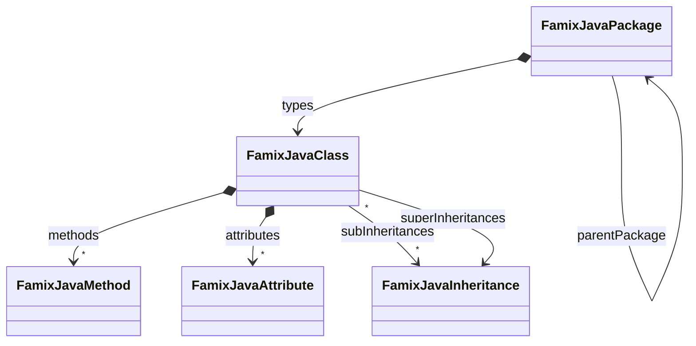
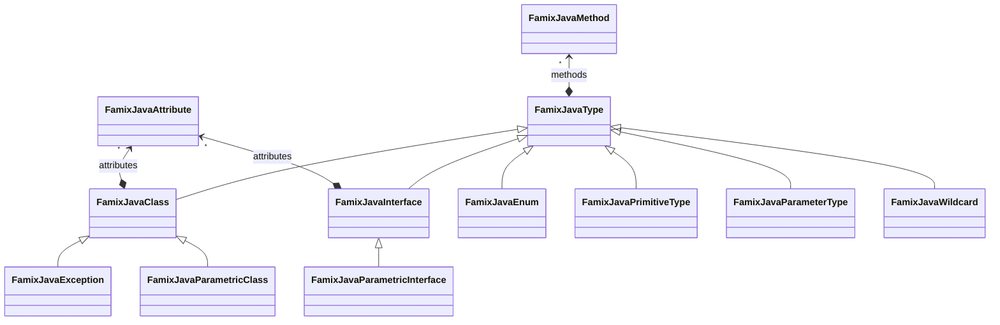
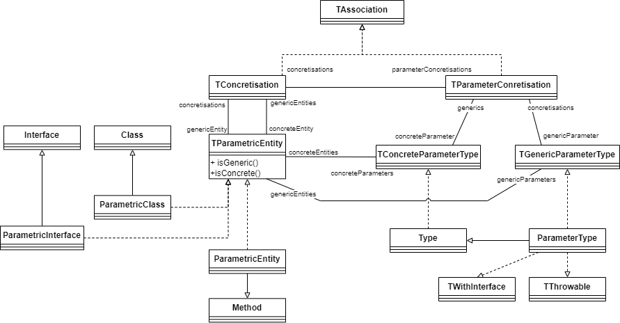

> This is a work in progress page that tries to help beginners. Do not hesitate to contact us for more information

Famix Java is the metamodel included in Moose used to represent any Java application.
As you can imagine, the metamodel is rather than complicated.
For instance, Famix Java uses a lot the [traits concept](/Developers/predefinedEntities).

We will present here some incorrect, but simplify and useful view to enable beginners to use Famix Java.

## Class neighborhood

## Type neighborhood

### Focus on Parametric Type

Parametric types are probably the most hard to understand.
We made a [full blog post about this subject]().

{: .img-fluid }
