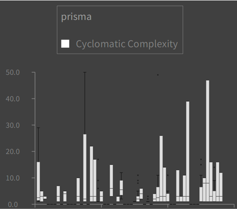

TypeScript is a more and more popular programming language, and so it would be great if we could analyze TypeScript projects using Moose.
At the time of writing, no meta-model (or importer) exists for the TypeScript language in Moose.
First, what are the pieces of the puzzle needed to analyze TypeScript with Moose?
Before we consider TypeScript, let's look at how things work with Java:


[VerveineJ](https://github.com/moosetechnology/VerveineJ) is the *importer* that can generate *models* of Java files, allowing us to do analyses in Pharo/Moose.

## What's needed to analyze TypeScript?

If we want to do the same thing for TypeScript, we would need:

- an equivalent of VerveineJ (importer) for TypeScript files,
- a Famix model of TypeScript.
 
Creating a parser and importer for TypeScript is no small task, but TypeScript is a popular environment and we can use [`ts-morph`](https://ts-morph.com/) to facilitate the navigation of the TypeScript AST.
There's also a very cool [visualization of TypeScript ASTs](https://ts-ast-viewer.com/#), which will be useful for understanding and debugging.

Designing a new meta-model for TypeScript is definitely not trivial, because it requires a deep understanding of the language.
On the other hand, once a meta-model exists, it's [easy to *generate* using FamixNG domain-specific language](https://modularmoose.org/moose-wiki/Developers/create-new-metamodel).

Pragmatically speaking, do we need a *perfect* model of TypeScript to analyze it?

## abap2famix

> "All models are wrong, but some are useful." --[maybe not George Box](https://en.wikipedia.org/wiki/All_models_are_wrong)

By searching the web for TypeScript and Moose, I discovered a GitHub project called [pascalerni/abap2famix](https://github.com/pascalerni/abap2famix). 
It is an [ABAP](https://en.wikipedia.org/wiki/ABAP) importer (written in TypeScript) that models ABAP projects using [FAMIX 3.0 (compatibility meta-model for Java)](https://www.researchgate.net/publication/265428652_MSE_and_FAMIX_30_an_Interexchange_Format_and_Source_Code_Model_Family).
Java and ABAP are indeed different languages, but perhaps the differences are not so important if we want to do some static analysis?
Seems like a pragmatic approach!

Looking at the node packages used by abap2famix I discovered [famix](https://www.npmjs.com/package/famix), a TypeScript implementation of Famix, which facilitates creating FAMIX 3.0 entities from TypeScript.
Its source is at [pascalerni/famix](https://github.com/pascalerni/famix), and I could see that much of it was generated, e.g., in [class.ts](https://github.com/pascalerni/famix/blob/d68d11cbbc3f8423dcd1acd46da602ea13e2b1f4/src/model/famix/class.ts#L1) there's proof it was not written by hand:

```typescript
// automatically generated code, please do not change

import {FamixMseExporter} from "../../famix_mse_exporter";
import {Type} from "./../famix/type";

export class Class extends Type {
  ...
}
```

How was this code generated? The answer is the fork of FameJava at [pascalerni/FameJava](https://github.com/pascalerni/FameJava), namely the [Famix30Codegen.java](https://github.com/pascalerni/FameJava/blob/master/test/ch/akuhn/fame/codegen/target/Famix30Codegen.java) file.
The original FameJava was used to generate the Java API for use with FAMIX 3.0 metamodel.
This fork generates (via Java) a TypeScript API.
Clever and useful!

## Drivers, start your engines!

So, what if we try to create an importer using `ts-morph` and the `famix` packages that will model TypeScript programs in a Java metamodel?
As a first try, model only the object-oriented elements of TypeScript, such as classes, methods, attributes, etc.

This is actually the project I proposed to students in an [advanced-topics software design course at my university](https://www.etsmtl.ca/etudes/cours/MGL843) during the winter of 2021.

## Results

Several teams set out to achieve this goal, although none of the students had ever done parsing or Pharo before.
Many were familiar with node and TypeScript.

I'm happy to say that they *all* were successful (in varying degrees) in writing an importer for TypeScript that allowed analyses to be done in Moose and Pharo, and their results are all on GitHub:

[Team 1](https://github.com/Start2Run/TypeScript2Famix) \| [Team 2](https://github.com/Imonor/ProjetFamix) \| [Team 3](https://github.com/xamrol/prj-mgl843) \| [Team 4](https://github.com/km229/mseTsGenerator)

Here are some visualizations produced by Team 4 using Roassal on models loaded into Moose.

The first shows the Weighted Method Count (sum) for classes in several TypeScript projects. The cyclomatic complexity values were calculated using another npm package (`ts-complex`) in the TypeScript importer:


The following chart shows distributions of Cyclomatic Complexities of methods for various classes in the `prisma` project:



## Limits of modeling TypeScript in a Java metamodel

Here are some of the obvious things in TypeScript (Javascript) that don't quite fit into a Java model:

- Functions can exist in the global namespace. A workaround proposed by one team was to create a "Global" class in the Java model, and just put functions there as static methods.
- Functions can exist in methods, but maybe this is possible to model in a newer meta-model for Java that supports lambdas. The API from pascalerni/famix supports an older meta-model for Java.
- `string`, `number`, `any` are types in TypeScript, but they do not really map to primitive types or classes in Java. 
- TypeScript doesn't have packages like Java, although it does have ways to specify namespaces and avoid naming conflicts.

## Conclusion

Even though a formal model in TypeScript doesn't (yet) exist in Famix, it's possible to perform useful analyses of TypeScript using the FAMIX 3.0 (Java) metamodel, thanks to packages, tools and APIs developed and reused in the npm and Moose communities. 

> Photo credit: "[patchwork beads](https://www.flickr.com/photos/brenneman/6062001126/)" ([CC BY-SA 2.0](https://creativecommons.org/licenses/by-sa/2.0/)) by [various brennemans](https://www.flickr.com/people/brenneman/)
