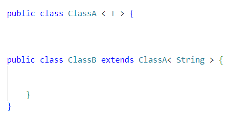
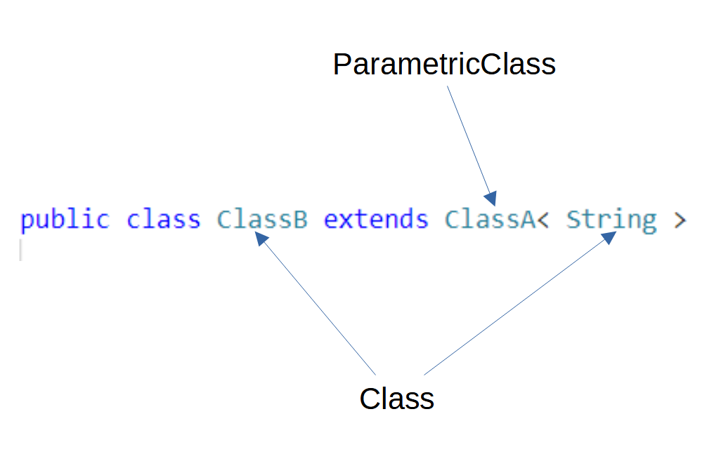
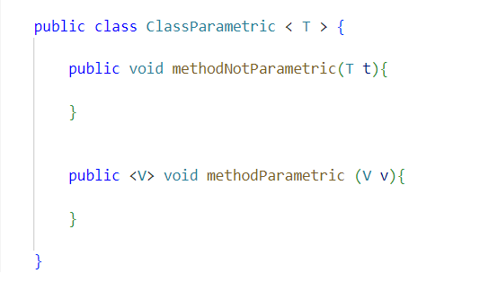

## Introduction

In Java generic types allow you to write a general, generic class (or method) that works with different types, allowing code reuse.

But their modeling and how it works can be difficult to understand.
Let's take an example.

### Generic class

```java
public class ClassA<T>
```

Here, `ClassA` is a generic class because there is one generic type T.
One can not use ClassA without specifying the generic type.

```java
ClassA<Integer> class1 = new ClassA<Integer>;
ClassA<String> class2 = new ClassA<String>;
```

`class1` and `class2` are variables of type ClassA, but this time `ClassA` doesn't have a generic type but `String` or `Integer`.
So, how do we represent all that?


We have 5 new traits in our meta-model :

- `TParametricEntity` is used by all parametric entities. It can be a `ParametricClass`, `ParametricMethod`, and `ParametricInterface`.
- `TConcretisation` allows one to have a link between two `TParametricEntity`. A `TParametricEntity` can have one or more concretizations with other `TParametricEntity`. Each `TParametricEntity` that is a concretization of another `TParametricEntity` has a genericEntity.
- `TConcreteParameterType` for concrete parameters.
- `TGenericParameterType` for generic parameters.
- `TParameterConcretisation` is the same as `TConcretisation` but instead of two `TParametricEntity` it has `TConcreteParameter` and `TGenericParameterType`. `TGenericParameterType` can have one or more concretisations and `TConcreteParameterType` has generics.

A `TParametricEntity` knows its concrete and generic parameters.

`ParameterType` uses the `TWithInheritance` trait because in Java we can do the following: `<T extends Object>` and `<? super Number>`.
For the first, it means that `T` can be all subclasses of `Object` and for the second, it means `Number` and all its superclasses or interfaces (`Number`, `Object`, `Serializable`).
`ParameterType` also uses the `TThrowable` trait because we can have a genericException so `ParameterType` should be considered like it.

```java
public interface GenericThrower<T extends Throwable> {
    public void doThrow() throws T;
}
```

#### Let's describe an example



If we take the first class. We have a `ParametricClass` with one `ParameterType` name `T`.


For the second class, we have a class that extends a parametric class with one parameter named `String`.
`String` here is a class.
It is not a `ParameterType` anymore.



So, what is the link between the two parametric classes and the parameters `T` and `String`?


We have here a `Concretisation`.
`ClassA` with the parameter `T` has one concretization and the parameter `T` has one parameter `Concretisation` which is String.

If we take back our first example:

```java
public class ClassA<T>
ClassA<Integer> class1 = new ClassA<Integer> 
ClassA<String> class2 = new ClassA<String>
```

We have three `ParametricClass`, one `ParameterType` and two types (`String` and `Integer`).
`T` is our `ParameterType` and has two `ParameterConcretisations`: `String` and `Integer`.
We can say that `T` is generic and `String` and `Integer` are concrete because we know what they are: classes.
`ClassA` with the ParameterType `T` (`ClassA<T>`) also has two concretizations.
These are `ClassA<Integer>` and `ClassA<String>`.
The three different `classA` know their parameters. `T` is in genericParameters. String and Integer are in concreteParameters.

A class is generic if it has at least one `ParameterType`.
We can have concretization of a parametric class that is also generic. See the example below:

```java
public class ParametricClass<T, V, K, Z> 

public class ParametricClass2<Z> extends ParametricClass<String, Integer, Integer, Z>
```

The second ParametricClass has one ParameterType, so the class is generic.
The four parameters (T, V, K, Z) have each a concretization (String, Integer, Integer, Z). Even if Z is still a ParameterType.

ParametricClass2 has for superclass ParametricClass, which has for generic entity ParametricClass with 4 ParameterTypes.

### Generic method



Let's see what we have here. First of all, we recognize a ParametricClass with one ParameterType. This class has two methods. One is a regular method and the second is a parametricMethod.
The first one isn't generic because when the class is concretized, the ParameterType T will become String, Integer, Animals... and it will be the same for the method.
The parameter of the first method depends on the class and this is not the case for the second method. That is why the second method is generic, not the first one.

### Example with Pharo

```java
public classA<T>  
public classB extends classA<String>
```

This is how we can represent this in [Pharo](https://pharo.org/).

```smalltalk
classAgen := FamixJavaParametricClass named:'ClassA'.
t := FamixJavaParameterType named:'T'.
classAgen addGenericParameter: t.

classAcon := FamixJavaParametricClass named:'ClassA'.
string := FamixJavaClass named:'String'.
classAgen addConcreteParameter: string.

FamixJavaConcretisation new concreteEntity: classAcon ; genericEntity: classAgen.

FamixJavaParameterConcretisation new concreteParameter: string ; genericParameter: t.

classB := FamixJavaClass named:'ClassB'.
FamixJavaInheritance new subclass: classB ; superclass: classAcon .
```

## Conclusion

In this post, we have seen how generics types are modeled with [VerveineJ](/developers/Parsers/VerveineJ) and Moose for code analysis.
