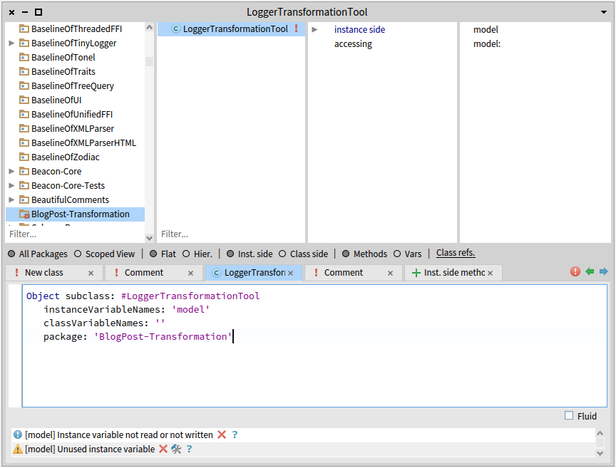

Sometimes we have to perform several similar edits on our source code. 
This can happen in order to fix a recurring bug, to introduce a new design pattern or to change the architecture of a portion of a software.
When many entities are concerned or when the edits to perform are complicated and take too much time, it can be interesting to consider building a transformation tool to help us and make that task easier.
Fortunately, Moose is here to help with several modeling levels and powerful tools enabling us to build what we need! 

## Preface

This little transformation journey will be divided into three blog posts. We will see how to build a simple transformation tool, with each post focusing on a different aspect:

- First post : Locating entities and nodes to transform
- Second post : Creating AST copies and AST nodes to make a transformation
- Final post : Viewing and editing our transformation, and applying it to the source files

Throughout those three posts, we will follow a simple transformation scenario, based on the software ArgoUML, an open-source Java project used in this [wiki](/beginners/moose-in-action).
The first step is to create the model for the software, using the [sources](https://github.com/argouml-tigris-org/argouml/releases/download/VERSION_0_34/ArgoUML-0.34-src.zip) and [libraries](https://github.com/argouml-tigris-org/argouml/releases/download/VERSION_0_34/ArgoUML-0.34-libs.zip) available on that wiki post, but creating the model on the latest stable version of [VerveineJ](moose-wiki/Developers/Parsers/VerveineJ).

Using the available Docker image, this command (on Windows) will create the model and store it in the sources repository : 
```sh
docker run -v .\src:/src -v .\libs:/dependency badetitou/verveinej -format json -o argouml.json -anchor assoc .
```

All that remains to do is to create a fresh image, and import this model (with the sources repository used to build the model as root folder) to start making our tool.

Note : As the creation of that tool is divided in three blog posts, keeping that image for all three blog posts is recommended.

## The scenario

The transformation case we will be dealing with in those blog posts is rather simple.
In the ArgoUML system, three classes define and use a method named `logError`. In our scenario, a class `ArgoLogger` has been defined and contains a static method `logError`. The transformation task is to add a receiver node to each `logError` method invocation so that the method is called using the right class.

## Tools to import

For this blog post, we will have to import two tools :

The first one is [Carrefour](/blog/2022-06-30-carrefour), allowing us to bind and access the (F)AST model of an entity to its Famix counterpart. Loading it will also load the FAST Java metamodel.
To load the project, execute this command in a Playground :
```smalltalk
Metacello new
  githubUser: 'moosetechnology' project: 'Carrefour' commitish: 'v5' path: 'src';
  baseline: 'Carrefour';
  load
```

Second, we will use [MoTion](https://github.com/alesshosry/MoTion), an object pattern matcher that will allow us to easily explore the FAST of our methods and find the specific nodes we are looking for.
To load the project, execute this command in a Playground :
```smalltalk
Metacello new
    baseline: 'MoTion';
    repository: 'github://AlessHosry/MoTion:main';
    load: 'MoTion-Moose'
```

## Querying the model

Finally done with explanations and setup! :smile:
Let us start by creating a class with a `model` instance variable, accessors, and add a class side initializer method for ease of use:



```smalltalk
onModel: aMooseModel

	^ self new
		  model: aMooseModel;
		  yourself
```

This class will contain our entire code manipulation logic. It will be pretty short, but of course when working on more important transformations dividing the logic of our tool will help to make it more understandable and maintainable.

In any case, we will start with a basic Famix query, in order to find all the implementation of `logError` methods, which will later allow us to easily find their invocations : 
```smalltalk
fetchLogErrorMethods

	^ model allModelMethods select: [ :m | m name = 'logError' ]
```

And then another query using this result, to get all invocations (the exact entities we seek to transform) :
```smalltalk
fetchLogErrorMethodInvocations

	^ self fetchLogErrorMethods flatCollect: [ :m | 
		  m incomingInvocations ]
```

Using [MooseQuery](https://moosequery.ferlicot.fr/userdocumentation.html), you should be able to find any Famix entities you are seeking.
From those Famix entities, we want to get the FAST nodes that we need to transform. We will look at two different methods to do so.

## Using Carrefour

In this context, Carrefour is the perfect tool to use to find the nodes we want to transform in the FAST of our methods.
Now that we found the entities that we have to transform in the Famix model, all that remains is building and binding the FAST node of every entity within our method, and then fetch the ones from our method invocations.

To do so, we will add two methods to our class. First, a method to fetch the FAST node matching a given method invocation :
```smalltalk
fetchFastNodeForFamixInvocation: anInvocation

	"building and binding the FAST of the invocating method"
	anInvocation sender generateFastIfNotDoneAndBind.
	
	"returning the actual node of the method invocation, our target"
	^ anInvocation fast 
```
And finally, a method that returns a list with every node we have to transform :
```smalltalk
fetchAllFastNodesUsingCarrefour

	^ self fetchLogErrorMethodInvocations collect: [ :mi | 
		  self fetchFastNodeForFamixInvocation: mi ]
```

And just like that, we now have the complete list of FAST nodes to transform!

## Using MoTion

But before celebrating, we should keep in mind that this transformation is a very simple use case. Here, it is easy to find the entities to transform using Famix, but in some other cases it might be much more complex to find the methods that are candidates to a transformation, not to mention every node that must be transformed.

In those cases, a good way to make things easier is to divide the logic of this process, and use separate means to find the methods that are candidates to a transformation and to find the nodes that must be transformed.

Making queries on the Famix model remains a very reliable way to find the candidates methods, but then what about the nodes inside the AST of these methods?
Methods can be quite complex (50 lines of code, 100, more...) and the resulting AST is huge. Finding the right node(s) in such AST is difficult.
That's where MoTion comes in. In order to find the nodes we are looking for, we can define patterns that describe those nodes, and the path to follow through the FAST to be able to reach those nodes.

MoTion is a powerful tool, allowing us to find specific items within a graph through concise patterns describing the objects we are looking for and the path in the graph used to reach them. However, it does have a very specific syntax that must be looked through before starting making our own patterns. Thankfully, everything is well documented and with examples (one of those being another example for FAST Java) on the repository of [MoTion](https://github.com/alesshosry/MoTion) (look at the README!). 

But enough description. Time to code! :smile:
```smalltalk
motionQueryForFastMethod: aFASTJavaMethodEntity

	| query |
	query := FASTJavaMethodEntity "type of the root node"
	         % { (#'children*' <=> FASTJavaMethodInvocation "looking through all childrens  (with *)"
																			 "until we find method invocation nodes"
		          % { (#name <=> 'logError') } as: #logErrorInvocation) }
																			 "if their name is logError,"
																			 "we save them to the given key"

		         collectBindings: { 'logErrorInvocation' }   "at the end, we want all found invocations"
		         for: aFASTJavaMethodEntity. "and this the root entity for our search"
		
	"the result of the query is a list of dictionaries, with each result in a dictionary"
	"we only have one call to logError per method, so we can do a simple access"	
	^ query first at: 'logErrorInvocation'
```
And without commentaries, to have a clearer view on how the pattern looks :
```smalltalk
motionQueryForFastMethod: aFASTJavaMethodEntity

	| query |
	query := FASTJavaMethodEntity
	         % { (#'children*' <=> FASTJavaMethodInvocation
		          % { (#name <=> 'logError') } as: #logErrorInvocation) }
		         collectBindings: { 'logErrorInvocation' }
		         for: aFASTJavaMethodEntity.

	^ query first at: 'logErrorInvocation'
``` 

Now, to complete the use of our pattern, let's make a final method that will fetch every node we need to transform :
```smalltalk
fetchAllFastNodesUsingMotion

	^ self fetchLogErrorMethodInvocations collect: [ :mi | 
		  mi sender generateFastIfNotDoneAndBind.
		  self motionQueryForFastMethod: mi sender fast ]
```
As you can see, we still use Carrefour even in this context, as it remains the easiest way to get the FAST of our method before looking through it using MoTion. Those two tools can therefore be used together when dealing with complex transformation cases.

## Try it yourself!

Now that our class is done, we are able to locate candidates methods for transformation and the specific nodes to transform using Famix, FAST, Carrefour and MoTion.
You can use a Playground to test out our class and model and see for yourself the results of each method :

```smalltalk
t := LoggerTransformationTool onModel: (MooseModel root at: 1).
t fetchAllFastNodesUsingMotion
```


The whole source code that was written on this blog post is also available on that [repository](https://github.com/RomainDeg/Moose-BlogPost-Transformation).

## Conclusion

Using Famix, FAST, Carrefour and MoTion, we are able to search and locate methods and nodes candidates for a given transformation test case. This first step is primordial to build a fully completed transformation tool. In the next blog posts, we will see how to create AST copies and AST nodes to use in a transformation, and finally how to view and edit our transformation before applying it to the source files.
