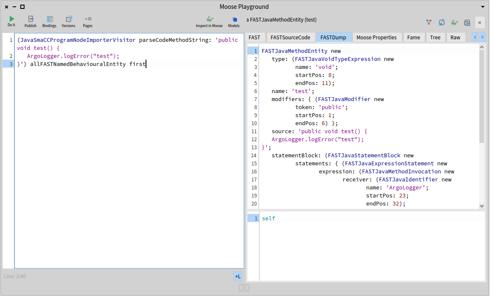
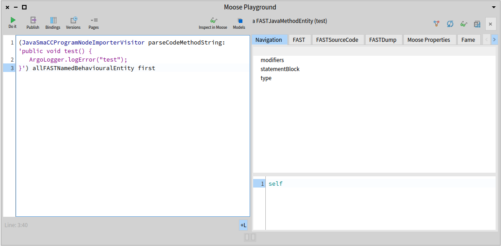

Welcome back to the little series of blog posts surrounding code transformation! In the previous post, we started to build a transformation tool using a basic fictional transformation use case on the software ArgoUML.
In this post, we will add behavior to the class we created previously, to achieve the actual transformation while making sure that we do not modify the original model in the process.
As a reminder, this is the scenario: in the ArgoUML system, three classes define and use a method named `logError`. 
A class `ArgoLogger` has been defined that contains a static method `logError`.
The transformation task is to add a receiver node to each `logError` method invocation so that the method called is now `ArgoLogger.logError`.

# Preface

As this blog post follows what was discussed and built in the first one of this series, a lot of information (how to build the image and model used for our use case, but also the use case itself) is provided in the previous post. 
If you haven't read it, or if you forgot the content of the post, it is recommended to go back to it, as it will not be repeated in this post.

# Tools to import

For this blog post, we will have to import a tool library, [FAST-Java-Tools](https://github.com/moosetechnology/FAST-Java-Tools), which contains several tools to use on FAST for Java entities. It also contains practical tools to build transformation tools! 
To load the project, execute this command in a Playground :
```smalltalk
Metacello new
  baseline: 'FASTJavaTools';
  repository: 'github://moosetechnology/FAST-Java-Tools:main/src';
  load
```

Loading it will automatically load the FAST-Java repository. Carrefour and MoTion (which were used in the previous post) are still necessary, so if you are starting from a clean image, you will need them as well.

# Copying the (F)ASTs to transform

With our import done, we are ready to get to work! :smile:
To create our transformation, we will modify the FAST of each candidate method for our transformation, and this modified FAST will then be generated into source code that we will be able to inject into the actual source files. Therefore, our next step is modifying the FAST of our methods.
However, we will begin by making a copy of said FAST, to ensure that our transformation will not modify the actual original model of our method. If that happens, we will still be able to run Carrefour on our method again (using the message `generateFastAndBind`) but it is better to avoid that scenario. If we have a bug on our tool and the FAST of many methods ends up being modified, then re-calculating and binding every FAST will be a big waste of time. Making a copy allows us to make the same actions, but ensures that our model remains untouched.

To create a copy, we have a visitor that fortunately does all the job for us! Using this simple command will give you a FAST copy :

```smalltalk
FASTJavaCopyVisitor new copy: aFASTMethod
```

However, to make things even easier, we will use an already made wrapper that will contain our candidate method for transformation in every useful "format" for transformation, which are :
- The Famix entity of that method
- The original FAST
- The copied (transformed) FAST

{::comment}
This wrapper also has collections to store specific nodes, but patience, we will see how to use these in the next blog post! :wink:
{:/comment}

For now, let's add a method to create that wrapper on a collection of candidate methods, in the class created in the first post :

```smalltalk
createWrappersForCandidateMethods: aCollectionOfFamixJavaMethods

	^ aCollectionOfFamixJavaMethods collect: [ :fmxMeth | 
		| fastMethod |
		fmxMeth generateFastIfNotDoneAndBind.
		fastMethod := fmxMeth fast.
		JavaMethodToTransformWrapper
			forFamixMethod: fmxMeth
			andFAST: fastMethod ]
```

With this, we created wrappers for each method to transform, and each of these wrappers contains a copy of the FAST ready to be transformed.
Before getting to the next step, we will define one more method, which will contain the "main behavior" of our tool, so that calling this method is enough to follow each step in order to transform the code.

```smalltalk
findAndTransformAllLogErrorInvocations

	| wrappers |
	wrappers := self createWrappersForCandidateMethods:
		self fetchLogErrorMethodInvocationsSenders.
		
	wrappers do: [ :w | self transformMethod: w ].
```

If you followed everything so far, you can notice that there are two new methods called here. The first one, `fetchLogErrorMethodInvocationsSenders`, is just here to make the code easier to read :

```smalltalk
fetchLogErrorMethodInvocationsSenders

	^ self fetchLogErrorMethodInvocations
		collect: [ :mi | mi sender ]
```

The other one, `transformMethod:`, is the next step in this transformation journey, creating a new receiver node for our `logError` invocations and applying it on said invocations.

# Create a new node

Therefore, the first thing to do is pretty obvious. We need to build a receiver node, for the `ArgoLogger` class. This transformation use case is pretty easy, so the node to create is always the same and is a pretty basic node.

We can in this case simply build this node "manually" in a method :

```smalltalk
createNewReceiverNode

	^ FASTJavaIdentifier new
		name: 'ArgoLogger';
		yourself
```

However, this option is not possible for every use case. Sometimes the node to create will be dependent on the context (the name of an identifier, method or variable might change), or we might have to create more complex nodes, composed of several nodes.
In order to create those more complex nodes, one option is to parse the code using the parsing tool from the [FAST-Java](https://github.com/moosetechnology/FAST-JAVA) repository, the `JavaSmaCCProgramNodeImporterVisitor`, before inspecting the parsed result using the `FASTDump` view.



Using this view of the inspector then enable us to get the node or tree that we seek for our transformation and copy-paste the code to create it in a method for our tool to use it when needed. 

# Adding the new receiver node to (F)ASTs 

Now that we have created our node and saw different means to do so, all that remains to do is setting it as the receiver of every copied FAST method to complete our transformation!
Let us do so right away, by finally implementing our `transformMethod:` from before:

```smalltalk
transformMethod: aJavaMethodWrapper

	| methodInvocationNode |
	methodInvocationNode := self motionQueryForFastMethod:
		aJavaMethodWrapper transformedFastMethod.
	
	methodInvocationNode receiver: self createNewReceiverNode
```

There are two things worth saying after making this method. 
First, and hopefully without boring you by repeating this over and over... This is a very simple transformation use case!
As you can see, the only thing we do is using the `receiver:` setter on the appropriate node.
Depending on the kind of edit that you want to apply on a method, you might need to experiment a bit and read the comments and method list of the classes of the nodes you are trying to edit.
To experiment, one way is inspecting one of the FAST method that you wish to transform, to find the nodes you need to locate and transform, then go and read the class documentation and method list of the types of those nodes to find the appropriate setters you need to use.
Another fun way to do so involves the Playground and using once again the parsing tool used in the previous section to use the `FASTDump` view of the Moose Inspector.



Using this little code snippet, you can parse a Java method and inspect its FAST. So, copy the method you need to transform, inspect it, then transform the code of this method manually, then parse it and inspect it again! It's an easy way to start the work towards building a transformation tool. :smile:

The second thing to notice, is the use of MoTion and not Carrefour. As we now modify a copy of a FAST, it is easier to run the MoTion query on it to get the node we are looking for right away, rather than go through the original Famix invocation.
However, it is still doable, as the original and copied FAST nodes both store their counterpart in an attribute slot. We can see this by inspecting one of the fast methods in a wrapper resulting from our transformation (look at the inspected slots and `mooseID` of each object).


# Try it yourself!

We are now done with the second part of our three blog post journey into code transformation!
Our class is now able to create wrappers for each candidate method containing a copy of the FAST to transform, creating the new nodes to insert and finally make the edit on the copied FAST.

Just like with the first post, feel free to now try the tool and methods that we created here in a Playground and experiment with the results, or the methods themselves!

```smalltalk
t := LoggerTransformationTool onModel: MooseModel root first.
t findAndTransformAllLogErrorInvocations 
```


The whole source code that was written on this blog post (and the previous one) is also available on that [repository](https://github.com/RomainDeg/Moose-BlogPost-Transformation).

## Conclusion

With the help of some tools and wrappers for FAST-Java, we managed to copy the FASTs of our candidate methods for our small transformation use case, before creating the necessary node for the transformation. In the next and final blog post on code transformation, we will see how to view and edit our transformation before confirming its content, and applying it to the source files.
Until next time! :smile:
