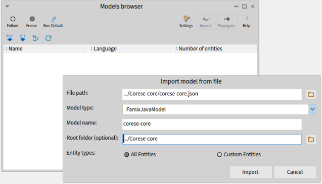
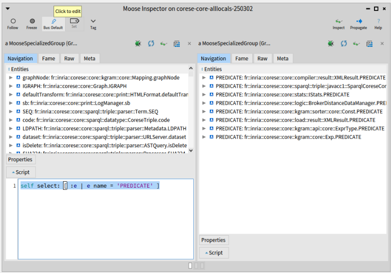
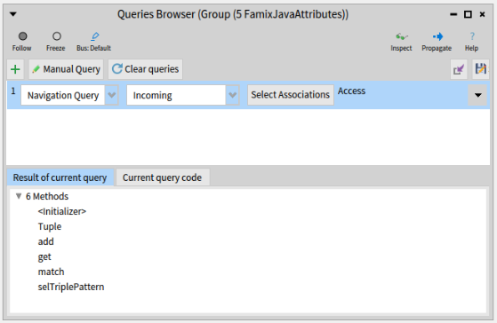
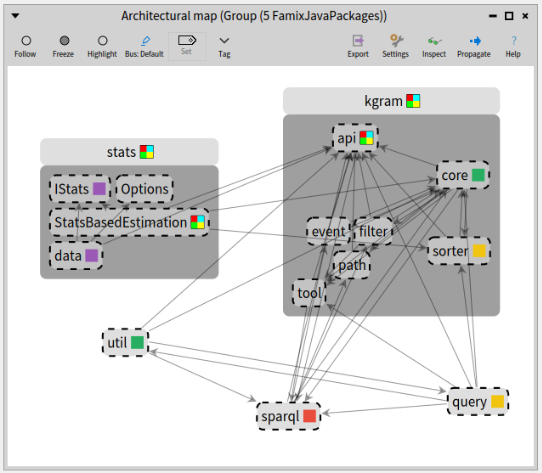

## A real example on using tags

Tags can be a powerful tool to visualize things on legacy software and perform analyses.
For example, tags can be used to create virtual entities and see how they "interact" with the real entities of the system analyzed.
In the article [Decomposing God Classes at Siemens](https://rmod-files.lille.inria.fr/Team/Texts/Papers/Anq19a-ICSME-GodClass.pdf) we show how tags can be used to create virtual classes and see their dependencies to real classes.

In this post I will show another use of tags:  how they can materialize a concept and show its instantiation in a system.

The scenario is that of analysing Corese, a platform to "create, manipulate, parse, serialize, query, reason and validate RDF data."
Corese is an old software that dates back to the early days of Java.
Back then, enums did not exist in Java and a good way to implement them was to use a set of constants:
```java
	public static final int MONDAY = 1;
	public static final int TUESDAY = 2;
	public static final int WEDNESDAY = 3;
	public static final int THURSDAY = 4;
	public static final int FRIDAY = 5;
	public static final int SATURDAY = 6;
	public static final int SUNDAY = 7;
```
Those were the days!

As an effort to restructure and rationalize implementation, the developers of Corese wish to replace these sets of constants by real Java enums.
This is not something that can be done in any modern IDE even with the latest refactoring tool.

Let us see how Moose can help in the task.

### Where are the constants used?

For an analysis in Moose, we need a model of the system, and this starts with getting the source code ([https://github.com/corese-stack/corese-core](https://github.com/corese-stack/corese-core)).
The model is created using VerveineJ which can be run using docker:
```
docker run -rm -v src/main/java/:/src ghcr.io/evref-bl/verveinej:latest -alllocals -o corese-core.json
```
This will create a file `corese-core.json` in the directory `src/main/java/`.
The command to create the model as an option `-alllocals`.
This is because VerveineJ by default only tracks the uses of variables with non primitive type (variables containing objects).
Here the constants are integers and if we want to know where they are used, we need more details.

Let's import the model in Moose.
This can be done simply by dragging-and-dropping the file in Moose.




We will study the use of the constants defined in fr.inria.corese.core.stats.IStats:
```java
public interface IStats {

    public static final int NA = 0;
    public static final int SUBJECT = 1;
    public static final int PREDICATE = 2;
    public static final int OBJECT = 3;
    public static final int TRIPLE = 4;
[...]
```

To find where the constants are used, we need to find the representation of the constants in the model.
For this, we can inspect the model ("Inspect" button in the Model Browser) and look for all "Model Attributes".
The constants are *attributes* of the interface/class in which they are defined as shown in the listing above).
And they are *model attributes* because they are defined in the source code analysed, as opposed to `System.out` which may be used in the code but for which we don't have the source code.

We can then select all the model attributes named PREDICATE:
`select: [ :each | each name = 'PREDICATE']`.
*(note, the backslash (\\) before the square bracket ([) was added by the publishing tool and is not part of the code)*

Moose gives us 8 different definitions of PREDICATE (and 9 for OBJECT, and 10 for SUBJECT).
The one we are interested in is the 3rd in the list (`IStats.PREDICATE`).



Having the same constants defined multiple times is not good news for the analysis and for the developers.
But this kind of thing is fairly common in old systems which evolved during a long time in the hands of many developers.
Not all of them had a complete understanding of the system and each had different skills and programming habits.

Looking at the lists of definitions for the 3 main constants (SUBJECT, PREDICATE, OBJECT), we find that there are at least 5 different definitions of these constants:

- stats.IStats:
```java
    public static final int NA = 0;
    public static final int SUBJECT = 1;
    public static final int PREDICATE = 2;
    public static final int OBJECT = 3;
    public static final int TRIPLE = 4;
```
- kgram.sorter.core.Const:
```java
    public static final int ALL = 0;
    public static final int SUBJECT = 1;
    public static final int PREDICATE = 2;
    public static final int OBJECT = 3;
    public static final int TRIPLE = 4;
    public static final int NA = -1;
```
- compiler.result.XMLResult
```java
    private static final int TRIPLE = 9;
    private static final int SUBJECT = 10;
    private static final int PREDICATE = 11;
    private static final int OBJECT = 12;
```
- kgram.api.core.ExprType
 ```java
 
        public static int TRIPLE 	 = 88;
        public static int SUBJECT  = 89;
        public static int PREDICATE = 90;
        public static int OBJECT 	 = 91;
```
- kgram.core.Exp
```java
    public static final int ANY        = -1;
    public static final int SUBJECT    = 0;
    public static final int OBJECT     = 1;
    public static final int PREDICATE  = 2;
```

So now we need to track the uses of all these constants in the system to understand how they can be replaced by one enum.

Note: Don't close the Inspector window yet, we are going to need it soon.

### Tagging the constants and their uses

Moose can help us here with tags.
Tags are (as the name implies) just labels that can be attached to any entity in the model.
Additionally, tags have a color that will help us distinguish them in visualizations.

So let's tag our constants.
We will define 5 tags, one for each set of constants, that is to say one for each of the 5 classes that implement these constants.
You can choose whatever name and color you prefer for your tags, as long as you remember which is which.
Here I named the tags from the name of the classes that define each set of constant.


Now we want to tag all the constants in a set with the same tag.
Let's see how to do it for constants in `IStats`, the ones listed in the previous section and that were our initial focus.

We select the "IStats" tag in the Tag Browser and go back to the Inspector where we have a list of all definitions of PREDICATE.
If we click on the 3rd of these PREDICATE ("fr::inria::corese::core::stats::IStats.PREDICATE"), a new pane appears on the right, focusing on this attribute.
There, we can click on its "parentType", giving yet another pane.
(The following screenshot shows the inspector right before we click on "parentType").

.

The right pane now focuses on the `IStats` Java interface.
We can click on "attributes" to get the list of attributes it defines (including PREDICATE from which we started).
There are 5 attributes which are the ones listed in the previous section.

So far so good.

To tag these attributes, we will "propagate" them (toolbar button of the Inspector on the right) to all tools that are in "Follow" mode.
Note that if you minimized the Tag Browser at some point, it will be in "Freeze" mode like in the screenshot above.
You need to put it back in "Follow" (radio toolbar button on the left) before propagating the list of constants.

Once propagated, the list appears in the center pane of the Tag Browser and you can pass it to the right pane with the "\>\>\>" button.
Doing this will effectively tag the entities with the selected tag.

We now have tagged these 5 constants with the "IStats" tag.
Ideally we want to find also the usage of these constants.
So we would like to also tag the methods that use these constants.

For this you can open a Query Browser, it will start with the same list of 5 attributes that we just propagated.
We can create a "Navigation query" and ask for all the "incoming" "accesses" to these attributes as shown below.
The result is a list of 6 methods.



We can now propagate these 6 methods and they will appear in the Tag Browser.
We tag them with the same tag as the attributes themselves.

You can repeat the same operations for the 5 sets of constants listed above and the 5 different tags.

### Visualizing the result

All this tagging was to be able to visualize where each set of constant is defined and, most importantly, used.
We now turn to the "Architectural Map" which is a fine tool to visualize tags.
for example, we could show all the top level packages of Corese and the Architectural Map will give visual clues on which ones contain tagged entities, and what tags.
The Architectural Map allows to expand the content of entities which will allow us to deep dive into each package containing tagged entities to understand where exactly the entities is used or defined.

To select all the top level packages, we go back one last time to the Inspector to the very first pane on the left (you may also "Inspect" again the model to open a new Inspector).
We select the "Model packages" and enter this query in the "script" at the bottom: `self select: [ :each | each parentPackage isNotNil and: [each parentPackage name = 'core'] ]`.
*(Again, ignore the backslashes)*

The result is a list of 23 packages that we can propagate.
Finally we open an Architectural Map that will start with the 23 packages that we just propagated.

In the following screenchot, I restricted the Architectural Map to the only 5 packages that do use our tags: "stats", "kgram", "util", "sparql", and "query".
This makes it easier to see the results here.
I also expanded "kgram" that is small and contains different tags.



The single-color square, on the right of each package name, shows that it contains entities having one uniq tag (of this color).
In our case it means that it contains the constants and methods accessing them, all with the same tag.
For example, "core" and "util" packages contain entities tagged with only the green tag (which corresponds to the `kgram.core.Exp` class as previously shown in the Tag Browser screenshot).

When the square is multicolored, it means it contains entities with different tags.
For example, we see that the package "kgram" contains at least the green ("Exp") and the yellow ("Const") tags.

Note that in this particular case, I added another tag for class `kgram.api.core.Node` which has its own definition of the OBJECT constant.
I wanted to see where it was used also.
This is the reason for the multicolored square of class `StatsBasedEstimation`, in package "stats", which uses OBJECT from `Node` and the other constants from `IStats`.

In the end, the visualization allows to conclude that each package sticks pretty much to its own definition of the constants which is rather reassuring.
It also shows where one would have to look if we were to replace the constant by a real enum.

This is not the end of it however because the constant values used in these methods can be passed off to other methods as argument.
Here Famix alone (the meta-model used in Moose by default) can no longer help us to follow the flow of usage of the constants because they are just integer being passed around.
For a finer analysis, a complete AST model should be used.
This could be done with the FAST meta-model (Famix-AST), but it is another story that falls outside the scope of this blog-post.

See you later.
