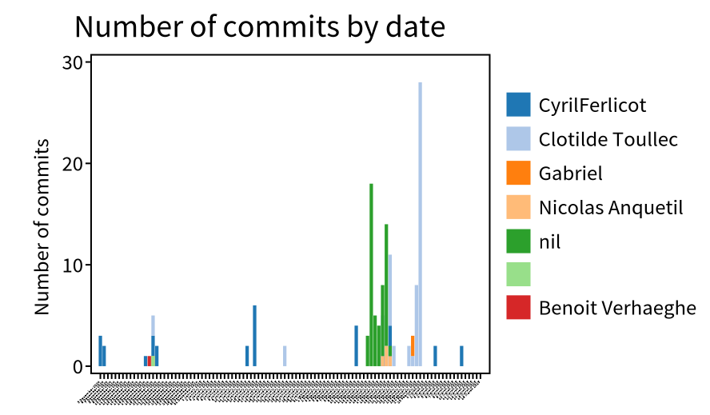

When it comes to understand a software system, we are often focusing on the software artifact itself.
What are the classes? How they are connected with each other?

In addition to this analysis of the system, it can be interesting to explore how the system evolves through time.
To do so, we can exploit its git history.
In Moose, we developed the project [GitProjectHealth](/users/git-project-health/getting-started-with-gitproject-health/) that enables the analysis of git history for projects hosted by GitHub, GitLab, or BitBucket.
The project also comes with a set of metrics one could use directly.

## First use of GitProjectHealth

GitProjectHealth is available in the last version of Moose, it can be easily installed using a Metacello script in a playground.

```smalltalk
Metacello new
  repository: 'github://moosetechnology/GitProjectHealth:main/src';
  baseline: 'GitLabHealth';
  onConflict: [ :ex | ex useIncoming ];
  onUpgrade: [ :ex | ex useIncoming ];
  onDowngrade: [ :ex | ex useLoaded ];
  load
```

## Example on Famix

For this first blog post, we will experiment GitProjectHealth on the [Famix](https://github.com/moosetechnology/Famix) project.
Since this project is a GitHub project, we first create a [GitHub token](https://github.com/settings/tokens) that will give GitProjectHealth the necessary authorization.

Then, we import the moosetechnology group (that hosts the Famix project).

```smalltalk
glhModel := GLHModel new.

githubImporter := GithubModelImporter new
  glhModel: glhModel;
  privateToken: '<private token>';
  yourself.

githubImporter withCommitsSince: (Date today - 100 days).
group := githubImporter importGroup: 'moosetechnology'.
```

This first step allows us to get first information on projects.
For instance, by inspecting the group, we can select the "Group quality" view and see the group projects and the last status of their pipelines.


Then, by navigating to the Famix project and *its repository*, you can view the Commits History.

.

It is also possible to explore the recent commit distribution by date and author

.

In this visualization, we discover that the most recent contributors are "Clotilde Toullec" and "CyrilFerlicot".
The *"nil"* refers to a commit authors that did not fill GitHub with their email. It is *anquetil* (probably the same person as "Nicolas Anquetil").
The square without name is probably someone that did not fill correctly the local git config for username.

## Who modified my code? - code churn

A popular metric when looking at git history is the code churn.
Code churn refer to edit of code introduced in the past.
It corresponds to the percentage of code introduced in a commit and then modified in other comments during a time period (e.g in the next week).
However many code churn definitions exit.

The first step is thus to discover what commits modified my code.
To do so, we implemented in GitProjectHealth information about diff in commit.

To extract this information, we first ask GitProjectHealth to extract more information for the commits of the famix project.

```smalltalk
famix := group projects detect: [ :project | project name = 'Famix' ].

"I want to go deeper in analysis for famix repository, so I complete commit import of this project"
githubImporter withCommitDiffs: true.
famix repository commits do: [ :commit | githubImporter completeImportedCommit: commit ].
```

Then, when inspecting a commit, it is possible to switch to the "Commits tree" view.


Here how to read to above example

- The orange square "Remove TClassWithVisibility..." is the inspected commit.
- The gray square is the parent commit of the selected ones.
- The red squares are subsequent commits that modify at least one file in common with the inspected commit
- The green squares are commits that modifies other part of the code

Based on this example, we see that *Clotilde Toullec* modifies code introduced in selected commits in three next commits.
Two are Merged Pull Request.
This can represent linked work or at least actions on the same module of the application.

*Can we go deeper in the analysis?*

## Connect GitProjectHealth

It is possible to go even deeper in the analysis by connecting GitProjectHealth with other analysis.
This is possible by [connecting metamodels](/developers/create-new-metamodel.md#introducing-submetamodels).
For instance, it is possible to link GitProjectHealth with Jira system, of Famix models.
You can look at the first general documentation, or stay tune for the next blog post about GitProjectHealth!
