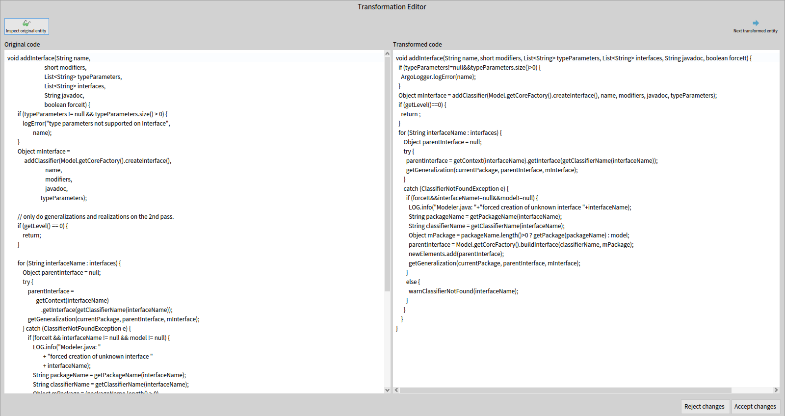
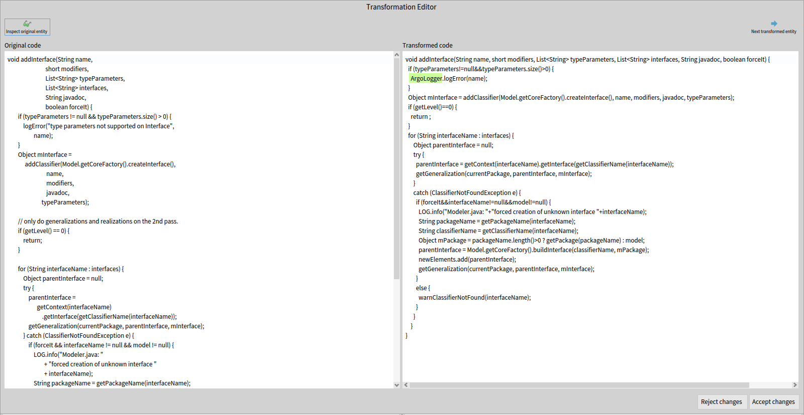
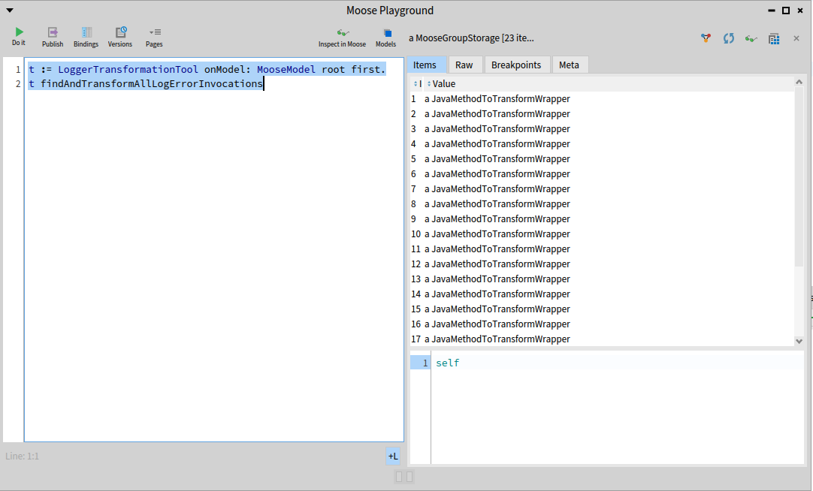

Once again, let me welcome you to the final blog post in those three blog posts about code transformations! During the [first blog](https://modularmoose.org/blog/2024-04-01-transformation-first/) post, we used queries and tools to locate the entities we seek to transform, before implementing the actual transformation logic in the [second blog](https://modularmoose.org/blog/2024-04-14-transformation-second/) post.

In this third post, we will use a visualisation window allowing us to check the source code of our entity before and after a transformation, and finally apply those transformation on the actual source files, therefore transposing this transformation from Moose to your actual software!

We are still following the scenario presented in the previous blog posts, on our use case, ArgoUML. In this system three classes define and use a method named `logError`. 
A class `ArgoLogger` has been defined that contains a static method `logError`.

The transformation task is to add a receiver node to each `logError` method invocation so that the method called is now `ArgoLogger.logError`().

## Preface

As this blog post follows what was discussed and built in the first one of the series, a lot of information (how to build the image and model used for our use case, but also the use case itself) is provided in the previous posts. 

If you haven't read it, or if you forgot the content of the post, it is recommended to go back to it, as it will not be repeated in this post.

## Tools to import

In this final blog post, we do not have any new tools to import. As long as you still have `FAST-Java-Tools`, `Carrefour` and `Motion` from the two previous posts, you should have no problem following this blogpost!

## A first look on our transformation

At this point, we now have in our tool modified FAST trees of the methods we need to transform, all encapsulated in wrapper objects to save all the necessary information to complete the transformation, and apply it where needed.
Hovewer, before that, you may feel the need to check the transformation produced by your tool. 

To do so, we can use the `TransformationEditor` tool, a dialog window able to display the code before and after our code transformation, along with some nice and practical features to fulfill this task.

First, let's add a new method to our transformation tool; `displayTransformationOfMethod: aMethodWrapper`. We will call this new method in the already existing method `transformMethod: aJavaMethodWrapper`, as shown here :

```smalltalk
transformMethod: aJavaMethodWrapper

	| methodInvocationNode codeEditor |
	methodInvocationNode := self motionQueryForFastMethod:
		                        aJavaMethodWrapper transformedFastMethod.

	methodInvocationNode receiver: self createNewReceiverNode.

	aJavaMethodWrapper addTransformedFastNode:
		methodInvocationNode receiver.

	codeEditor := self displayTransformationOfMethod:
		                     aJavaMethodWrapper.
```


```smalltalk
displayTransformationOfMethod: aMethodWrapper

	| exportVisitor transformedCode codeEditor |
	exportVisitor := FASTJavaExporttVisitor new.

	transformedCode := exportVisitor export:
		                   aMethodWrapper transformedFastMethod.

	codeEditor := TransformationEditor
		              openForOriginalText:
		              aMethodWrapper originalFastMethod sourceText
		              transformed: transformedCode
		              originalEntity: aMethodWrapper famixMethod.

	^ codeEditor
```

As you can notice in this new method, we also call another tool, the `FASTJavaExportVisitor`. This visitor will allow us to convert a FAST Java tree to a string giving us the source code of our method after transformation. 

Coupling the result of using this tool to this class method of the `TransformationEditor` class will display such results : 



In this new window, you can find on the left the original source code of the entity, before any transformation. And on the right, you can find the source code of the same entity, after applying the transformation. 

The first thing we can notice, is how radically different the two methods look at a glance. Hovewer, everything is the same (to the exception of the new ArgoLogger class added with our transformation). They look different because the transformed code is generated from the transformed FAST tree, and the export visitor exports that code with its own formating.

The source code after transformation (on the right pane) is also editable, meaning that you can manually add code to the entity if it is necessary for any reason. Do be careful that the code is syntaxically correct however, as there is no checks (syntax, compilation) on this code in Moose.

## Adding highlights

We now have a way to view our transformation, but as it is, it is still tough to view properly where are the changes and what they are. And in this example, the transformation is very basic! If the transformation was spread throughout a class rather than a method, or if the transformation was simply more complex, then the tool would fail as a means to review the changes.

But of course, we can fix that. :wink:

To do so, we will modify the new method `displayTransformationOfMethod:` and use a subclass of the export visitor previously used; `FASTJavaExportAndHiglightVisitor`.

```smalltalk
displayTransformationOfMethod: aMethodWrapper

	| exportVisitor transformedCode codeEditor |
	exportVisitor := FASTJavaExportAndHighlightVisitor new.
	exportVisitor entitiesToHighlight:
		aMethodWrapper transformedFastNodes.

	transformedCode := exportVisitor export:
		                   aMethodWrapper transformedFastMethod.

	codeEditor := TransformationEditor
		              openForOriginalText:
		              aMethodWrapper originalFastMethod sourceText
		              transformed: transformedCode
		              removedHighlights: OrderedCollection new
		              addedHighlights: exportVisitor highlights
		              originalEntity: aMethodWrapper famixMethod.

	^ codeEditor
```

Our first edit simply calls the method wrapper to add a "transformed node", a FAST node added during the transformation. In a similar fashion, you can add an "original node", a FAST node removed during the transformation (no such node exists in our example, so we don't use that feature).

This new transformed node is used in our second edit, where we give the transformed nodes collection to the new visitor tool that we are going to use. 

This tool behaves just like the original exporter tool, except when it encounters a node present in the transformed nodes list. In this case, the tool save an interval corresponding to the `startPos` and `endPos` of the node, to know precisely its position in the generated string.

This allows our editing window to apply an highlight on this interval, therefore showing only the nodes added in the transformation for the user to easily review the work of their transformation tool.

To use this feature in the editing window, simply do as done in the edit, giving the tool a collection of interval for the `removedHighlights` and / or `addedHighlights` slots.



## Applying our changes on the source files 

Now that we reviewed and accepted the transformation on our entities, only one step remains. To apply those code changes on the actual source code of the modeled software, thereby completing the transformation task.

Once again, we have a tool ready for this need, in the form of the `TransformationApplyerOnSourceAnchor` class. Let's do a final edit on our method `transformSourceCodeOfMethod` to add it:

```smalltalk
transformSourceCodeOfMethod: aMethodWrapper

	| exportVisitor transformedCode codeEditor |
	exportVisitor := FASTJavaExportAndHighlightVisitor new.
	exportVisitor entitiesToHighlight:
		aMethodWrapper transformedFastNodes.

	transformedCode := exportVisitor export:
		                   aMethodWrapper transformedFastMethod.

	codeEditor := TransformationEditor
		              openForOriginalText:
		              aMethodWrapper originalFastMethod sourceText
		              transformed: transformedCode
		              removedHighlights: OrderedCollection new
		              addedHighlights: exportVisitor highlights
		              originalEntity: aMethodWrapper famixMethod.

	codeEditor isOk ifTrue: [
		| tool |
		tool := TransformationApplyerOnSourceAnchor new.
		tool
			transformMethod: aMethodWrapper famixMethod
			withNewSource: codeEditor fetchEditedCode ]
```

As you can see, all this tool needs in our context is a method and the new source code as a String to complete the operation. You can also see that we called the method `fetchEditedCode` on our code editor window, which returns the String present in the right window of said editor. Using this method ensures that you get the right data, even if the code was manually edited during its review.

Once this tool has made its job and transformed the source code of your software, do keep in mind that the model of that software is no longer up to date with the source. This means that any analysis that you could run on this model could be flawed, so it is recommended to regularly replace that model with a new one, based from the source after it has been transformed.

Hovewer, the model is slightly updated by the tool after each transformation applyed. The values of `startPos` and `endPos` on the source anchor of entities within the file which received a transformation. This means that their source code will still be properly fetched by Moose whenever you need it. 

For example, if your transformation tool relies mostly on the FAST models, this allows you to apply some transformations on several entities even if those are located in the same file without having to worry too much about the order in which you make those transformations.

## Try it yourself!

This concludes our blog post series about code transformation! 

We now have a tool managing every step of the way to complete a specific transformation case, from finding the necessary informations needed for the transformation, transforming a FAST model and using those transformed FAST models to view, edit and apply the transformations to the source code.

Just like with the two other posts, feel free to now try the tool and methods that we created here in a Playground and experiment with the results, or the methods themselves!

```smalltalk
t := LoggerTransformationTool onModel: MooseModel root first.
t findAndTransformAllLogErrorInvocations 
```



The whole source code that was written on the three blog posts is still available on that [repository](https://github.com/RomainDeg/Moose-BlogPost-Transformation).

## Conclusion

Through the use of tools to query and search through FAST models, transform said models, before generating, reviewing and applying the new code on the source files, we managed to build a fully functionnal and semi-automatic transformation tool for our use case!

This use case was a rather small example.
A real transformation in a software would need more queries and FAST edits.
But the only real difference would be the scale. Using the methodology and tools in the same way that they were used in this blog post would be enough to apply to many use cases out there. :smile:

