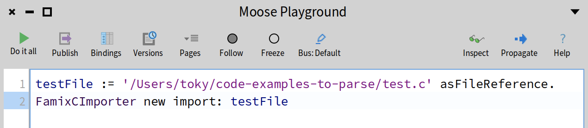
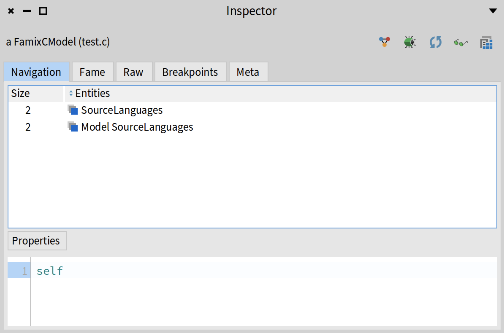
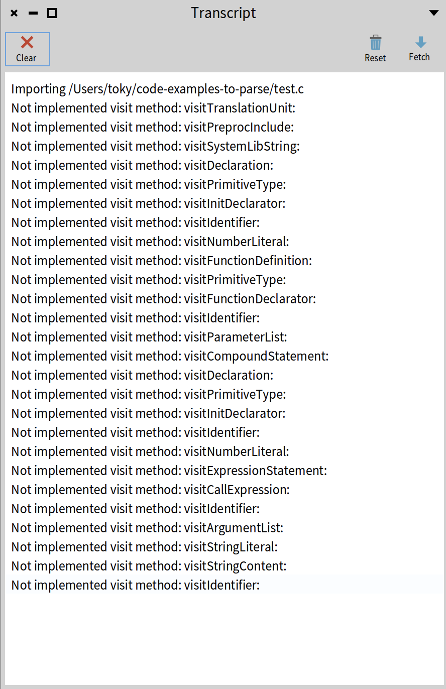
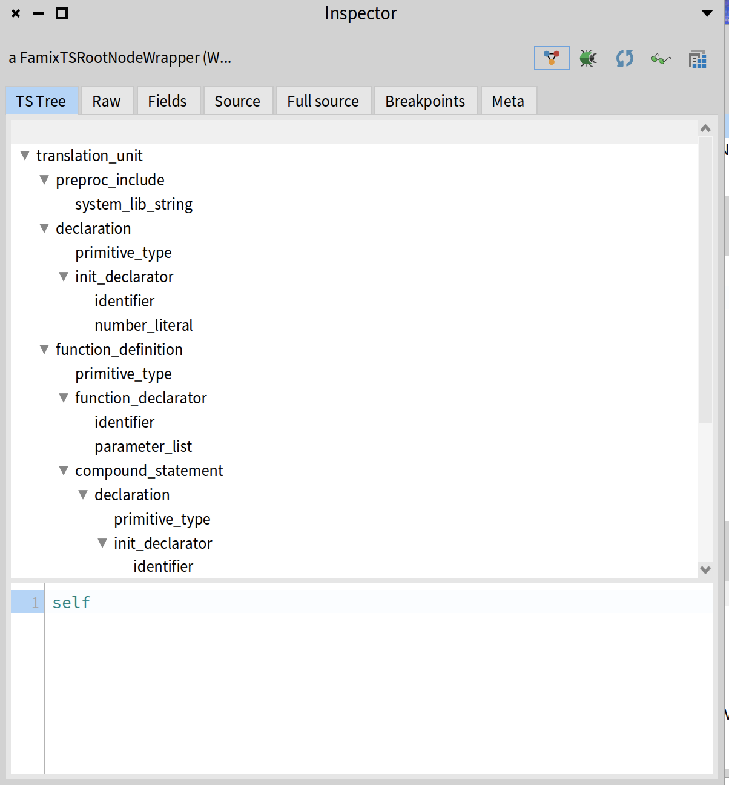
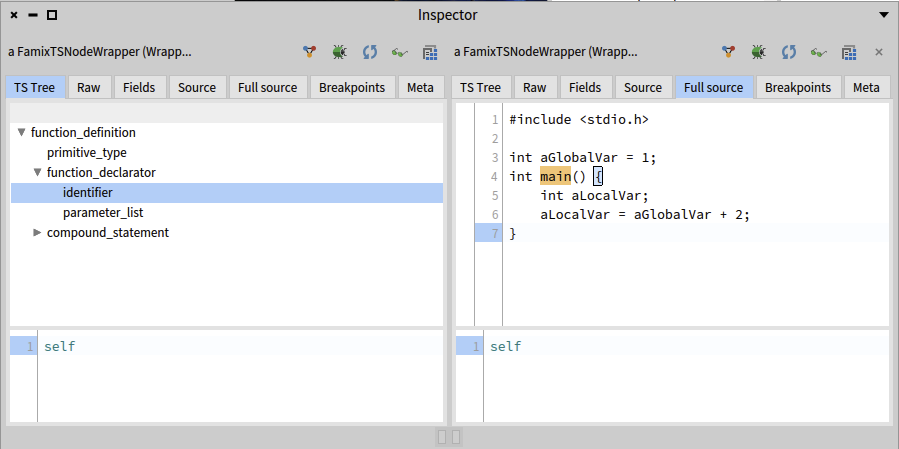
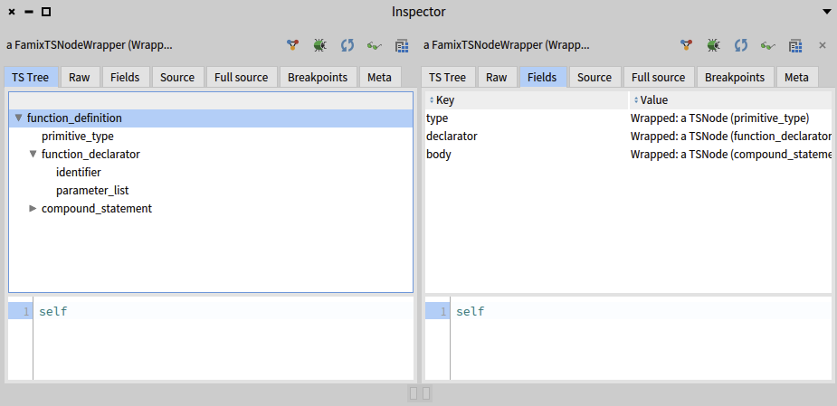
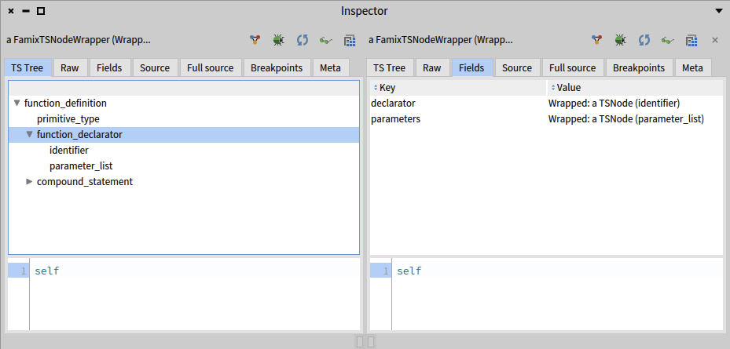

---
authors:
  - tokyRT
title: Building a Famix importer with TreeSitterFamixIntegration
date: 2025-05-11
lastUpdated: 2025-05-11
tags:
  - infrastructure
draft: true
---

Analyzing source code starts with parsing and for this you need _semantic understanding_ of how symbols in the code relate to each other.
In this post, we’ll walk through how to build a **C code importer** using the **[TreeSitterFamixIntegration](https://github.com/moosetechnology/TreeSitterFamixIntegration)** framework.

:::note[Important]
The goal of this blog post is to provide a starting point on how to use the TreeSitterFamixIntegration framework to build a Famix importer.
:::

## Prerequisites
- Basic knowledge of Famix and Moose.
- Basic knowledge of what [Tree-sitter](https://tree-sitter.github.io/tree-sitter/) is.
- Familiarity with the Visitor design pattern. You can check [this blog post](https://modularmoose.org/blog/2025-03-26-visitor-external-grammar/) which explains the Visitor pattern in the context of tree-sitter ASTs.
## Overview of TreeSitterFamixIntegration

The TreeSitterFamixIntegration stack provides tools to ease the development of Famix importers using tree-sitter. 
This package offers some great features for parsing such as (but not limited to):

- Useful methods for source management (getting source text, positions, setting sourceAnchor of a famix entity).
- Error handling to help catch and report parsing issues
- a better TreeSitter node inspector (which is very helpful when debugging)
- Utility to efficiently import and attach single-line and multi-line comments to their corresponding entities.
- Context tracking for symbol scope (no more context push and pop 😁)

There is a detailed [documentation](https://github.com/moosetechnology/TreeSitterFamixIntegration/blob/main/resources/docs/UserDocumentation.md) you can check that explain every features.

## Step 1: Setting up our environment
After creating a new Moose image, let's start by loading the necessary packages. 

### The C Metamodel

First, we need to load the C metamodel. This metamodel provides the Famix classes that represent C entities such as functions, structs, variables, etc.

```smalltalk
Metacello new
    baseline: 'FamixCpp';
    repository: 'github://moosetechnology/Famix-Cpp:main';
    load
```

:::tip[Tip]
You can directly load the C metamodel from the Moose toolbar by going to the **Library** menu: *Library Famix > Load additional modules > Load Famix-Cpp*
:::

### The TreeSitterFamixIntegration project
Next, we need to load the TreeSitterFamixIntegration project. 
It provides both pharo-tree-sitter and SRSymbolResolver.

```smalltalk
 Metacello new
    githubUser: 'moosetechnology' project: 'TreeSitterFamixIntegration' commitish: 'main' path: 'src';
    baseline: 'TreeSitterFamixIntegration';
    load
```

### The project structure
Now that we have the necessary packages loaded, we can create our C importer. 

Create a new package named `Famix-C-Importer`. 
The minimum classes we will have to create inside are:
- `FamixCimporter`: This class will be responsible for importing C files and parsing them using Tree-sitter.
- `FamixCVisitor`: This class will walk through the parsed C syntax tree and create Famix entities.
- `FamixCCommentVisitor`: This class will handle comments and attach them to the corresponding Famix entities.

### The `FamixCimporter` class
The `FamixCimporter` class is the entry point for our importer. It will handle the parsing of C files into Abstract Syntax Trees (AST).

This class will inherit from `FamixTSAbstractImporter` (defined in the TreeSitterFamixIntegration project), which provides the necessary methods for importing and parsing C files using Tree-sitter.

```smalltalk
FamixTSAbstractImporter << #FamixCImporter
	slots: {};
	package: 'Famix-C-Importer'
```

Now, let's override some methods to set up our importer:
#### 1. `treeSitterLanguage` method

```smalltalk
FamixCImporter >> treeSitterLanguage
    "Should return a TreeSitter language such as  TSLanguage python"

	^ TSLanguage cLang
```
This method returns the Tree-sitter language we want to use for parsing. In this case, we are using the C language. You can find the available languages in the `Pharo-Tree-Sitter` package.

#### 2. `visitorClass` method

```smalltalk
FamixCImporter >> visitorClass

    ^ FamixCVisitor
```
It returns the visitor class that will walk through the parsed syntax tree and create Famix entities. We will define this class later.

#### 3. `importFileReference:` method

```smalltalk
FamixCImporter >> importFileReference: aFileReference

	aFileReference isFile
		ifTrue: [
			(self isCFile: aFileReference) ifFalse: [ ^ self ].
			self importFile: aFileReference
		]
		ifFalse: [
			aFileReference children do: [ :each | 
			self importFileReference: each 
		].
	]
```

This method calls `importFile:` on all C files recursively found in a directory.
We will add more logic to this method later but for now, it serves as a starting point for our importer.

The `isCFile:` method checks if the file has a `.c` or `.h` extension.

```smalltalk
FamixCImporter >> isCFile: aFileReferencemon
    ^ #( 'c' 'h' ) includes: aFileReference extension
```

The `importFile:` method is defined in the `FamixTSAbstractImporter` class (provided by the TreeSitter-Famix-Integration project).
It parses the file content to create an AST and then passes the visitor (the `FamixCVisitor` that we previously defined) to walk through the AST.

### The `FamixCVisitor` class
The `FamixCVisitor` class is responsible for walking through the parsed AST and creating Famix entities. It will inherit from `FamixTSAbstractVisitor`, which provides the necessary methods for visiting Tree-sitter nodes.

```smalltalk
FamixTSAbstractVisitor << #FamixCVisitor
    slots: {};
    package: 'Famix-C-Importer'
```

For this class, we will just need to override one method:

#### `modelClass` method

```smalltalk
FamixCVisitor >> modelClass

    ^ FamixCModel
```

It returns the Famix metamodel class that will be used to create Famix entities. In this case, we are using `FamixCModel` which is in the `Famix-Cpp` package. 

### Let's test our importer so far

Now that we have our importer and visitor classes set up, we can already test it.
To test our importer, we can create a simple C file and import it using the `FamixCImporter` class.

```c
// test.c
#include <stdio.h>

int aGlobalVar = 1;
int main() {
	int aLocalVar;
	aLocalVar = aGlobalVar + 2;
}
```

To import this file, we can use the following code in the Playground (cmd + O + P to open it):



Before running the above code, open the Transcript to see the logs (cmd + O + T to open it). 

Then select all the code and run it by inspecting it (cmd + I or click the "Inspect" button). You will get something similar to this.



The above screenshot shows what is inside our model. We can see that there is pretty much nothing there yet apart from the SourceLanguages which is added by default by TreeSitterFamixIntegration. 


Now if we look at the Transcript, we can see that the importer has imported the file but we didn't implement the visitor methods yet for every node in the AST, so no Famix entities were created.




:::note[Note]
The way those methods are named is `visitNodeType: aNode` where `NodeType` is the type of the node in the AST. For example, for a function declaration, it would be `visitFunctionDeclaration: aNode`.
This [blog post](https://modularmoose.org/blog/2025-03-26-visitor-external-grammar/) explains one way to create automatically these methods.
:::

If you want to inspect the corresponding AST of our test file, you can do something similar to what is in [this other blog post](https://modularmoose.org/blog/2025-03-25-tree-sitter/#a-first-pharo-ast) on tree-sitter.




## Step 2: Our first Famix entities
In this section we are going to see some examples of visiting methods for creating compilation unit and function entities.


### CompilationUnit entities

Let's go back to our `FamixCImporter` class and from there we will create a CompilationUnit and HeaderFile entities. We need to do that there because we have to check if the file is a header file or a source file.

```diff lang="smalltalk"
FamixCImporter >> importFileReference: aFileReference
    aFileReference isFile
		ifTrue: [
				| fileEntity |
				(self isCFile: aFileReference) ifFalse: [ ^ self ].
				fileEntity := aFileReference extension = 'c'
					              ifTrue: [
+					               visitor model newCompilationUnitNamed: aFileReference basename. 
									]
					              ifFalse: [
+					               visitor model newHeaderFileNamed: aFileReference basename. 
									].

				visitor
					useCurrentEntity: fileEntity
					during: [ self importFile: aFileReference ] ]
				
		ifFalse: [
				aFileReference children do: [ :each |
					self importFileReference: each 
                    ].

				^ self ]
```

We use the <mark>useCurrentEntity:during:</mark> to provide a context for the visitor. This is same as pushing the `fileEntity` to a context, visit children and then popping it from the context. And it will set the current entity to the `fileEntity`.


Now try importing a whole directory containing C files. You should see that the importer creates a `FamixCHeaderFile` for each header file and a `FamixCCompilationUnit` for each source file. 

### Source Anchors

To set the source anchor for any Famix entity, we can use the <mark>setSourceAnchor: aFamixEntity from: aTSNode</mark> method provided by the `FamixTSAbstractVisitor` class. This method takes a Famix entity and a Tree-sitter node.

We can use it to set the source anchor for our `fileEntity` . Go to `visitTranslationUnit:` in the `FamixCVisitor` class and add the following code:

```diff lang="smalltalk"
FamixCVisitor >> visitTranslationUnit: aNode
+	self setSourceAnchor: self currentEntity from: aNode.
	self visitChildren: aNode "for not cutting the traversal"
```

:::note[Note]
The `self currentEntity` returns the entity that is currently being visited by the visitor (i.e at the top of the stack). In this case, it will return the `fileEntity` that we pushed to the context in the `importFileReference:` method by using the `useCurrentEntity:during:` method. 
:::

Now if we import our `test.c` file again, we will see that the `CompilationUnit` entity has a source anchor.

### Function entities

Next, we will create `FamixCFunction` entities for each function declaration in the C file. We will do this in the `visitFunctionDefinition:` method of the `FamixCVisitor` class.

But first we need to know where the function name is located to create the `FamixCFunction` entity. Create the method and put a `halt` there to inspect the node.

```diff lang="smalltalk"
visitFunctionDefinition: aNode
+	self halt.
	self visitChildren: aNode.
```




If we look at the function definition node, we can see that the function name is in the identifier node, which is a child of the function declarator node.

To get that name, there are two ways:
- visit the function_declarator until the identifier returns its name using `self visit: aNode`
- get it by child field name using `aNode _fieldName` that returns the child node with the given field name. And you don't need to implement the `_fieldName` method because it is already handled by the framework.

For simplicity, and to show other available features in the framework, we will use the second way. 

Let's inspect the function definition node to see what fields it has. 



So if we do `aNode _declarator` it will return the function declarator node 


 And if we do `aNode _declarator` from the function_declarator it will give us the identifier that we want.
```

:::note[Note]
the `sourceText` will return the text of the node, which is the function name in this case.
:::


Now we can create the function entity and set its name and source anchor.

```smalltalk
visitFunctionDefinition: aNode

	| declaratorNode identifierNode functionName entity |

	declaratorNode := aNode _declarator.
	identifierNode := declaratorNode _declarator.
	functionName := identifierNode sourceText.


	entity := (model newFunctionNamed: functionName) functionOwner: self currentEntity.

	self setSourceAnchor: entity from: aNode.

	self useCurrentEntity: entity during: [ self visitChildren: aNode ]
```

The `self currentEntity` returns the compilation unit entity which is the parent of the function entity.

And before visiting the children, we set the current entity to the newly created function entity using `useCurrentEntity:during:`. This will allow us to create other entities that are related to this function, such as parameters and local variables.


### Local and Global Variables

The difference between local and global variables is that local variables are declared inside a function, while global variables are declared outside any function.

#### Implementation

:::tip[Tip]  
Before visiting a node, check its fields by inspecting the node to know how to extract the needed information.
:::


To create the variable entities, we will create the `visitDeclaration:` method in the `FamixCVisitor` class. This method is called for each variable declaration in the C file.

```smalltalk
FamixCVisitor >> visitDeclaration: aNode
	"fields: type - declarator"

	| varName entity |
	
	self visit: aNode _type. 
	
	varName := self visit: aNode _declarator.

	entity := self currentEntity isFunction
		          ifTrue: [
				          (model newLocalVariableNamed: varName)
					          parentBehaviouralEntity: self currentEntity;
					          yourself ]
		          ifFalse: [
				          (model newGlobalVariableNamed: varName)
					          parentScope: self currentEntity;
					          yourself ].

	self setSourceAnchor: entity from: aNode.
```

The `visitDeclaration:` method does the following:

1. Visits the variable’s type. This will allow us to parse its type information.  
2. Retrieves the variable name by visiting the `declarator` field. If the variable is initialized, this will be an `init_declarator` node; otherwise, it will be an `identifier`. We should implement visit methods for both cases to extract the name correctly.  
```smalltalk
FamixCVisitor >> visitInitDeclarator: aNode
	"fields: declarator - value"

	self visit: aNode _value.
	^ self visit: aNode _declarator "variable name is in the declarator node"
```

```smalltalk
FamixCVisitor >> visitIdentifier: aNode

	^ aNode sourceText "returns the name of the variable"
```
3. Creates a variable entity, either a local variable or a global variable, depending on whether the current entity is a function or not.
4. Sets the source anchor for the variable entity using the `setSourceAnchor:from:` method.


## Step 3: Symbol resolution  

In this section, we will implement the symbol resolution for our C importer. This will allow us to resolve references to variables and functions in our C code.

As an example, we will resolve the reference to the local variable `aLocalVar` in the `main` function, which will be represented as a famix write access entity.


#### Implementation

##### **Create the write access entity**

To create the write access entity, we will implement the `visitAssignmentExpression:` method in the `FamixCVisitor` class. This method is called for each assignment expression.

```smalltalk

visitAssignmentExpression: aNode
	"fields: left - right"
	| access leftVarName |

	leftVarName := self visit: aNode _left.

	access := model newAccess accessor: self currentEntity;
					isWrite: true;
					yourself.
	
	self setSourceAnchor: access from: aNode.

```


### Using SRIdentifierResolvable

Add the following code to the `visitAssignmentExpression:` method to resolve the variable:
```diff lang="smalltalk"
visitAssignmentExpression: aNode
	"fields: left - right"
	| access leftVarName |

	leftVarName := self visit: aNode _left.

	access := model newAccess accessor: self currentEntity;
					isWrite: true;
					yourself.
	
	self setSourceAnchor: access from: aNode.

+	self
+		resolve: ((SRIdentifierResolvable identifier: leftVarName)
+					expectedKind: {
+						FamixCLocalVariable.
+						FamixCGlobalVariable };
+					yourself)
+
+		foundAction: [ :variable :currentEntity | access variable: variable ].

```

The <mark>resolve: aResolvable foundAction: aBlockClosure</mark> method is provided by the `FamixTSAbstractVisitor` class. 

It takes two arguments:
1. `aResolvable`: an instance of `SRIdentifierResolvable`. This resolvable is created with the identifier (the variable name) and the expected kinds of entities (in this case, either a local variable or a global variable). The `identifier:` method sets the identifier to resolve, and the `expectedKind:` method sets the expected kinds of entities that can be resolved.
2. `aBlockClosure`: a block that will be executed when the resolvable is resolved (we found the variable). In this case we set the variable of the access entity to the resolved variable.

See the [SRIdentifierResolvable documentation](https://github.com/jecisc/SymbolResolver/blob/main/resources/docs/UserDocumentation.md#sridentifierresovable)

### Custom resolver
The `SRIdentifierResolvable` is a generic resolver that can be used to resolve identifiers. However, in some cases, we may need to create a custom resolver to handle specific cases. In that case, we can create a class that inherits from `SRResolvable` and override the `resolveInScope:currentEntity:` method to implement our custom resolution logic.

For more information about the symbol resolver, you can check the [documentation](https://github.com/jecisc/SymbolResolver/blob/main/resources/docs/UserDocumentation.md#add-you-own-solver).
  

## Step 4: Parse comments
The TreeSitterFamixIntegration package provides a utility to parse comments and attach them to the corresponding Famix entities. This is done using the `FamixCCommentVisitor` class.

let's add some comments to our `test.c` file:
```c
// test.c
#include <stdio.h>

int aGlobalVar = 1;

/*
entry point of our programm
*/
int main() {
    int aLocalVar; // a local variable
    aLocalVar = aGlobalVar + 2;
}
```

#### Implementation
To parse comments, we will create the `FamixCCommentVisitor` class that will inherit from `FamixTSAbstractCommentVisitor`. And we just need to override the `visitNode:` method.

```smalltalk
FamixCCommentVisitor >> visitNode: aNode

	aNode type = #comment ifTrue: [
			(aNode sourceText beginsWith: '/*')
				ifTrue: [ self addMultilineCommentNode: aNode ]
				ifFalse: [ self addSingleLineCommentNode: aNode ] ].
			
	super visitNode: aNode
```

We use the `addMultilineCommentNode:` and `addSingleLineCommentNode:` methods provided by the `FamixTSAbstractCommentVisitor` class to add the comment to the model.

For a detailed explanation of how to use the comment visitor, you can check the [documentation](https://github.com/moosetechnology/TreeSitterFamixIntegration/blob/main/resources/docs/UserDocumentation.md#comment-importer-helper).

Last thing to do is to use the comment visitor somewhere in our importer. We can do that everytime we finish visiting every children of translation unit node.

```diff lang="smalltalk"
FamixCImporter >>visitTranslationUnit: aNode

	self setSourceAnchor: self currentEntity from: aNode.
	self visitChildren: aNode.
	
+	FamixCCommentVisitor visitor: self importCommentsOf: aNode 
```
We use the `visitor: aFamixVisitor importCommentsOf: aNode` method to import the comments of the translation unit node. 


## Summary
In this blog post, we have seen how to build a Famix importer for C code using the TreeSitterFamixIntegration framework. We have covered the following topics:
- Setting up the environment and creating the importer and visitor classes.
- Creating Famix entities for compilation units, functions, and variables.
- Implementing symbol resolution for local and global variables.
- Parsing comments and attaching them to the corresponding Famix entities.

This is just a starting point for building an importer with this stack. You have to implement more tests and methods to handle other entities. The TreeSitterFamixIntegration framework provides a lot of other utilities we didn't cover to help you with that.

## Useful links
- [TreeSitterFamixIntegration documentation](https://github.com/moosetechnology/TreeSitterFamixIntegration/blob/main/resources/docs/UserDocumentation.md)
- [Pharo-Tree-Sitter](https://github.com/Evref-BL/Pharo-Tree-Sitter)
- [Symbol Resolver documentation](https://github.com/jecisc/SymbolResolver/blob/main/resources/docs/UserDocumentation.md)
- [Creating an importer for an alien grammar
](https://modularmoose.org/blog/2025-03-26-visitor-external-grammar/)
