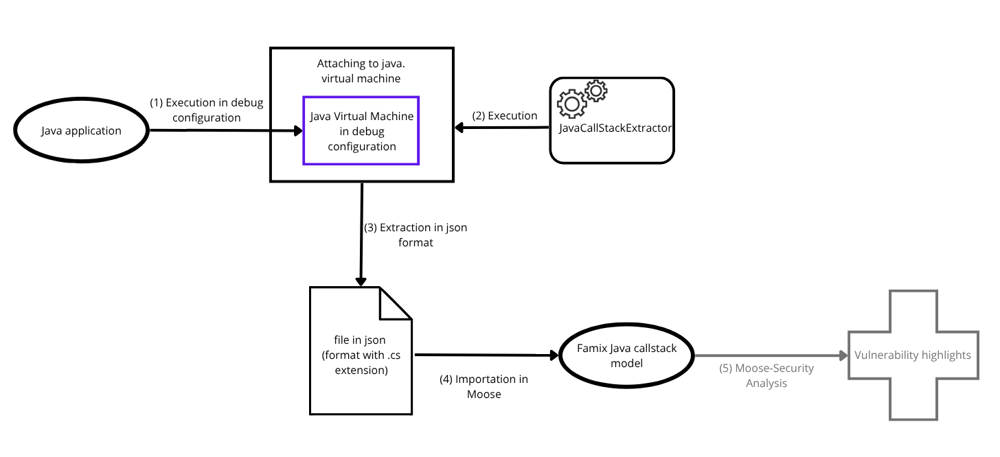
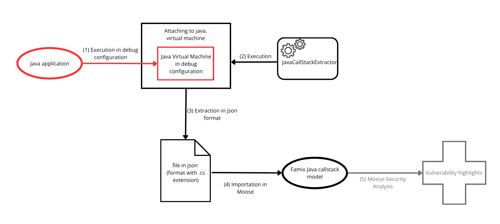
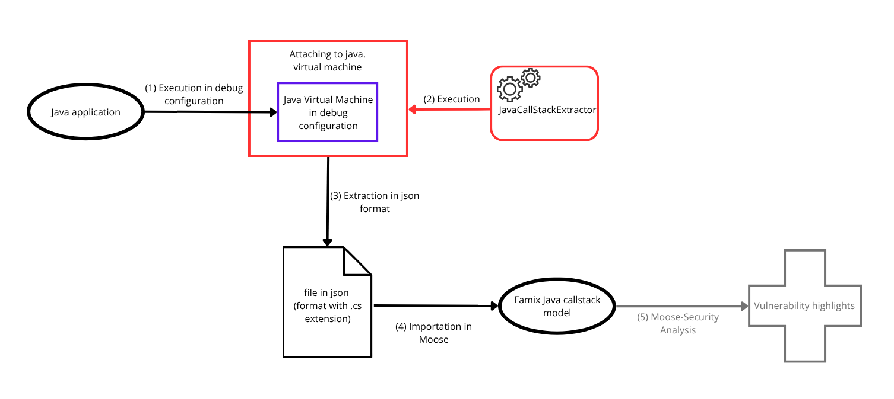
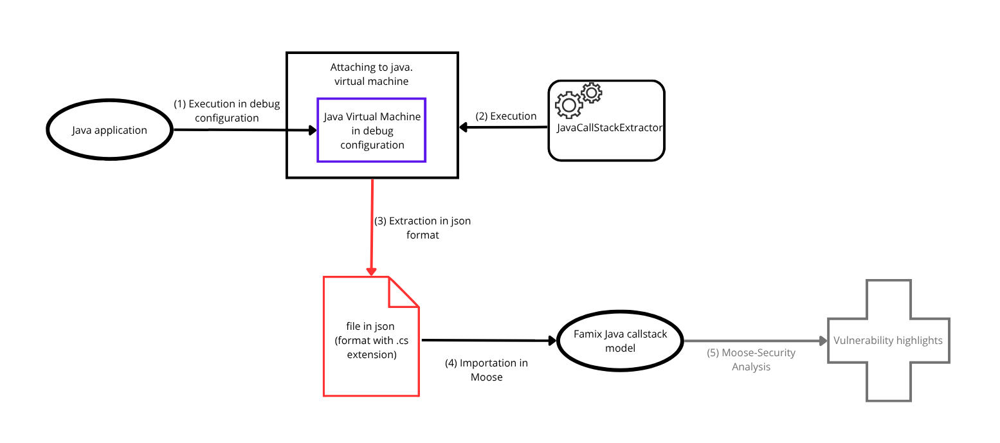
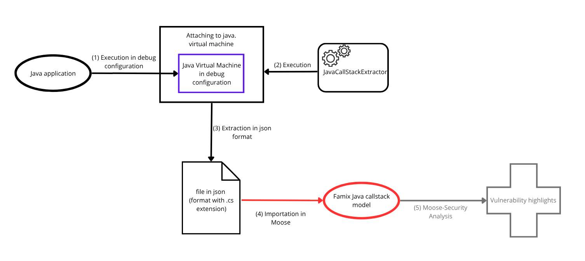

Until recently, Moose was limited to analyzing statically extracted Java models. While useful, static analysis often misses critical information that only appears during runtime execution. Many issues—especially security vulnerabilities stem from dynamic behavior that static models cannot capture.

One important application of dynamic analysis is in [Moose-Security](https://github.com/moosetechnology/Moose-Security), a toolset aimed at automating the detection of security flaws in Java applications. Through experimentation, we found that many vulnerabilities arise not from code structure, but from how the program behaves at runtime. Therefore, **capturing and analyzing dynamic execution traces**, particularly **call stacks**, offers powerful insights into how such vulnerabilities emerge and how they may be exploited.

To enable this capability, we rely on the **Java Debug Interface (JDI)** to observe the JVM at runtime. JDI allows us to hook into a running application and extract rich information such as method invocations and variable states, details that static models cannot provide.

By integrating this dynamic runtime data into Moose's metamodeling infrastructure, we unlock a new class of analyses. From profiling to debugging and security, the ability to work with live execution data enriches possible analyses.

# How to Get a Java Call Stack into Moose?

Here’s a summary of the complete process, broken down into clear steps:



> The final grayed-out step (Moose-Security analysis) is just one example of how this metamodel can be applied.


## How to extract a java call stack ?

To get started, clone [JavaCallStackExtractor](https://github.com/moosetechnology/JavaCallStackExtractor), the current tool for generating Moose-compatible call stack files.  
Refer to its README for up-to-date usage instructions and detailed guidance—it is your main reference.  


**What do you need?**  
You'll need two things:
1. A Java application to analyze
2. A clear idea of:
    - Where execution starts (typically it is main(String[]))
    - Where you want to pause execution to extract the call stack (a chosen method breakpoint)
   
The breakpoint depends entirely on what part of your program’s behavior you’re interested in.  
It could be a method that’s causing performance issues, triggering an error, or performing a critical task you want to inspect.

**How to configure JavaCallStackExtractor for your application?**  
Check the [configuration tutorial](https://github.com/moosetechnology/JavaCallStackExtractor/blob/main/utils/tutorials/config.md) all up-to-date information should be detailed here.

After configuration, run your application manually. (Note: In the future, JavaCallStackExtractor may handle this step automatically.)
 

Launch the main method of JavaCallStackExtractor as explained in the repository’s README. 
  

Upon execution, a call stack trace file (default: JDIOutput.cs) will be created in the project’s root directory. 
  


## How to import this call stack in Moose ?

Open a Moose image, then import the  [FamixCallStack](https://github.com/moosetechnology/FamixCallStack) project:
- Either by using Metacello (as explained in its README)
- Or by directly cloning and loading it with Iceberg

### So how to import your callstack?
**Option A : Programmatically**
```smalltalk
file := '/Path/To/.../JDIOutput.cs' asFileReference.

model := CallStackJsonReader import: file.
```
**Option B : Drag and drop**  
Just drag the file "JDIOutput.cs" and drop it on your Moose image (here the extension .cs is really important, without it the importation will fail)
  
  

## What are the possible uses to this metamodel?
One of the possible uses, is as already said, the use for security analysis.
The [Moose-Security](https://github.com/moosetechnology/Moose-Security) project provides APIs to detect security vulnerabilities in Java code. It as a goal to **automatically detect security flows in java applications**.

To achieve this, we aim to identify recurring **attack patterns**, that are common characteristics of observed on attacks call stacks. These patterns could help flag suspicious behavior in other applications.  
However, defining such patterns is difficult: attacks often depend on complex and variable runtime data. That’s where the call stack metamodel becomes invaluable. By analyzing a sample of call stacks from known attack scenarios, we can uncover **reproducible structures** or **behaviors** that might otherwise remain hidden in static models.  
These patterns could then be formalized and used to detect similar vulnerabilities automatically.
