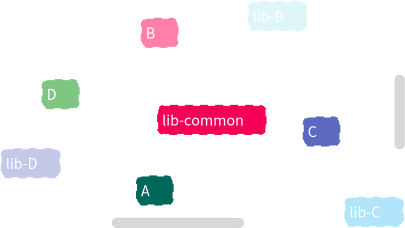

import { FileTree } from '@astrojs/starlight/components';
import { Steps } from '@astrojs/starlight/components';


In July, I had to analyze the dependencies between microservices for [Berger-Levrault](https://www.berger-levrault.com/).
To do so, I chose to use the Moose tool.

Here is the simple but effective process I followed.


## About the project structure

The backend I analyzed follows a common pattern.
In the git repository, there is a folder `api` containing the microservices, and a folder `lib` with resources for each microservice.
There is also an additional project called `lib-common`.

Thus, the microservice `home` is composed of a project named `api-home` and a project named `lib-home`.

<FileTree>

- src
  - api
    - api-home
        - src/
  - lib
    - lib-home
        - src/
    - lib-common/

</FileTree>


We wanted to check that dependencies were correctly implemented in the project:
- no `api` project should directly depend on another `api` (API calls are allowed, but not classic Java dependencies)
- each `api` project can depend on its equivalent `lib` project
- `lib` projects can depend on `lib-common`

Let's see how to perform this check with Moose.


## Loading the project

To perform the analysis, I used Moose and followed these steps:


<Steps>


1. [I installed the latest version of Moose](https://modularmoose.org/beginners/install-moose/).
2. I cloned the repository containing the backend to analyze.
3. I installed the project dependencies with:
    ```sh
    mvn clean install
    ```
4. I used [VerveineJ](https://modularmoose.org/developers/parsers/verveinej/) to generate a model of the code. To avoid version issues, I used the Docker version of VerveineJ, which gave me a *model.json* file:
    ```sh
    docker run -v /path/to/my/project:/src -v /home/badetitou/.m2/repository:/dependency  ghcr.io/evref-bl/verveinej:v3.3.1 -alllocals -anchor assoc -format json -o model.json
    ```
5. I loaded the model into a Moose 12 image by drag-and-dropping the *model.json* file into the running Moose image.

</Steps>


## Building a dependency visualization

Moose provides ready-to-use visualizations to represent dependencies. In my case, I chose to use the *Architectural map*.
This visualization presents the entities of the model (packages, classes, methods) as a tree and displays the associations between them (i.e., the dependencies).

I first asked this visualization to display all the classes. It works, but does not allow us to distinguish the different microservices.


The main problem is that too much information is displayed and we cannot see the microservices.
To fix this, I used Moose's tag feature.
A tag allows you to associate a color and a name to an entity.

So I tagged the classes of my system depending on their location in the repository.

To do this, in a Moose Playground, I used the following script (adapt it to your context 😉):


```smalltalk
model allTaggedEntities do: [ :entity | entity removeTags ].

((model allWithSubTypesOf: FamixJavaType) reject: [ :type | type sourceAnchor isNil ]) do: [ :class |
    class sourceAnchor ifNotNil: [ :sa |
        (sa fileName beginsWith: './services/api-A') ifTrue: [ class tagWithName: 'A' ].
        (sa fileName beginsWith: './services/api-B') ifTrue: [ class tagWithName: 'B' ].
        (sa fileName beginsWith: './services/api-C') ifTrue: [ class tagWithName: 'C' ].

        (sa fileName beginsWith: './libraries/lib-A') ifTrue: [ class tagWithName: 'lib-A' ].
        (sa fileName beginsWith: './libraries/lib-common') ifTrue: [ class tagWithName: 'lib-common' ].
        (sa fileName beginsWith: './libraries/lib-B') ifTrue: [ class tagWithName: 'lib-B' ].
        (sa fileName beginsWith: './libraries/lib-C') ifTrue: [ class tagWithName: 'lib-C' ].
    ]
].

(model allWithSubTypesOf: FamixJavaType) reject: [ :type | type tags isEmpty ]
```


:::note
In the Moose Playground, select all the lines and execute *Propagate* to send the result to the architectural map.
:::

The result is not perfect yet because entities are not grouped by tag.
To fix this, simply select the *tag to add* option in the architectural map settings.



You then get a clear visualization of the links between the microservice projects and the libraries they use. We see that no `api` is linked to an incorrect `lib` project.
We also notice that microservice *B* is linked to *lib-B* as well as *lib-common*.
Maybe this link to *lib-common* should be removed? But that's another story...
