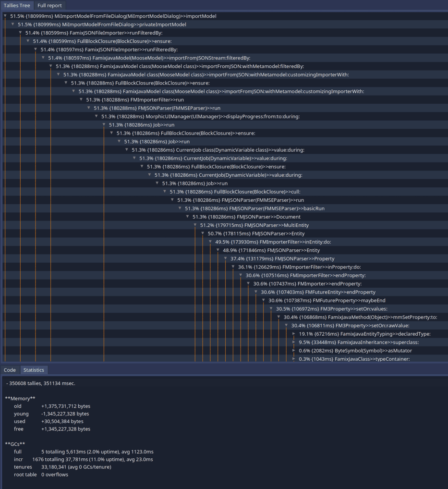
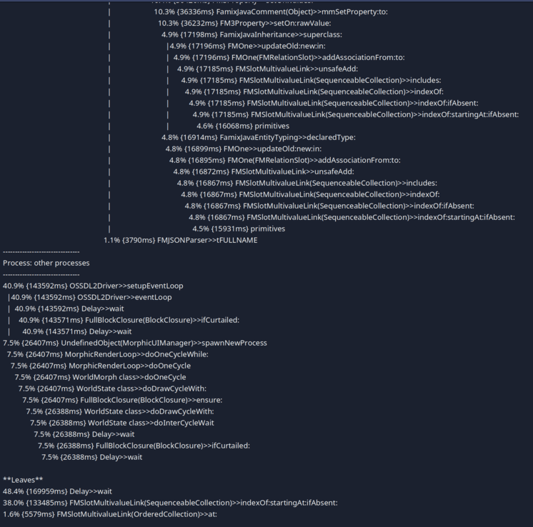
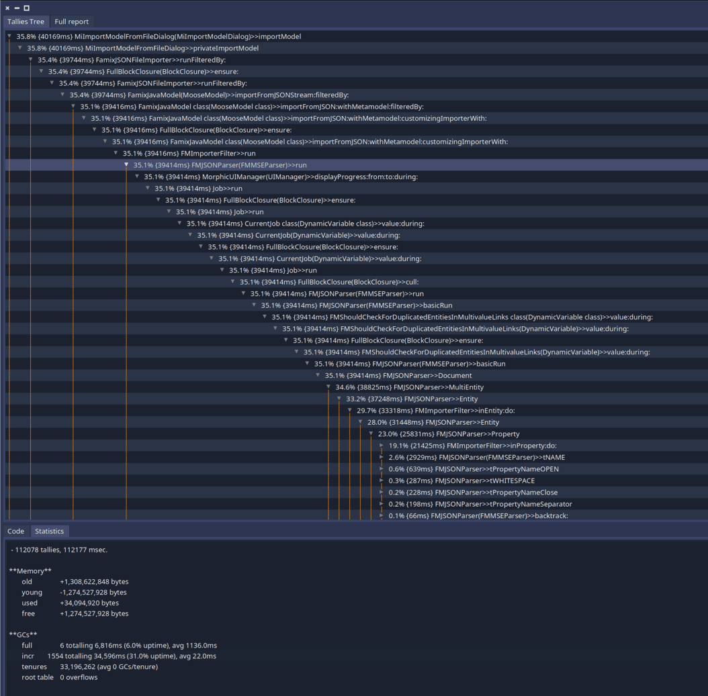
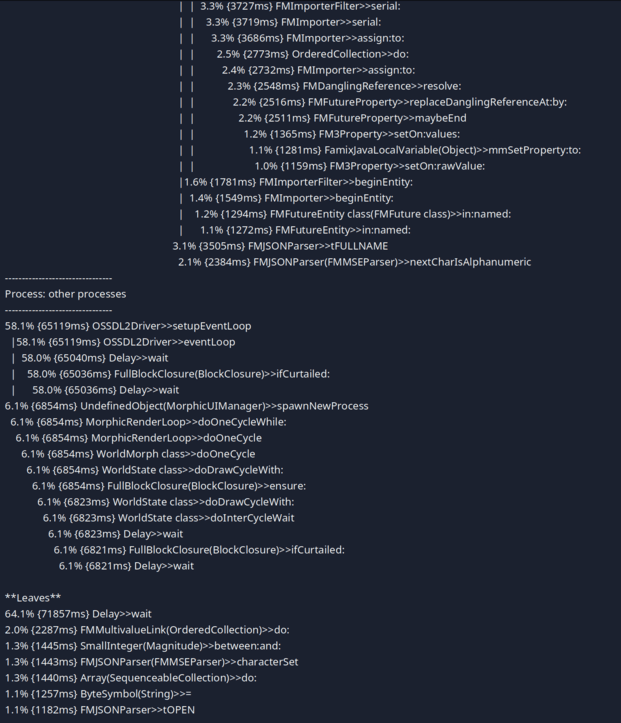

---
authors:
- CyrilFerlicot
title: "Speed up models creation: application to JSON/MSE parsing"
date:  2025-11-18
lastUpdated:  2025-11-18
tags:
- infrastructure
- optimization
---

## Context 

In order to be able to work with Moose there is a prerequisite we cannot avoid: we need a model to analyze. This can be archieved in 2 principal ways:
- Importing an existing JSON/MSE file containing a model
- Importing a model via a Moose importer such as the Pharo importer or Python importer

While doing this, we create a lot of entities and set a lot of relations. But this can take some time. I found out that this time was even bigger than I anticipated while profiling a JSON import.

Here is the result of the profiling of a JSON of 330MB on a Macbook pro M1 from 2023:



Form this profiling we can see that we spend 351sec for this import. We can find more information in this report:



On this screenshot we can see some noise due to the fact that the profiler was not adapted to the new event listening loop of Pharo. But in the leaves we can also see that most of the time is spent in `FMSlotMultivaluedLink>>#indexOf:startingAt:ifAbsent:`. 

This is used by a mecanism of all instance variables that are `FMMany` because those we do not want duplicated elements. Thus, we check if the collection contains the element before adding it. 

But during the import of a JSON file, we should have no duplicates making this check useless. This also explains why we spend so much time in this method: we always are in the worst case scenario: there is no element matching.

## The optimization 

In order to optimize the creation of a model when we know we will not create any duplicates, we can disable the check. 

For this, we can use a dynamic variable declaring that we should check for duplicated elements by default, but allowing to disable the check during the execution of some code.

:::note[Note]
If you do not know what is a Dynamic Variable you can check [the pharo wiki](https://github.com/pharo-open-documentation/pharo-wiki/blob/master/PharoProjects/DynamicVariables.md).
:::

```smalltalk
DynamicVariable << #FMShouldCheckForDuplicatedEntitiesInMultivalueLinks
	slots: {};
	tag: 'Utilities';
	package: 'Fame-Core'
```

```smalltalk
FMShouldCheckForDuplicatedEntitiesInMultivalueLinks>>#default
	^ true
```

And now that we have the variable, we can use it:

```diff lang="smalltalk"
FMSlotMultivalueLink >> unsafeAdd: element
-	(self includes: element) ifFalse: [ self uncheckUnsafeAdd: element ]
+	FMShouldCheckForDuplicatedEntitiesInMultivalueLinks value
+		ifTrue: [ (self includes: element) ifFalse: [ self uncheckUnsafeAdd: element ] ]
+		ifFalse: [ self uncheckUnsafeAdd: element ]
```


```diff lang="smalltalk"
FMMultivalueLink >> unsafeAdd: element
-	(self includes: element) ifFalse: [ self uncheckUnsafeAdd: element ]
+	FMShouldCheckForDuplicatedEntitiesInMultivalueLinks value
+		ifTrue: [ (self includes: element) ifFalse: [ self uncheckUnsafeAdd: element ] ]
+		ifFalse: [ self uncheckUnsafeAdd: element ]
```

And the last step is to disable the check during the MSE/JSON parsing:


```diff lang="smalltalk"
FMMSEParser >> basicRun
-	self Document.
-	self atEnd ifFalse: [ ^ self syntaxError ]
+	FMShouldCheckForDuplicatedEntitiesInMultivalueLinks value: false during: [
+			self Document.
+			self atEnd ifFalse: [ ^ self syntaxError ] ]
```

## Result of the optimization

Now let's try to import the same JSON file with the optiwization enabled:





We can see that the import time went from 351sec to 113sec!

We can also notice that we do not have one bottleneck in our parsing. This means that it will be harder to optimize more this task (even if some people still have some ideas on how to do that).

## Use this optimization in your project

This optimization has been made for the import of JSON but it can be used in other contexts. 
For example, in the Moose Python importer, the implementation is sure to never produce a duplicate. Thus, we could use the same trick this way:

```smalltalk
FamixPythonImporter >> import
	FMShouldCheckForDuplicatedEntitiesInMultivalueLinks value: false during: [ super import ]
```