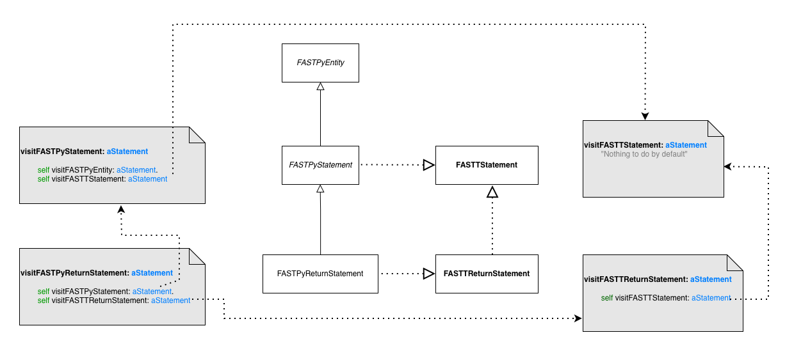

---
authors:
- CyrilFerlicot
title: "Improving the generation of visitors"
date:  2026-05-20
lastUpdated:  2026-05-20
tags:
- infrastructure
- famix-tools
---

## Context  

Recently, I needed to implement a feature in `FAST-Python` requiring a visitor for my metamodel. People knowing me knows that I if I can automatize a task to save time and to keep the code coherant with the model, I'll go for it. Nicolas Anquetil and Clotilde Toullec recently started to implement a visitor generator, so I tried it. Since it was a POC, I encountered some problems. 

I'll explain in this blog post how to use this visitor generator, what problems I encountered and the solutions I proposed.

## Using the visitor generator

Once my changes will be integrated, using the visitor generator is as simple as adding one method on the class side of your generator. For example, in FAST-Python:

```smalltalk
FASTPythonMetamodelGenerator class>>metamodelToolGenerators

	^ { FamixVisitorGenerator }
```

This will tell the generator to also generate a visitor trait.

It is possible to also customize the package in which the visitor is generated by overridin `#packageNameForVisitor`:

```smalltalk
FASTPythonMetamodelGenerator class>>packageNameForVisitor

	^ #'FAST-Python-Visitor'
```

## Problems I faced

While using this visitor generator I faced a few problems.

### Dependency on sub metamodels

#### Problem 

The first one I encountered is that `FAST-Python` is depending on `FAST` that is depending on `Famix` that is depending on `MooseQuery`. 

In order to have the FAST-Python visitor working, all dependencies needed to have a visitor themselves which was not the case. So I had to generate a FAST visitor for example. I could do it since I am part of the moosetechnology organization, but this is a hassle.

#### Solution

The solution I found was to generate standalone visitors. Instead of using the visitors of the sub metamodels, now we generate a visitor containing the visit of all entities of the model *and* the visit of the remote trait used in the model. 

This can seems like a lot of useless code at first, but it has two advantages:
- Visitors and now standalone
- This allow to customize the visit of remote traits for the language we are currently working on. This will be important for one of the other problems I encountered.

### Infinit loops in visitors

#### Problem

The second problem I faced was that the generated visitor had infinit loops while I tried to use it. The reason is simple, when visiting an entity, we were visiting all its relations, but Moose is a cyclic graph since we have relations to the contained entities and relations to the containers of the entity. 

#### Solution

Since most analysis that we are doing are "top down" (meaning that we start by the top level entities of our project and we visit their children) and we do not often need a "bottom up" visitor (for this we can just iterate on parents), I decided to exclude the visit of parent entities from the visit.

### Double visit of some relations

#### Problem

In some cases I noticed the we visited two times the same nodes. This is due to the fact that Famix model mix the usage of superclasses and traits. Here is a simple case to understant what is happening:



Here we see that a `FASTPyReturnStatement` inherits from `FASTPyStatement`. This class is using `FASTTStatement`. `FASTPyReturnStatement` also uses the trait `FASTPyReturnStatement`, but this trait also uses `FASTTStatement`. 

Now when we visit `FASTPyReturnStatement`, we end up visiting two times `FASTTStatement`. Once via its superclass and once via its trait composition.

#### Solution 

The solution I proposed is that when we visit a trait composition, we check the users of the trait and if some of them already visit the trait in their superclasses, we skip the visit of this relation.

With this, `#visitFASTPyReturnStatement` in the context of FAST-Python become:

```smalltalk
visitFASTTReturnStatement: aTReturnStatement

	<generated>
	"We should visit FASTTStatement but all its users in this language already visit it in their superclasses so we skip the call here.".

	self visitEntity: aTReturnStatement expression
```

In some cases, we need to skip the visit for some entities, but not all of them. For example, with conditional statements. In that case we generate a method like this:

```Smalltalk
visitFASTTConditionalStatement: aTConditionalStatement

	<generated>
	"We do not visit all behaviorals because some classes already visit it in their superclasses in this language implementation. Visiting them here also would cause a double visit of this trait."
	({ FASTPyIfStatement . FASTPyWhileStatement } includes: aTConditionalStatement class)
		ifFalse: [ self visitFASTTStatement: aTConditionalStatement ].
		
	self visitFASTTWithCondition: aTConditionalStatement
  ```

  This is possible only because we generate standalone visitors now.

  ## Conclusion

  With those changes I'm hoping it will be easier to generate and use visitors with Famix. The big advantage is that if we do not need to touch the visitor by hand, it will follow all the evolutions of the metamodel. 

  Have fun with this :)