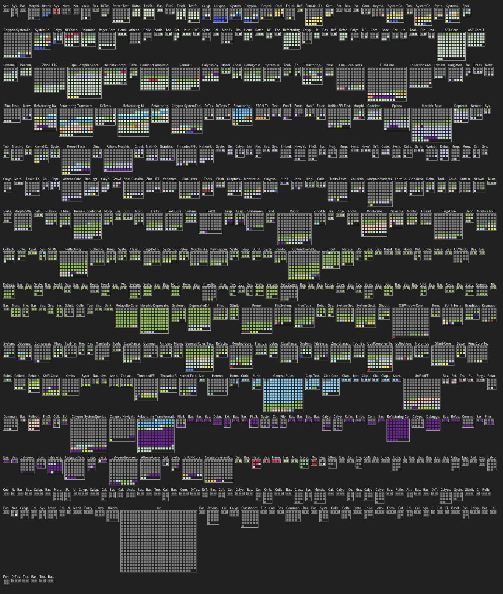

---
authors:
- BenoitVerhaeghe
title: "Building an ownership cartography of a system - Part 2"
date:  2026-08-13
lastUpdated:  2026-08-13
tags:
- Mining Software Repositories
---

import 'katex/dist/katex.min.css';
import { Aside } from '@astrojs/starlight/components';

When you share your work with others, such as the previous blog post, you can get feedback and suggestions for improvement.
And this is exactly what happened.

<Aside title=" " type="tip" icon="comment">
> "The last step I wanted to investigate is to visualize the ownership of a system. I did not create a visualisation dedicated to this point yet."

You mean something like the Distribution Map? 😉
</Aside>

And by Distribution Map, we are talking about a [research paper accepted at ICSM 2006](https://www.researchgate.net/profile/Stephane-Ducasse/publication/221308136_Distribution_Map/links/02e7e51f0feed80eae000000/Distribution-Map.pdf)
So, let's not reinvent the wheel anymore and look at how to use the already existing Distribution Map in Moose to visualize the ownership of a system.

## One color for each developer

The first visualisation that comes to mind is to use one color for each developer.
Using the Degree-of-Authorship (DOA) formula, we can compute the ownership of each file and retrieve the main developer for each file.

In moose, we can then create a tag that will associate a color to each developer and then use this tag to color the files in the system.
We assign a tag to each file that corresponds to the main developer of the file.

```smalltalk
((glhModel allWithSubTypesOf: GLHFile)
    select: [ :file | file diffs size ~= 0 ])
	do: [ :file |  file tagWithName: ((file degreeOfAuthorship) keyAtValue: 1.0) name  ].
```

We first search for all the files that have been modified, then we compute the degreeofAuthorship for every possible user, we select the one with the best score, which is 1, and we create a tag with the author name.
Once the tag is created for every file, it is possible to propagate the files to the Distribution Map.

## Propagate to Distribution Map

To propagate the files to the distribution, we first retrieve the files in our model.
Then, we get the parent folder of the files.

```smalltalk
appsFolder := (glhModel allWithSubTypesOf: GLHFileDirectory) detect: [ :fi | fi path = 'src' ].
files := (appsFolder allToScope: GLHFileBlob).
"Find parent folder"
folders := (files collect: [ :file | file directoryOwner ] as: Set).
folders 
```

Based on the parent folders, the Moose Distribution Map will be able to recalculate the children, and so the files of interest.
We select the `folders` variable and propagate with <kbd>Cmd</kbd> + <kbd>Shift</kbd> + <kbd>M</kbd>, <kbd>Cmd</kbd> + <kbd>Shift</kbd> + <kbd>P</kbd>.

Then, we open the Distribution map from the Moose Menu.

We first get a visualisation without any color.
So, in the settings of the visualisation, we select the tags to display.
We select every authors and get the last visualisation.



Again, the visualisation well presents the different packages and the one with major author.
The gray square corresponds to file less modified in the system the last two years.

