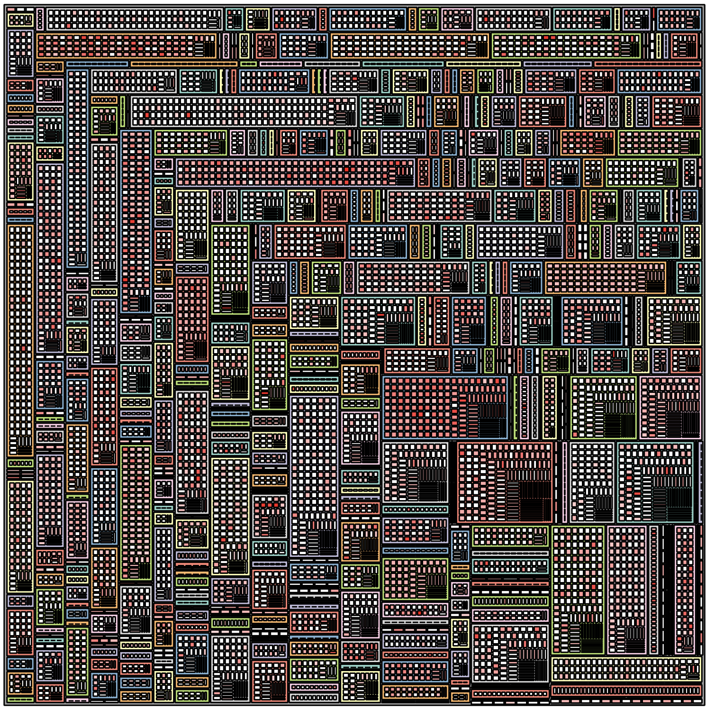
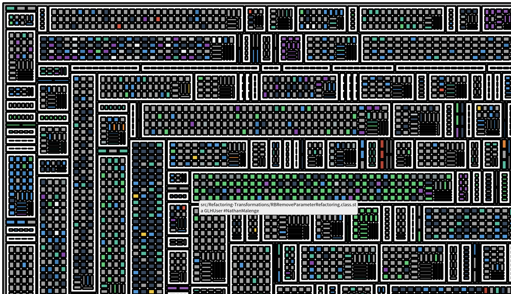

---
authors:
- BenoitVerhaeghe
title: "Building an ownership map of a system"
date:  2026-08-11
lastUpdated:  2026-08-11
tags:
- Mining Software Repositories
---

import 'katex/dist/katex.min.css';

## Context  

when managing a software system, it is important to know who is responsible for which part of the system.
This information can be useful for various reasons, such as identifying potential bottlenecks, understanding the impact of changes, and improving collaboration among team members.

One major threat could, for example, come from a developer leaving the team.
This is often referred to as the "bus factor" or "truck factor".
But how to detect such a situation?

Research have shown that the ownership of a system can be inferred from its version control history.
To do so, one approach is to first investigate the ownership of each file.

Two nice papers, not from the Moose community, are:

- [Algorithms for Estimating Truck Factors: A Comparative study](https://homepages.dcc.ufmg.br/~mtov/pub/2019-sqj.pdf)
- [A Novel Approach for Estimating Truck Factors](https://arxiv.org/pdf/1604.06766)
  - [Truck-Factor tool](https://github.com/aserg-ufmg/Truck-Factor)

## Computing the ownership of a file

Looking at the research paper, we can find a formula that can help build a first version of ownership.
It consists for each file of a git repository to compute a degree of authorship for each potential author using this formula.

Given a file $f$ with path $f_p$, the degree-of-authorship of a developer $d$ whose Git user has been mapped to $m_d$ is given by.

$$
DOA(m_d, f_p) = 3.293 + 1.098 × FA(m_d, f_p) + 0.164× DL(m_d, f_p)−0.321 ×ln(1 + AC (m_d, f_p))
$$

With the following definitions:

> DOA depends on three factors: (i) first authorship ($FA$): if $m_d$ originally created $f$, $FA$ is 1; otherwise it is 0; (ii) number of deliveries ($DL$): number of changes in $f$ made by $m_d$; and (iii) number of acceptances ($AC$): number of changes in $f$ made by any developer, except $m_d$.

Looking at the source code of the Truck-Factor tool, we can see thet $DL$ corresponds to a commit that modifies a file.
The file [can be added, modified, and renamed](https://github.com/aserg-ufmg/Truck-Factor/blob/614600ed6b36bb8f452bc6eab7c9b95320f5d7be/gittruckfactor/src/aserg/gtf/task/DOACalculator.java#L104).

$AC (m_d, f_p)$ is computed by the total number of modifications of a file minus the number of modifications made by the developer $m_d$.

## Moose Implementation

Moose comes with the [GitProject Health](/users/git-project-health/getting-started-with-gitproject-health) project to represent a Git repository and analyze its history.
So, I wanted to implement the DOA formula in Moose.

### Making it faster

One concern is that GitProject Health is firstly made to analyze Git Social Platform and not only git repository with the truck factor in mind.
Thus, it is not optimized for this use case.

The major concern comes when loading the model that rely on several calls to the Git Platform API.
In order to avoid this, I decided to implement a companion importer named `GitLocalModelImporter` that can load a model from a local git repository.

To go faster, it relies on the [FFI LibGit2](https://github.com/pharo-vcs/libgit2-pharo-bindings).
This project includes a `LGitRevwalk`, a walker that can iterate over the commits of a git repository.
Thus, we can iterate over the commits and retrieve the files, the diffs, the commits, and the authors in a repository.

> This version is still not optimized to compute truck factor, but it can be used to do lot more than just computing truck factor. It comes as a new classic importer for GitProject Health and so can be used side by side with other importers for optimization.

### Implementing the DOA formula

To implement the DOA formula, I created a simple but effective class named `GLPDegreeOfAuthorshipAnalyzer`.
This class is now part of the GitProject Health project set of metrics.
It reuses the exact same algorithm as the Truck-Factor tool to compute the degree of authorship for each file in a git repository.

We note several additionnal considerations to compute the DOA formula.
These considerations are mention because they enable analysis of a project without considering the history of the project, which is long to consider.

- The first authorship ($FA$) is computed by looking at the first commit that added or modified a file to the repository.
- GitProject Health does not consider renaming of files *yet*, so it does not consider file renaming.

Even though not considering rename can create issues, this work has been performed on an industrial project and considering renaming would not drastically change the results of the analysis.

## Vizualizing the ownership of a system

The last step I wanted to investigate is to visualize the ownership of a system.
I did not create a vizualization dedicated to this point yet. 
But let's investigate a running example for the [pharo](https://github.com/pharo-project/pharo) project.

After cloning the project, I create a Moose image with the GitProject Health project installed.
Then, I load the pharo project.

```smalltalk
glhModel := GLHModel new.
repository := GLHRepository new
    cacheAt: #localImporterReference
    put: '/path/to/MSR/pharo' asFileReference;
    yourself.

glhModel add: repository.

localImporter := GitLocalModelImporter new.
localImporter withFiles: true.
localImporter glhModel: glhModel.
"I will import the last two years"
localImporter withCommitsSince: 2 years.
localImporter importRepository: repository.
```

After a possibly long execution, we get the repository loaded.
It is thus possible to investigate it using our tools.

We want to build a cartography of the application to identify the coverage of files with an author.
To do so, I decided to build a TreeMap using the Roassal framework.

First, I need to load the Roassal TreeMap support

```smalltalk
Metacello new
    baseline: 'Roassal';
    repository: 'github://pharo-graphics/Roassal:Pharo13';
    onConflictUseIncoming;
    load: #( Full )
```

Then, start the fun.

### A quick view of the project

We build a dictionary with the degree of authorship for everyfile.

```smalltalk
filesAuthorShip := ((glhModel allWithSubTypesOf: GLHFile)
    select: [ :file | file diffs size ~= 0 ])
    collect: [ :file |
        "This uses our analyser behind the scene"
        file -> file degreeOfAuthorshipAuthors ]
    as: Dictionary.
```

We look for the folder that is the root of the tree map, and we compute the max number of authorship that will be used for coloring the vizualisation.

```smalltalk
appsFolder := (glhModel allWithSubTypesOf: GLHFileDirectory)
    detect: [ :fi | fi path = 'src' ].

max := (filesAuthorShip collect: #sum) max.
```

Finally, we build the tree map.

```smalltalk
palette := RSQualitativeColorPalette qualitative set39.
b := RSTreeMap new.
b inset: 2 asPoint.
b boxShape borderColor: Color black.
b boxShape borderWidth: 0.05.

color := NSScale linear domain: { 0. max };
    range: #( white red ).
b
    leafWeight: [ :f | 1 ];
    explore: appsFolder nesting: [ :directory |
        directory files select: [ :f | (f isKindOf: GLHFileDirectory) ] ]
    leaves: [ :directory | directory files reject: [ :f | f isKindOf: GLHFileDirectory ] ].

b shapes
    do: [ :box |
        box borderWidth: 1.
        box isSLeaf
            ifTrue: [ box color: (color scale: (filesAuthorShip at: box model ifPresent: [ :dic | dic sum ] ifAbsent: [ 0 ])) ]
            ifFalse: [
                | path |
                path := (box model path splitOn: '/').
                path size > 1 ifTrue: [  
                    box color: (palette scale: (box model path splitOn: '/') second) ] ] ].

b shapes @ (RSPopup text: [:f | f path, String crlf, ((filesAuthorShip at: f ifPresent: [ :dic | dic sum ] ifAbsent: [ 0 ]) printString) ]).

b build
```

Using this script, we built a vizualisation with different color for each package, and a red scale for know packages.
It ouput the following image



Looking at the image we see that some package have author from the 2 last year modification whereas other were not modified at all.

> More than showing the Truck Factor, this vizualization highlights the code that have been updated by people that gain or conserve knowledge on the codebase.

One improvment could be to highlight the core contributors.

### highlighting the core contributors

To highlight the core contributors, we first create a color palette for them.

```smalltalk
coreContributors := (filesAuthorShip values flatCollect: #keys) asSet.
paletteContributor := RSQualitativeColorPalette qualitative flatui120.
```

Then, we update the first `b shapes` statements by:

```smalltalk
b shapes
    do: [ :box |
        box borderWidth: 1.
        box isSLeaf
        ifTrue: [ 
            filesAuthorShip at: box model ifPresent: [ :dic |
                | author |
                author := (dic associations sorted: [ :a :b | a value > b value ]) first key.
                box color: (paletteContributor scale: author) ] ]
        ifFalse: [
            | path |
            path := (box model path splitOn: '/').
            box color: Color white ] ] ].
```

This attributes the color of the core contributors to each box.
We present below a final computed visualization that highlight one contributor who seems to became the expert of the Refactoring package.


