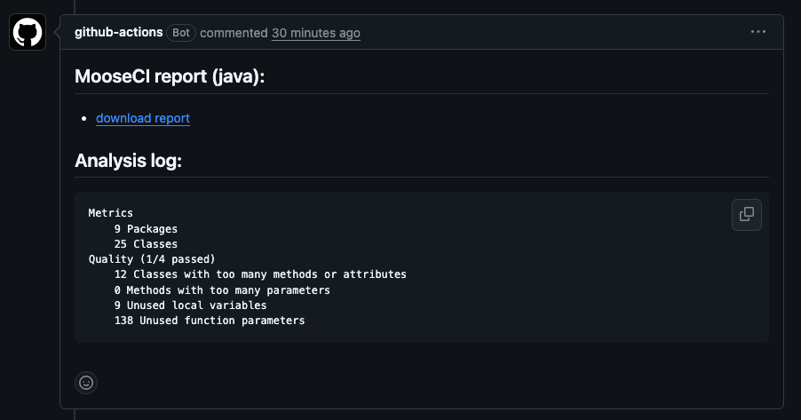
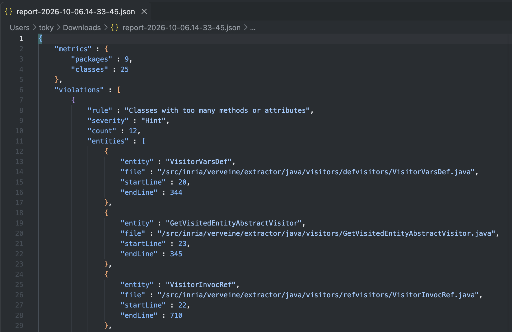

---
authors:
- tokyRT
title: "Setup MooseCI on your repository with GitHub Actions"
date: 2026-10-05
tags:
- CI
- Moose
- Java
---

# Setup MooseCI on your repository with GitHub Actions

## What is MooseCI?

[MooseCI](https://github.com/moosetechnology/MooseCI) is a tool that runs automatic analyses on your code. It looks for code quality problems and writes a report for you.

MooseCI is built on top of Moose. It can run in headless mode, so you can use it on a CI server.

You can use MooseCI in two ways:

- as a command line tool, with Docker
- inside a CI, with its GitHub Action for example

For now, MooseCI supports Java and Python.

MooseCI runs its analyses on the [Famix](https://github.com/moosetechnology/Famix) model of your project, not on the FAST model.

## Run MooseCI with Docker

The easiest way to try MooseCI is with Docker.

First, pull the image for your language. For Java, use the `latest` image, and for Python, use the `python` image:

```bash
docker pull ghcr.io/moosetechnology/moose-ci:latest
docker pull ghcr.io/moosetechnology/moose-ci:python
```

Go to the folder you want to analyze, and create a configuration file with the `init` command:

```bash
docker run -v "$(pwd):/src" ghcr.io/moosetechnology/moose-ci:latest init
```

This creates a `moose-ci.ston` file. You can edit it to choose the rules and the metrics.

Then run the analysis:

```bash
docker run -v "$(pwd):/src" ghcr.io/moosetechnology/moose-ci:latest analyze
```

MooseCI prints the report in the console and writes a JSON report in `.moose-ci/report`.

## Run MooseCI in a CI with GitHub Actions

MooseCI is also available as a [GitHub Action](https://github.com/moosetechnology/setup-MooseCI). Add it to a repository, and it runs on every pull request.

The Action:

- runs MooseCI on your project
- uploads the report as an artifact
- comments on the pull request with a download link and a short summary of the analysis

### Example with VerveineJ

Let's take [VerveineJ](https://github.com/moosetechnology/VerveineJ) as an example. VerveineJ is a Java project that parses Java code and exports it to JSON/MSE for Moose.

We added MooseCI to VerveineJ. You can see the result in this [pull request](https://github.com/moosetechnology/VerveineJ/pull/275).

First, create the configuration file. Go to the folder you want to analyze, and run `init`:

```bash
cd app/src/main/java/fr
docker run -v "$(pwd):/src" ghcr.io/moosetechnology/moose-ci:latest init
```

This creates `app/src/main/java/fr/moose-ci.ston`. The file looks like this:

```ston
MooseCIConfig {
	#projectLanguage : #java,
	#metrics : [
		#packages,
		#classes
	],
	#rules : [
		#too_many_parameters : 10,
		#large_class : 20,
		#unused_local_variable,
		#unused_parameter
	],
	#outputFormats : [
		#json
	],
	#outputPath : '.moose-ci/report',
	#visualizations : [ ],
	#isRemote : false
}
```

In this file, you can:

- set the language with `#projectLanguage`
- choose the metrics to compute with `#metrics`
- choose the quality rules with `#rules`, and give a threshold to some rules (for example `#too_many_parameters : 10`)
- choose the report format and location with `#outputFormats` and `#outputPath`

Then add the workflow. Create `.github/workflows/moose-ci.yml`:

```yaml
name: MooseCI
on: pull_request
permissions:
  contents: read
  actions: write
  pull-requests: write
jobs:
  analyze:
    runs-on: ubuntu-latest
    steps:
      - uses: actions/checkout@v4
      - uses: moosetechnology/setup-MooseCI@v1
        with:
          project-path: ./app/src/main/java/fr
          project-language: java
```

Some details:

- `on: pull_request` runs the workflow on every pull request.
- `actions: write` is needed to upload the report.
- `pull-requests: write` is needed to write the comment.
- `project-path` is the folder to analyze. It must contain `moose-ci.ston`.
- `project-language` selects the image. Use `java` or `python`.

On each pull request, MooseCI comments with the analysis. For VerveineJ, the summary looks like this:




The report also contains the list of rule violations, with the location of each problem in the source code.



## Use MooseCI in another CI

MooseCI is not limited to GitHub. In any other CI, you can run the same Docker image and the same commands as the CLI, for example:

```bash
docker run -v "$(pwd):/src" ghcr.io/moosetechnology/moose-ci:latest analyze
```

The report is written in the MooseCI report folder (`.moose-ci/report`). Your CI can then publish it as an artifact.

## Conclusion

MooseCI is easy to use. You can run it locally with Docker, or on every pull request with the GitHub Action. You only need a configuration file and a small workflow.
