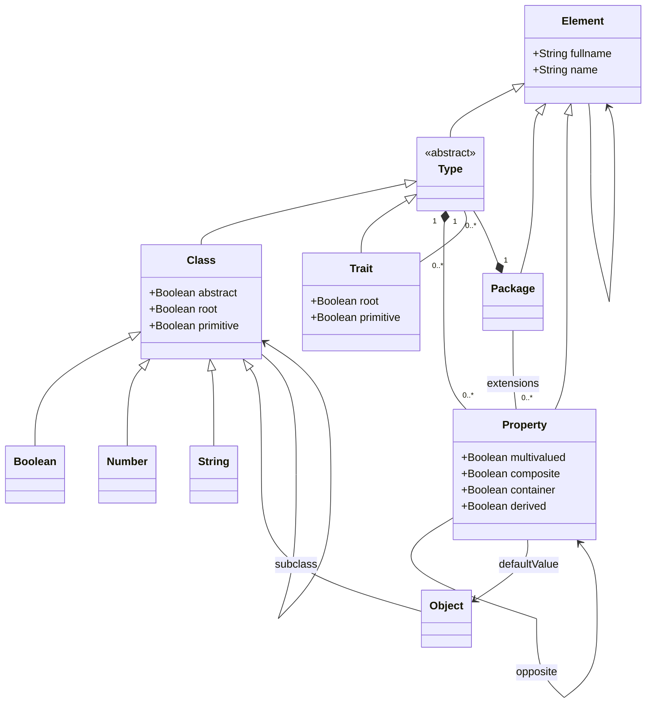

Fame is the meta-meta-model of Famix.
In the following, we mainly present the Pharo implementation and usage of Fame.

## Meta-model



### Main concepts

It consists of 6 main entities:

1. Element --- the root of the meta-model
2. Package --- a container that can contain Class, Trait, and Properties
3. Type --- an abstraction of Class and Trait
4. Class --- contained by Package. A Class might contains several Properties. A Class can have a superclass, subclasses, and use traits. Some Class are Constants.
5. Trait --- contained by Package. A Trait might contains several Properties. A Trait can be used by other Types and can use other Trait.
6. Property --- attached to a Type. Property has a value and a value type. It can have an opposite property that will be my miror.
   The type of a property is a Class

### Constants

Fame defines 4 constants:

1. Boolean --- value can be `true` or `false`
2. Number --- value is a number. When exporting, consider using a float
3. String --- a common string.
4. Object --- a complex structure which is not part of any metamodel

## Implementations

Fame is implemented in the following programming languages:

- [Java](https://github.com/moosetechnology/FameJava)
- [Pharo](https://github.com/moosetechnology/Fame)

## Installation

The last stable version of Fame is always includeds in Moose.
The project can be found in the packages prefixed with `Fame-`.

It is also possible to install Fame in a fresh [Pharo](https://pharo.org/) image.
To do so, execute the following script:

```smalltalk
Metacello new
    githubUser: 'moosetechnology' project: 'Fame' commitish: 'v1.x.x' path: 'src';
    baseline: 'Fame';
    load
```

## Export / Import

### Export

Fame supports [two file formats](/users/file-format) to export meta-models: MSE, and JSON.

The new JSON file format should be chosen preferably.
It can use with the following script:

```smalltalk
String streamContents: [ :writeStream | MyModel metamodel exportOn: writeStream usingPrinter: FMJSONPrinter ]
```

To export a model (or meta-model) in the mse format (for example, to use FameJava and VerveineJ), execute the following code:

```smalltalk
'/path/to/file.mse' asFileReference writeStreamDo: [ :writeStream | MyModel metamodel exportOn: writeStream ]
```

### Import

It is also possible to import a Fame model from a JSON and a MSE file.

To import a model please use the following script:

```smalltalk
"aMetamodel is a Fame Metamodel"
"Considering you want to import a FamixJavaModel"
"aMetamodel := FamixJavaModel new metamodel."
model := FMModel withMetamodel: aMetamodel.
importer := aBlock
    value:
        ((FMImporter model: model) autorizeDandlingReferencesAtEnd
"Replace FMJSONParser with FMMSEParser when importing a model stored in a MSE file"
            parser: FMJSONParser; 
            stream: aStream;
        yourself).
importer run.
```

When using a Moose image, some methods are implemented to simplify the script.
For instance, one can use `FamixJavaModel>>#importFromJSONStream:` and `FamixJavaModel>>#importFromMSEStream:`.
