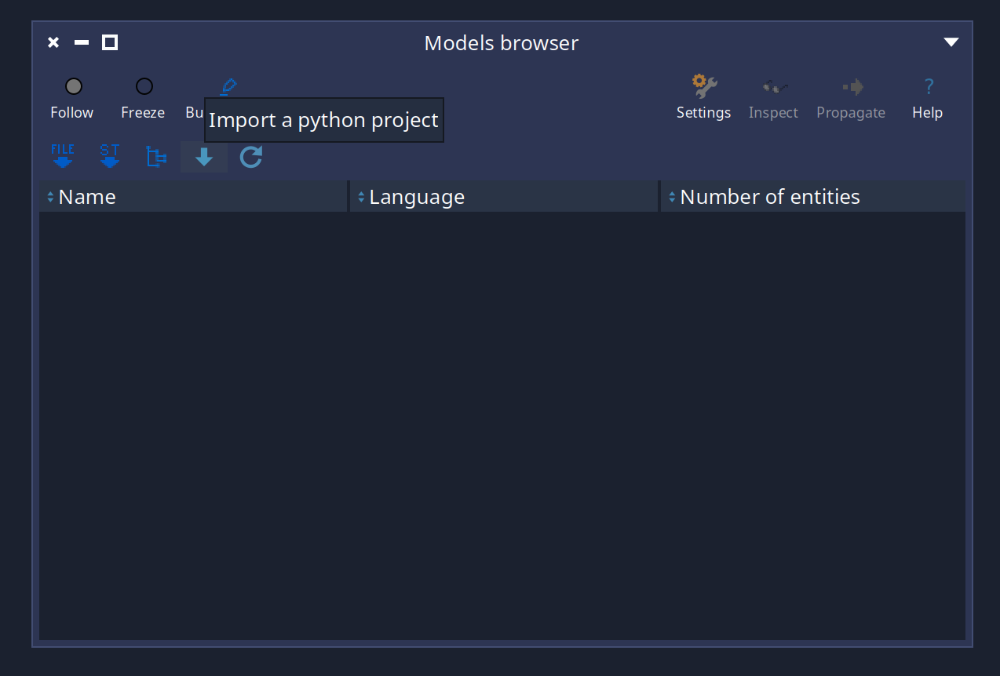
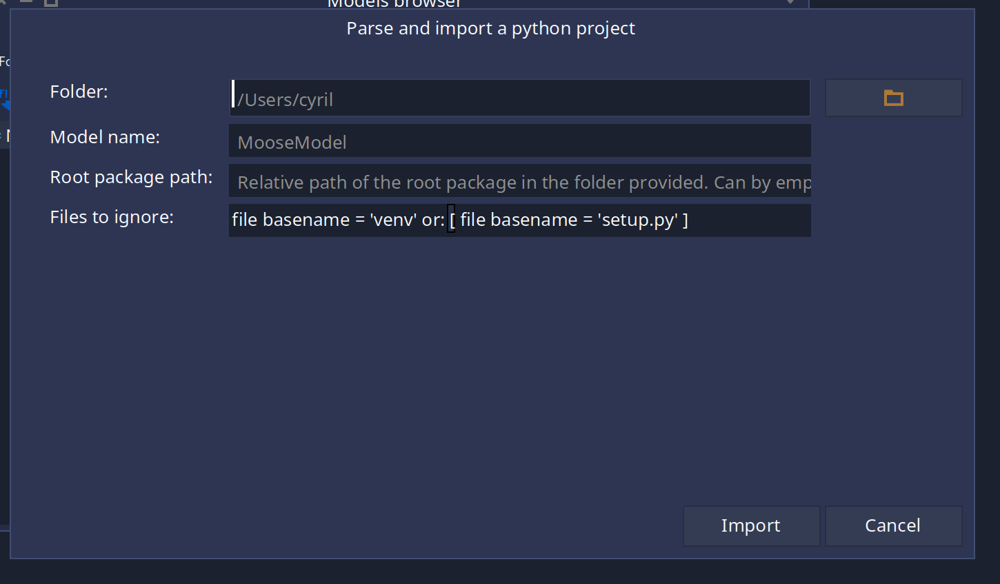

---
authors:
- CyrilFerlicot
title: "Python importer"
subtitle: "How to import a python projet as a Moose model"
---

It is possible to import python projets using `MoosePy`.

## Installation

To install `MoosePy` on your Pharo image, execute the following script:

```smalltalk
Metacello new
	githubUser: 'moosetechnology' project: 'MoosePy' commitish: 'master' path: 'src';
	baseline: 'MoosePy';
	load
```

To add `MoosePy` to your baseline:

```smalltalk
spec
	baseline: 'MoosePy'
	with: [ spec repository: 'github://moosetechnology/MoosePy:master/src' ]
```

## Usage

### Import a project programatically

You can launch the import of a project like this:

```smalltalk
  FamixPythonImporter import: '/Users/cyril/testPython/reader' asFileReference
```

It will return a Famix python model generated from the `.py` files in this folder and if there are errors during the parsing, it'll open an inspector with the list of errors.
It is also possible to provide a single `.py` file to the importer.

#### Resolution of absolute imports

In order to determine the origin of the absolute imports, we are using the first folder that contains all .py to parse of the project. But sometimes it is not that easy. In that case it is possible to configure manually the folder to consider the root of the project.
	
Let's take this example:

```	
	/project
		/src
			/package
				__initi__.py
			module.py
		/resources
			/example
				example.py
```			

If no root package path is specify, `project` will be considered the root directory and will be the start point for the absolute import resolution. But it's highly possible that the real working directory here is /src. 
	
It is possible to do:

```smalltalk	
	FamixPythonImporter import: 'path/to/project' asFileReference rootPackagePath: 'src' 
```

This will start the import from the src folder and not project. The file `example.py` will be ignored.

#### Ignore files

It as also possible to indicate that we want to ignore files or folder. In order to do that, the variable `#filesToIgnoreBlock` should be used. It should be a valuable (like a block) taking file references as parameter and returning true if we should ignore those files/folders.
By default I'm excluding folders named `venv` because it is common to have a python interpreter of this name in projects if we develop them on the computer and files `setup.py`.

For the example above we could do:

```smalltalk
	FamixPythonImporter new
		filesToIgnoreBlock: [ :file | #('venv' 'setup.py' 'resources') includes: file basename ] ];
		import: 'path/to/project'
```

### Import from the graphical interface

It is also possible to import the project using the `Models browser` of Moose. 




This will open a window with the different options explained in the previous section


