---
authors:
- CyrilFerlicot
title: "Building a Control Flow Graph (CFG) for FAST"
---


FAST models represent the AST of a programming language. 

Multiple static analysis we might do on those models requires the ability to have a control flow graph (CFG). Due to the nature of FAST, it is not possible to have a CFG for FAST languages since we have no intermediate representation of the AST. But FAST now provides helpers to speedup the implementation of a CFG algo for your language.

:::note
During the documentation, when we talk about "blocks" it means the blocks of the CFG graph. When we talk about "nodes", it means the nodes of the FAST model.
:::

## Introduction

### CFG explanation

A control flow graph is an algorithm that will represent the AST as a graph of blocks splitting each time a conditional appears. We can consider that if multiple expressions are in the same block, they will be executed together. Multiple structures in different programming languages can create those splits such as:
- if
- elif
- conditional expressions (or one linne if)
- while
- for
- switch
- try catch

Here is an example of possible CFG for this python code:

```python
def process_data(items):
    index = 0
    
    while index < len(items):
        item = items[index]
        
        if item == "STOP":
            print("Stopping processing.")
            break  # Exits the loop immediately
        
        if item == "SKIP":
            index += 1
            continue  # Skips to next iteration
        
        print(f"Processing: {item}")
        index += 1
    
    return "Done"
```

CFG:

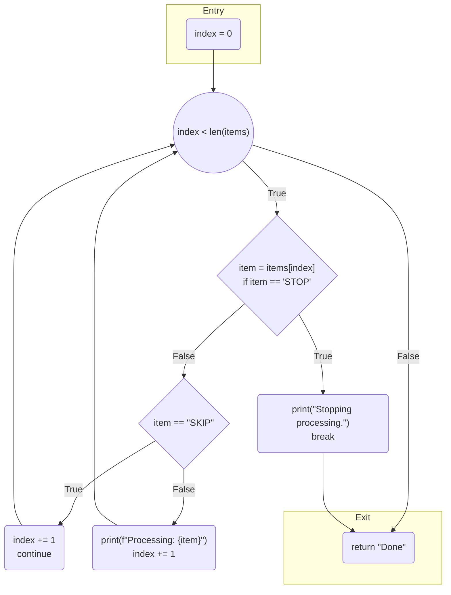

:::note
Here is the legend of blocks shape used for this documentation:

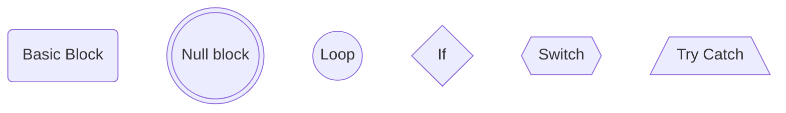
:::

For more information you can read external documentations on CFG.

### Variations 

The CFG algo can have variations depending on the analysis we need to do with it.

A first variation is that some CFG want an unique exit for our graph while other allows multiple exits. The current FAST implementation choose to have only one exit. It create a `FASTCFGNullBlock` in case we have multiple exits. In case you want multiple exits, it would be possible to add a setting for this.

Another variation is on the try catch. Some implementation create one normal block for each statement of the try block because an error car arise at each statement. We decided to create a unique try block to avoid having a graph that is too big. If you want to use the CFG to do analysis about excetions, we could add an option to split the node into 
ultiple nodes. 

A last variation is that some CFG decide to split each blocks into one statements blocks. The default implementation provided by this project groups each statements executed together. For the implementation of FAST-Python CFG I also choose to have the conditions in the same block as the previous statements and the finally with the next statements when they are always executed together in order to simplify the analysis I need to make with the CFG.

## Getting started

:::note
This project was done while building the CFG of FAST-Python. All examples will be illustrated with pieces of code of the Python CFG except of the feature is not required in Python.
:::

### Metamodel requirements

In order to use all features provided by the CFG algorithm, a metamodel need to use some traits:
- `FASTTStatement` needs to be used by all statements of the model. This will be used to collect the statements to add in a block
- `FASTTStatementBlock` needs to be used to navigate the blocks of code in the AST
- `FASTTReturnStatement` needs to be used to stop the visit of the current branch of a function/method when the node is encountered
- `FASTTBreakStatement` and `FASTTContinueStatement` needs to be used to manage the loops
- `FASTTConditionalStatement` needs to be used to ease the building of conditional blocks

If those traits are missing or missused, it will be much more complex to build the CFG.

### Getting a visitor

A requirement in order to build a CFG is to have a visitor for our FAST model. 

This task can be long and we can easily do mistakes if we do it by hand so I recommand to generate it. It is possible to generate it automatically since Moose 13:

Using the visitor generator is as simple as adding one method on the class side of your generator. For example, in FAST-Python:

```smalltalk
FASTPythonMetamodelGenerator class>>metamodelToolGenerators

	^ { FamixVisitorGenerator }
```

This will tell the generator to also generate a visitor trait.

It is possible to also customize the package in which the visitor is generated by overridin `#packageNameForVisitor`:

```smalltalk
FASTPythonMetamodelGenerator class>>packageNameForVisitor

	^ #'FAST-Python-Visitor'
```

For more information on this visitor, you can check [this blog post](blog/2026-05-20-improving-visitor-generator.md).

Now we have a trait `FASTPyTVisitor` with all visit methods.

In my case I choose to implement a class using this trait:

```smalltalk
Object << #FASTPythonVisitor
	traits: {FASTPyTVisitor};
	slots: {};
	tag: 'Visitor';
	package: 'FAST-Python-Model'
```

### Initializing the CFG builder

`FAST` is providing a trait to help build a CFG algo: `FASTCFGUtility`. 

The first step to do is to create a class using this trait:

```smalltalk
FASTPythonVisitor << #FASTPythonCFGVisitor
	traits: {FASTTCFGUtility};
	tag: 'CFG/DataFlow';
	package: 'FAST-Python-Tools'
```

This class needs to initialize its trait like this:

```smallatlk
initialize

	super initialize.
	self initializeCFG.
	started := false
```

This class needs to be adapted in order to build a CFG. This will be covered in future sections, but before this, I will explain how the algorithm is working so that you can understand what is happening during the constructions of the CFG. Depending on the language, this might not be needed, but if you language has some uncommon features, this might be useful. 

### Algorithm explanation

#### Building of blocks

This algorithm is a second version of FAST CFG. The first implementation choose to create nodes when we encountered the first statement of the node. This made complexe the management of the previous nodes. This new version decide to save all statements we encounter in the variable `#currentStatement` of the visitor and to use those statements to build a block once we know the block is done.

The management of statements will be done automatically via this method provided by `FASTCFGUtility`:

```smalltalk
visitFASTTStatement: aStatement
	"Register the statement in the list of statements to create the current block once we find a conditional or the end of a block"

	self addStatement: aStatement
```

This has just one problem: it will add control structures as statements. In order to remediate to this, all control structure visit methods will need to be overriden to skip the invocation of `visitTStatement:`. We will go over all of those in the next sections.

In order to build a bloc, the API used will depend on the kind of block. This will be covered in the next sections of this documentation.

:::note
Depending on the FAST language, it is possible that expressions are also statements. This is the case in Python. In that case we need to add expressions only if they are an expression statement like this:

```smalltalk
FASTPythonCFGVisitor>>visitFASTPyExpression: aFASTPyExpression
	"We ignore expressions that are not in a statement block"

	aFASTPyExpression isExpressionStatement ifTrue: [ ^ super visitFASTPyExpression: aFASTPyExpression ]
```

```smalltalk
FASTPyExpression>>isExpressionStatement

	self containersDo: [ :container | (container isOfType: FASTTStatementBlock) ifTrue: [ ^ true ] ].

	^ false
```
:::

#### The kinds of blocks

It exists multiple kind of blocks. 

All blocks store:
- A boolean to know if they are the start of a CFG graph via `#isStart`
- A list of statements that are in the block. At the exception of a `FASTCFGTryBlock` that can be stopped at any statement, all statements of a block will be executed if the execution enter this block
- The previous blocks pointing to me in the graph

All blocks should be able to provide their next blocks via `#nextBlocks`, but the number of blocks possible vary depending on the node. 

A node should return true to `#isFull` if it has all its required next blocks. 

A node should return true to `#isFinal` if it is the exit of the CFG graph. A CFG graph will always have one exit. In case of multiple exits, we create a `FASTCFGNullBlock` to join the exits.

##### FASTCFGBlock

I am a block to represent a basic execution block in a CFG graph.

A basic execution block is a block that does not end with a conditional and that have only one next block.

For example, this function only has one normal block:

```python
def func():
	index = 0
	index += 3
	return index
```
CFG: 
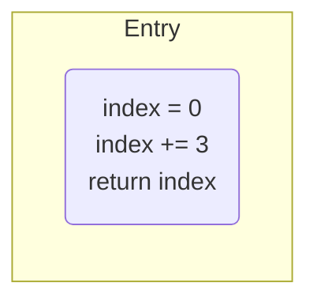

##### FASTConditionalBlock 

I am a node representing a two way conditional block.

I should have 2 next blocks. The first one is the one happening if the condition is true. The second, when the condition is false.

I am mostly used to define an if or an elif or a loop (while/for).

If return true to `#isLoop` if I am a loop. This is important to build the CFG.

Example:

```python
def func(a):
	index = 0
	if a > 3:
		index += 3
	return index
```

CFG: 


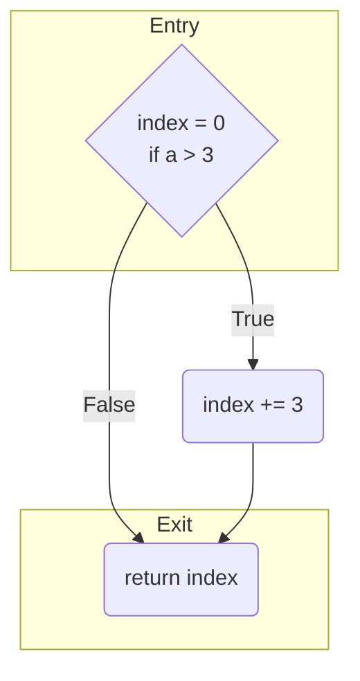

##### FASTCFGSwitchBlock and FASTCFGTryBlock

Those blocks represent conditional blocks with multiple exits (0 to n).

This will be used to define blocks for switch or try catch.

They keep an ordered dictionary for the next blocks association the pattern determining the next block condition and the block executed if the pattern matches.

In case the pattern is nil, it means that we have the default block (for example: a default case in a switch or a finally block in a try catch).

Example:

```python
def func(a):
	match a:
		case 1: b()
		case 2: c()
		case _: d()
```
CFG:

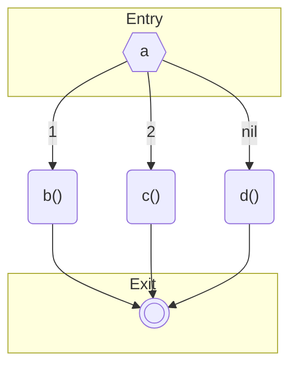

##### FASTNullBlock

I am a node that is created if a CFG have multiple exits. In that case I am created and I follow those nodes to have only one exit point.

If the CFG already has one exit, I am not present in the graph.

#### Context management 

`FASTCFGUtility` is keeping a context of the current visit of the FAST tree. This will be used for multiple things such as:
- Determining the blocks preceding a block we are currently creating
- Determining which loop is impacted by a break or continue in case of imbricated loops 
- Determining which nodes should loop when we finish to visit the main statement block of a loop 

The context is a stack of `FASTCFGContextEntry`. It will have a root entry for the CFG and we will stack one entry each time we enter a conditional. The entry will save the conditional block associated to it. Once we get out of this conditional, we pop the entry.

In a context entry, on top of the conditional we save the current blocks created in the active branch of the conditional been visited. If a branch is finished, this collection of blocks should be flushed.

This is needed because when we resolve the previous blocks of a block. If a block is the first of its branch, then its previous block in the top conditional in the stack. Else, it will be all "unfinished" blocks in the current list of blocks. An unfinished block is a block that does not have all its next blocks.

To illustrate this, let's check the CFG of this Python function:

```python
def func(i):
	if i > 4:
		if i > 10:
			print(1)
		else:
			print(2)
		pass
```

Let's imagine we already create a conditional block for `i > 4` and we are creating the conditional block for `i > 10`. 

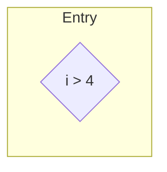

Currently our context stack has 2 entries. The root entry and an entry for the `i > 4` conditional block. This last entry does not have any current block. Since the current blocks are empty, we should add our block next to the top conditional.


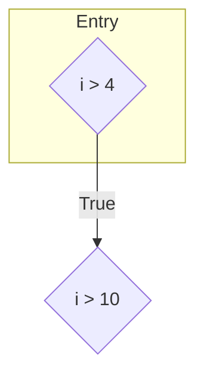

Now let's fast forward to the creation of the `pass` block. Here is our current graph:


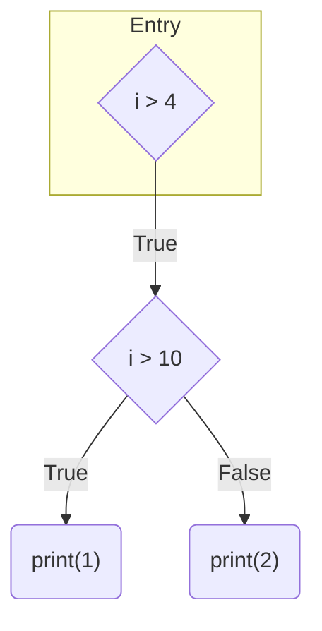

In the context we still have two entries. One for the root and one for the `i > 4` conditional. And we have the `i > 10` conditional block in the list of current blocks of the top entry.

When looking for the pervious blocks of the `pass` block, since it has previous blocks, we check all of them to find unfinished blocks and we find two blocks that do not have their required amount of next blocks: `print(1)` and `print(2)` that are both basic blocks without next block. Thus we add those two blocks as previous blocks of `pass`:


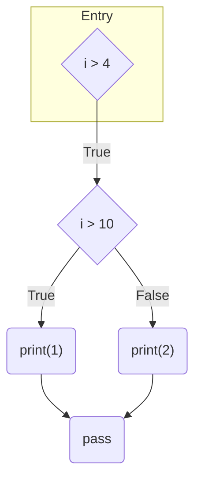

And now we are only missing the exit since we have 2 exits currently. We build this Null block the same way as other blocks. Once we build it, we only have a root context entry left with the `i > 4` conditional block in its current blocks. Since the list of current blocks is not empty, we are in the second case. When checking this previous block, we can find that two blocks are not finished: `i > 4` and `pass`:

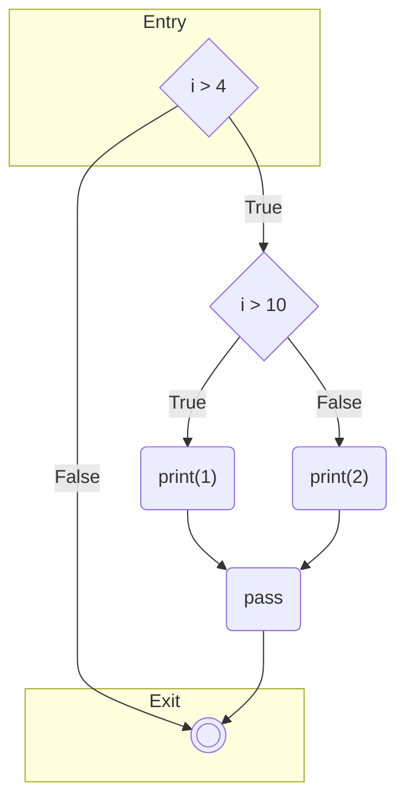

:::caution
This explanation on how to determine the previous blocks of a block is simplified. There is one case that was not explained: the break or continue statements. 
When we are in the second solution (the block to create is not the first block of its statement block), we select all unfinished blocks as previous blocks. But in case some of those blocks ends with a break or continue statement, we select them only if they are not stopping the loop in their scope. 
This will be more detailed once we will explain how to use `FASTCFGUtility` to build loops.
:::

Now that we explained a little the inner mecanism of the CFG, let's implement our Python CFG!

## Development of the CFG visitor

We will now develop the CFG visitor to be able to use it like this:

```smalltalk
FASTPythonCFGVisitor buildCFGOf: aModel allFunctionDefinitions first.

"or"

aModel allFunctionDefinitions first cfg
```

### Managing the entry points 

This section will be mostly specific to Python but canr give you ideas on how to implement your own visitor.

Some CFG are simpler to implement than others. Some languages can have only one structure used as base of a CFG. For example, a function. 

In Python, we can build a CFG from:
- A function
- A method
- A class
- A lambda
- A module 

This change the action to do when we visit those methods. For the provided FAST node, we need to visit the content of its statement block. But in all other cases, we need to just add them as a statement to the next block to create. 

In order to do that I decided to add a `#started` instance variable initialized to false and add this method:

```smalltalk
FASTPythonCFGVisitor>>visitPossibleEntryPoints: aFASTEntity
	"I am the definition of a function, method, class, module or lambda. I can be the entry point of a CFG but I can also be a statement encountered in another definition. 
	
	In the first case I visit the definition's statement block. Else I consider the definition as a statement only."

	started
		ifTrue: [ self visitFASTTStatement: aFASTEntity ]
		ifFalse: [
				started := true.
				self visitFASTTStatementBlock: aFASTEntity ]
```

Then I just need to call this method from the visit method of each entry points:X

```smalltalk
FASTPythonCFGVisitor>>visitFASTPyModule: aModule

	self visitPossibleEntryPoints: aModule
```

:::note
Maybe this could be made easier, but FAST does not have the necessary information to automate this and it was decided by FAST maintainer to not add those missing information for now in FAST. 
:::

### Handling basic blocks

A basic block is a block with only one next block. They can be created by `FASTCFGUtility` directly or manually depending on the case.

`FASTCFGUtility` will create a basic node automatically each time we finish to visit a `FASTTStatementBlock` even if it is stopped by a Break, Continue or Return statement. This happens for example at the end of a function, if branch, switch branch, loop...

In some other cases, we will need to build a basic block ourselves. For example, before managing a loop. Everything that happens before a loop should be in their own block because the condition of the loop can be executed alone at each step of the loop. 

```python
def func(i):
	print(i)
	while i > 3:
		i -= 1
```

Will produce this:

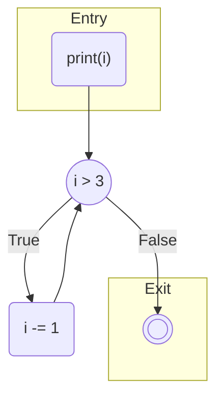

Since there is generic structure for loops in FAST, we need to manage their visit ourselves. This start with the production of a block in the loop is preceeded by statements. 

`FASTCFGUtility` propose two ways to create a basic block:
- `#buildBlockIfNeeded` : Produces a basic block if we have statements saved and add it in the graph
- `#endBlock` : This method does the same as the previous one, but also flushes the current blocks at the top of the context

Most of the time, you will need to `#buildBlockIfNeeded`, but in some cases we might need `#endBlock`. For example, for conditional expressions that do not contain statement blocks.

So now we can start our loop like this:

```smalltalk
FASTPythonCFGVisitor>>visitFASTPyWhileStatement: aWhileStatement

	self buildBlockIfNeeded.
	self visitFASTTConditionalStatement: aWhileStatement.

	"We will detail the remaining implementation in a future section"
```

#### Case of the return statement

When we encounter a return statement, we should stop the visit of the current statement block.

The CFG of:

```python
def i():
    return 3
    if y > 4:
	a()
```

Will be:

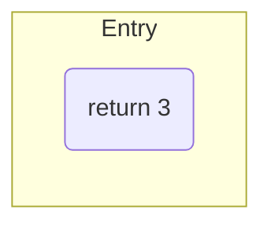

This is managed by `FASTCFGUtility` if your return statement is using `FASTTReturnStatement`. Its visit will raise an exception to skip the rest of the block. 

```FASTCFGPythonVisitor>>visitFASTTReturnStatement: aTReturnStatement

	super visitFASTTReturnStatement: aTReturnStatement.
	FASTCFGStatementBlockInterruption signal
```

:::caution
It can happen that the visitor will visit `FASTTReturnStatement` before `FASTTStatement`. If that happens, the return statement will be missing in the statements of the current block.

For example, in python the generator creats this visit method:

```smalltalk
FASTPyTVisitor>>visitFASTPyReturnStatement: aReturnStatement

	<generated>
	self visitFASTTReturnStatement: aReturnStatement.
	self visitFASTPyStatement: aReturnStatement
```

We need to override it to change the order and start by adding the statement:

```smalltalk
FASTCFGPythonVisitor>>visitFASTPyReturnStatement: aReturnStatement
	"We need to visit the statement before the TReturnStatement to add the return statement in the list of statements. Else the visit of #FASTPyStatement will be skipped by the exception raised FASTCFGStatementBlockInterruption"

	self visitFASTPyStatement: aReturnStatement.
	self visitFASTTReturnStatement: aReturnStatement.
```

I needed to do that for `FASTPyBreakStatement` and `FASTPyContinueStatemet` also.
:::

### Managing if and elif 

One of the most used conditional structures in programming languages are the conditions: if.

In order to manage those we have the method `#buildAndUseConditionalDuring:`. This method needs to be called one the condition of the if has been visited and takes as parameter a block executing the visit of the `then` and `else` statement blocks:

```smalltalk
FASTPythonCFGVisitor>>visitFASTPyIfStatement: anIfStatement

	self visitFASTTConditionalStatement: anIfStatement.

	self buildAndUseConditionalDuring: [
			self visitEntity: anIfStatement thenClause.
			self visitFASTPyTWithElseClause: anIfStatement ]
```

Here is what is happening:
- First it will create a conditional block with the current statements
- It will find the previous blocks of this new node
- It pushes a new context entry on the context stack linked to this conditional
- During the visit of the `then`, the blocks created will be saved in the current blocks of the context entry
- After the visit of the statement block of the `then`, the current blocks will be flushed
- If we have an else, the same operation apply once again
- At the end of the visit we pop this context entry

Now we are able to generate the CFG of pieces of code like this:

```python
def f(i):
    y()
    if i > 3:
        print(i)
    else:
        pass
    return True
```

CFG:

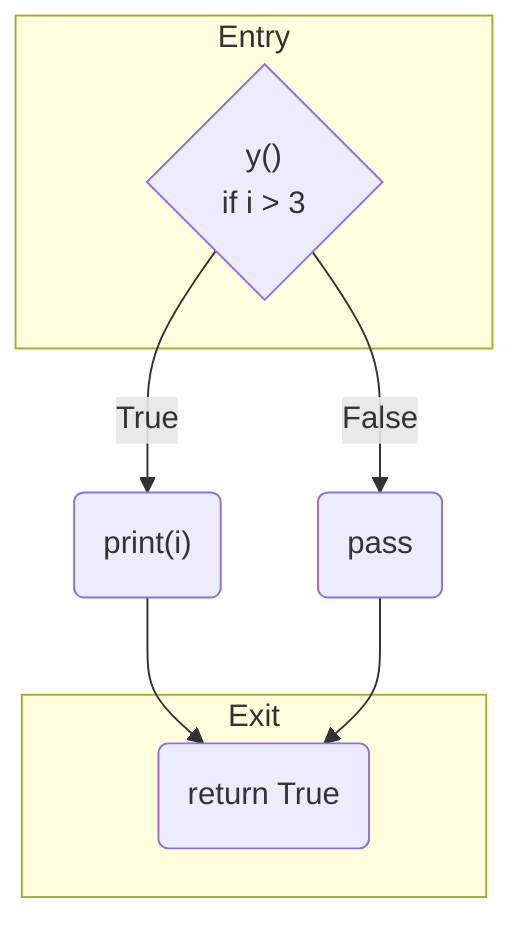

#### Elif management

Elif if a little more tricky to manage because the "false" branch is often not contained in the `elif` FAST node, but in the if statement directly either in the form of another elif, as an else or as nothing. 

The first step to manage them is to visit them in our if. The previous piece of code becomes:

```smalltalk
FASTCFGPythonVisitor>>visitFASTPyIfStatement: anIfStatement

	self visitFASTTConditionalStatement: anIfStatement.

	self buildAndUseConditionalDuring: [
			self visitEntity: anIfStatement thenClause.
			self visitCollection: anIfStatement elifClauses.
			self visitFASTPyTWithElseClause: anIfStatement ]
```

Now we need to define what is happening during the visit of the elif. We cannot use `#buildAndUseConditionalDuring:` as we do in the if because it would pop the elif conditional block from the context stack once it is done and the next elif or else will not be linked to the right conditional. 

Instead we can use a little trick allowed by `FASTCFGUtility`: We can create and push a new conditional block on the context without poping it at the end. Instead, it will be poped at the end of the closest `#buildAndUseConditionalDuring:` finalization. This method does not just pop the last context. It pops all context entries until it poped the context entry it created. Thus, the visit of the elif can be done like this:

```smalltalk
FASTCFGPythonVisitor>>visitFASTPyElifClause: anElifClause

	self visitFASTTConditionalStatement: anElifClause.
	
	"In the case of the elif, the else clause is in the parent and not here. So we create a conditional that will be automatically popped when we will finalize the containing if."
	self buildAndPushBlockOfType: FASTCFGConditionalBlock.
	self visitFASTTStatementBlock: anElifClause
```

For example here is what happens if we build the CFG of this function:

```python
def f(i):
    if i > 3:
        print(i)
    elif i < 8:
        pass
    else:
      a()
```

Here is what is happening:
1) We visit the conditional `i > 3` and add it to the current code to save
2) `#buildAndUseConditionalDuring:` will create a conditional block with `i > 3` (flushinf the current statement doing this) and pushes it on the context stack
3) We visit the `then` statement block. This will save `print(i)` in the list of current statements
4) At the end of the statement block, `#endBlock` is invoked. It create a new basic block and add it after the top conditional block `i > 3` becoming the "true" branch
5) We visit the `elif` and add save the condition
6) `#buildAndPushBlockOfType:` will create a new conditional block with the condition we just saved and will be pushed on the context stack
7) We visit the statement block of the elif. This will save `pass` in the current statements and create a basic block with it. It will associate it to the top conditional in the stack: the elif `1 < 8`.
8) We finish the visit of the elif but we do not pop the top context to be able to manage the false branch
9) We visit the else statement block. This will save the call to `a()` then create a new basic block with it. It will associate it to the top conditional which is still the elif `i < 8` becoming its "false" branch
10) At the end of `#buildAndUseConditionalDuring:`, we pop every context until we poped the `i > 3` conditional block. This will pop 2 context entries in our case: `i > 8` and `i < 3`
11) We generate the null block since we have 3 exits (`print(i)`, `pass` and `a()`)

This produces


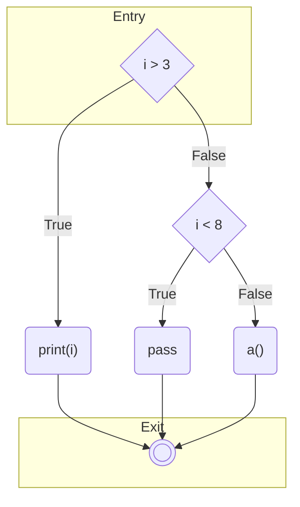

#### Conditional expression

Another case to manage are conditional expression. Those are if/then/else that can be done in one line but the then and else contains only one statement instead of a statement block.

For example in python:

```python
def f(i):
    x() if i % 2 == 0 else y()
```

It management is similar to the one of the if statement with one difference. Since we do not have statement blocks to visit, we need to declare ourselves that the `then` and `else` blocks are finished:

```smalltalk
FASTCFGPythonVisitor>>visitFASTPyConditionalExpression: aConditionalExpression

	self visitFASTTConditionalStatement: aConditionalExpression.

	self buildAndUseConditionalDuring: [
			self addStatement: aConditionalExpression thenExpression.
			self endBlock.
			self addStatement: aConditionalExpression elseExpression.
			self endBlock ]
```

This will produce this CFG:

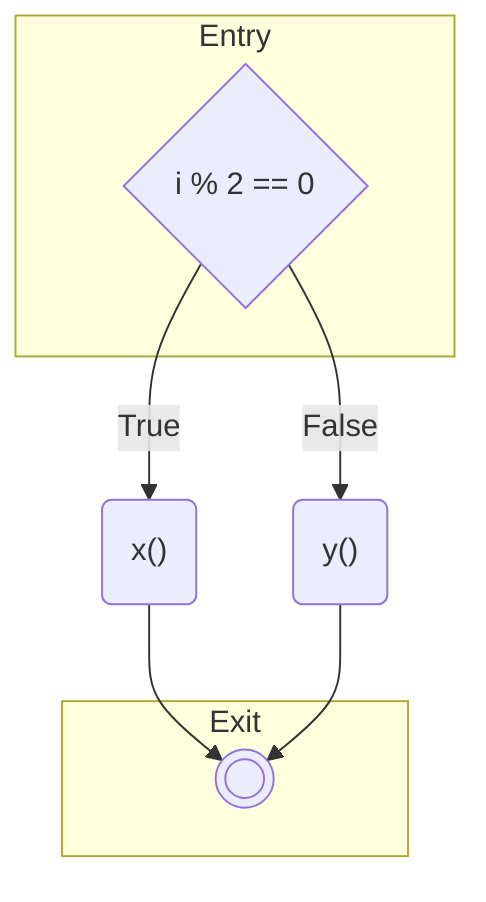

### Loops

Loops are similar to if in that it has 2 next blocks. One if the condition is true and one if the condition is false. But it is more tricky to use because some blocks will loop to the conditional block and it can contain break or continue statements that impact the CFG.

We will need to use loops for two kind of nodes in Python: while and for statements.

Because of the loop, we need to split the block preceding the loop and the condition in two different blocks since next blocks can loop on them. We can do that by using `#buildBlockIfNeeded`.

In order to manage the loop, we use `#buildAndUseLoopDuring:` instead of `#buildAndUseConditionalDuring:` like we did in the if. 

In case of Python, there is also an else block to manage.

Our visit method will look like this:

```smalltalk
FASTCFGPythonVisitor>>visitFASTPyWhileStatement: aWhileStatement

	self buildBlockIfNeeded.
	self visitFASTTConditionalStatement: aWhileStatement.

	self buildAndUseLoopDuring: [
			self visitFASTTStatementBlock: aWhileStatement.
			
			"We add the loops after finishing the first statement block, so the else can be managed in this block to be in the right context."
			self visitFASTPyTWithElseClause: aWhileStatement ]
```

Using `#buildAndUseLoopDuring:` will impact the management of edges. When we finish to visit the statement block defining the code to execute in the loop, `FASTCFGUtility` will look for loops to define. Each unfinished blocks that do not end in a break that is directly in the loop (in case of imbricated loops) will loop to the conditional block. 

We are now able to build the CFG of functions like this:

```python
def f(i):
	while i < 4:
		while i < 2:
			if i < 1:
				break
			else:
				a()
```

It will produce this CFG:

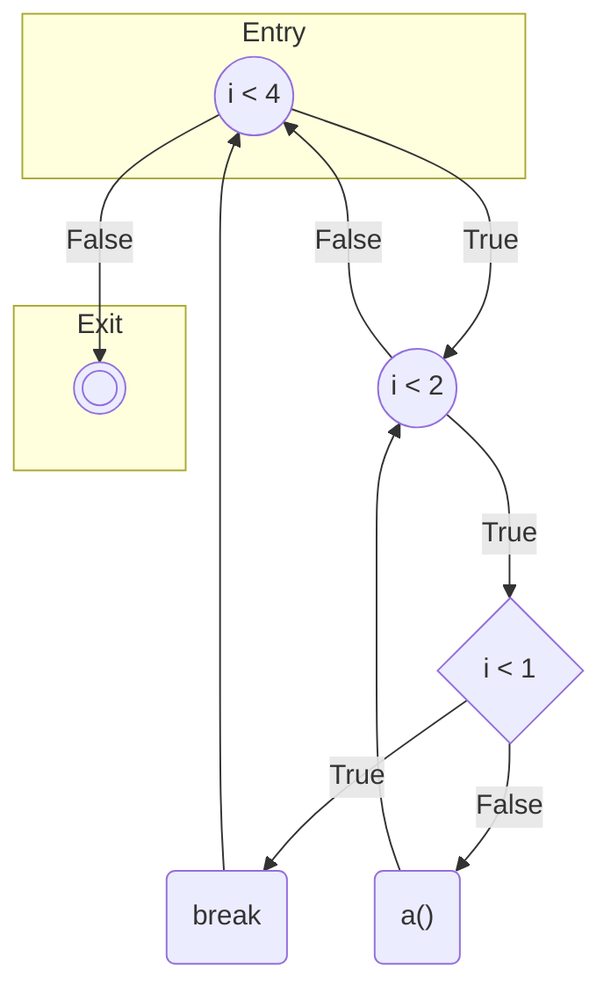

:::caution
Note that in this example, the break is breaking the inner while, but not the outer while since most programming languages are working like this.
:::

### Switches

In python the switch is the match statement. A Match statement has a subject (what should be compared) and statements blocks depending on the pattern provided in the cases. 

For this, we produce a `FASTCFGSwitch` node that associate a pattern to a next block. 

The `_` pattern defines a default case. This next block will be added with `nil` as pattern. 

We can manage a switch using `#buildAndUseSwitchDuring:`. This method will mark the conditional node as finished once the block is done executing.

```smalltalk
FASTCFGPythonVisitor>>visitFASTPyMatchStatement: aMatchStatement
	"We skip the visit of the statement. We add the subject as last thing to execute of the previous block then we declare a switch."

	self addStatement: aMatchStatement subject.

	self buildAndUseSwitchDuring: [ self visitCollection: aMatchStatement cases ]
```

Then we need to manage the cases:

```smalltalk
FASTCFGPythonVisitor>>visitFASTPyCaseClause: aCaseClause

	self assert: self currentConditional isSwitch.
	
	self currentConditional addPattern: aCaseClause pattern. "The next block created will be associated to this pattern"
	self visitFASTTStatementBlock: aCaseClause
```

With this we can now parse:

```python
def f(day):
	a()
	match day:
		case "Saturday" | "Sunday":
			print(f"{day} is a weekend.")
		case "Monday" | "Tuesday" | "Wednesday" | "Thursday" | "Friday":
			print(f"{day} is a weekday.")
		case _:
			print("That's not a valid day of the week.")
	b()
```

Will produce:

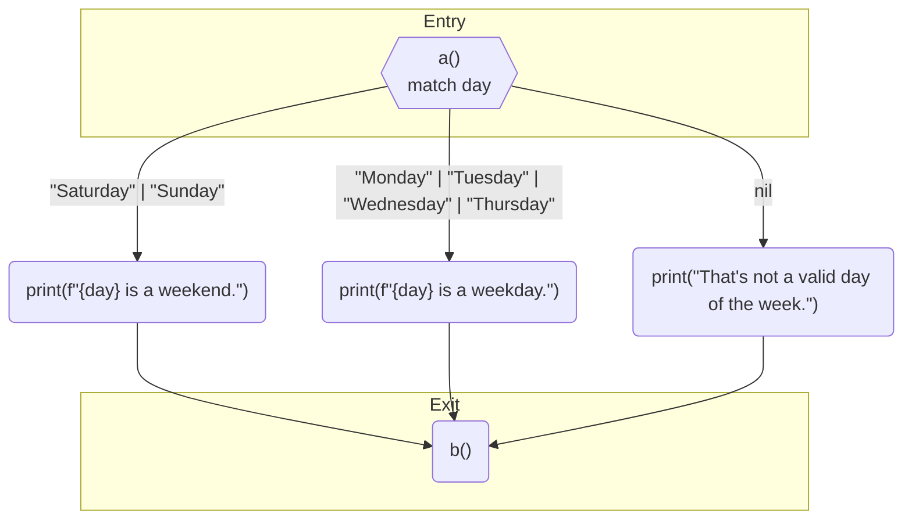

### Try catch

Try catch is similar to the switch in that it has 0 to N next blocks. 

This block will be asociated to a pattern like the Switch block. 

This block is considered full when it has a next block associated to nil (there is no pattern).

We can build it using `#buildAndUseTryDuring:`.

In Python we need to manage the try statement, the exclude clauses (exceptions to catch), an else clause to execute if no exception happened and a finally clause. 

```smalltalk
FASTCFGPythonVisitor>>visitFASTPyTryStatement: aTryStatement

	self buildBlockIfNeeded.
	self visitCollection: aTryStatement statements.

	self buildAndUseTryDuring: [
			self visitCollection: aTryStatement excepts.

			aTryStatement elseClause ifNotNil: [ :clause |
					context top conditional addPattern: nil.
					self visitEntity: clause ].

			self visitEntity: aTryStatement finally ]
```

```smalltalk
FASTCFGPythonVisitor>>visitFASTPyExceptClause: anExceptClause

	self assert: self currentConditional isTry.

	self currentConditional addPattern: anExceptClause expression.

	self visitFASTTStatementBlock: anExceptClause
```

And 

```smalltalk
FASTCFGPythonVisitor>>visitFASTPyFinallyClause: aFinallyClause
	"We do not want to create the block immediatly because this content will be added with the following instructions after the try since they should be executed together."

	aFinallyClause statements do: [ :statement | self addStatement: statement ]
```

With this, we are now able to finish our Python CFG algo and we are able to build a CFG for:

```python
def f(day):
	a()
	try:
		b()
		c()
		d()
	except Exception1:
		e()
	except Exception2:
		f()
	except Exception3:
		g()
	else: 
		h()
	finally: 
		i()
	j()
```

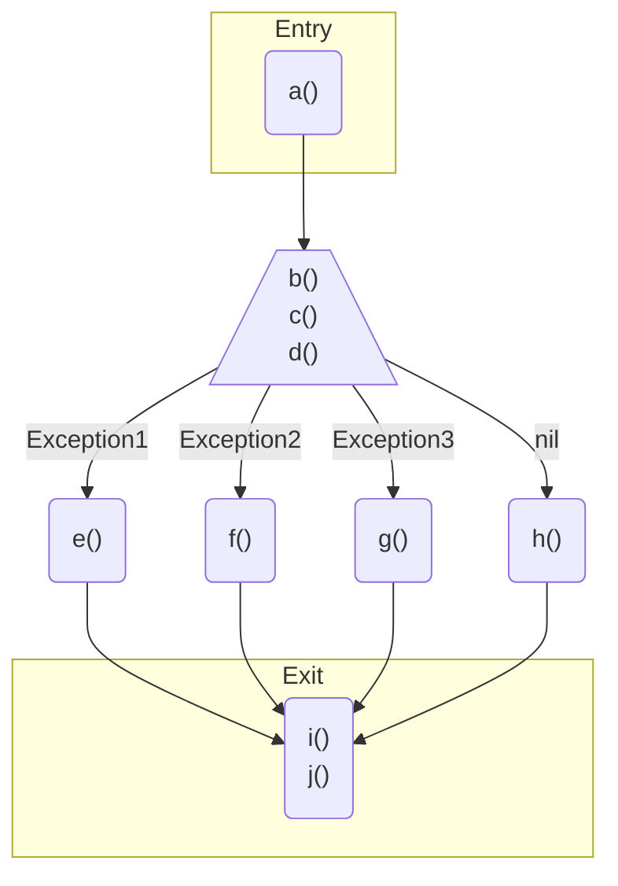

## Utilites

The CFG currently has two utilities. 

### Mermaid export

It is possible to export the graph as a [mermaid script](https://mermaid.js.org/). 

```smalltalk

aFunction cfg asMermaidScript

```

For example, the script for the try statement section earlier would export this:

```
flowchart TD
	subgraph Entry
		direction TB
		1
	end

	subgraph Exit
		direction TB
		7
	end

	1("a() ")
	2[/"b()<br/>		c()<br/>		d() "\]
	3("e() ")
	4("f() ")
	5("g() ")
	6("h() ")
	7("i()<br/>	j() ")
	1 --> 2
	2 -- PyIdentifier(50 - 59) --> 3
	2 -- PyIdentifier(76 - 85) --> 4
	2 -- PyIdentifier(102 - 111) --> 5
	2 -- Nil --> 6
	3 --> 7
	4 --> 7
	5 --> 7
	6 --> 7
```

### Roassal visualization

Another utility is a roassal visualization of the CFG. It is `FASTCFGVisualizationBuilder`. We can see it while inspecting a CFG. 

```smalltalk
aFunction cfg inspect
```

## Conclusion

It should now be easier to write a FAST CFG. In the future I would like to have a test generator to be able to produce regression tests. Maybe if I need to build another one in the future :)
