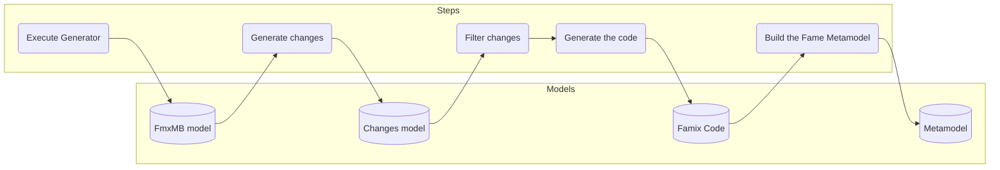

---
authors:
- CyrilFerlicot
title: "Metamodel generation process"
---

This page is here to explain the generation process of Metamodels in Moose. The goal is to document the process currently used in the generation, but it is not needed to know it for regular users of Moose, or for people developing a new metamodel.

## Introduction

When we create a new metamodel, it is recommended not to do it by hand, but to use a generator by subclassing `FamixMetamodelGenerator`, as we describe in [this page](../create-new-metamodel).

When we generate our metamodel, this process is taking place:

:::note
The process was different before Moose 13. This page will only explain the process in place since Moose 13.
:::

## Steps

The first step of the generation process is the execution of the generator written by developers. This step produces an intermediate model that we call the "FmxMB model".

This model represents all the entities and relations defined by the generator. Once we have it, we use it to produce a model of "changes".

Changes are a representation of all the operations required to generate the code of the metamodel. It includes operations such as:
- Adding a class or trait
- Adding a method
- Removing a method
- ...

The generation of this changes model happens in two visitors:
- `FmxMBChangesBuilderVisitor` : This visitor builds all changes for the current metamodel
- `FmxMBRemoteChangesBuilderVisitor` : This visitor builds all changes considered as "Remote". A remote relation is a relation in another metamodel. They are used in case of composed metamodels.

:::note
The generators will build changes for the code to add, but also for code to remove. Let's imagine that we generate a metamodel after the removal of a relation or of an entity, the visitor creates changes to remove the code related to the removed entities.
:::

Once we have the changes model, we filter it.

It can take some time to compile code in Pharo, and if we are "re"generating a model, most of the code is already present. To speedup the process, we compare each changes to the version in the system, and we drop all changes that would have no effect on the current code.

Once we have the minimal list of changes, we sort them. For example, we need to create traits and superclasses before the classes that use and inherit them, and we need to create classes before their methods.

Then, we apply the changes in the system. This generates the code of your metamodel.

The final step is to generate the Fame metamodel describing the metamodel and to set it in the MooseModel class of the metamodel.

## Future steps

In the future, we want to simplify this process to have fewer steps.