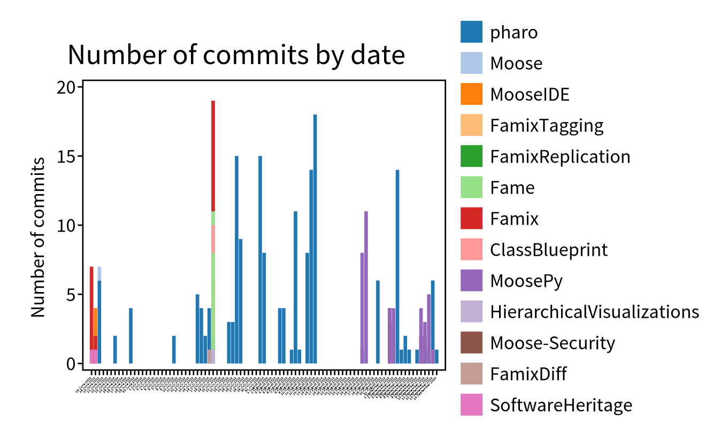

This page presents the starting point if you want to have high-level information about your repositories' _health_.

## What is GitProject Health

GitProject health is a suit of importers, models, and visualizations, that enable the analysis of your repositories.
For instance, you will be able to see the repositories with failing pipelines, the numbers of commits by projects, the authors of commits, _etc_.
It is also possible to link the repository commits with a Famix model to have even more information.

## Installation GitProjectHealth

To install GitProjectHealth, you'll need a Moose11+ image (see the [install Moose page](/Beginners/InstallMoose)).

In the Moose image, in a playground (`Ctrl+O`, `Ctrl+W`), perform:

```smalltalk
Metacello new
  repository: 'github://moosetechnology/GitProjectHealth:main/src';
  baseline: 'GitLabHealth';
  onConflict: [ :ex | ex useIncoming ];
  onUpgrade: [ :ex | ex useIncoming ];
  onDowngrade: [ :ex | ex useLoaded ];
  load
```

This command will load the GitProjectHealth project as well as all its Pharo dependencies.

> The project was originally made for GitLab repositories analysis, so some feature might be available only for GitLab. We try to update this documentation with all information as much as we can, do not hesitate to do a pull request if some feature are missing

## Import a model

Once the GitProjectHealth project has been loaded, one has to _import_ the project from the Git server to the Moose image.
As of today, we import a _group of repositories_.

### Import a group from GitLab 

In a playground (`Ctrl+O`, `Ctrl+W`).

```smalltalk
glhModel := GLHModel new.

glhApi := GitlabApi new
    privateToken: '<Your private token>';
    hostUrl: 'https://gitlab.myPrivateHost.com/api/v4';
    yourself.

glhImporter := GitlabModelImporter new
    repoApi: glhApi;
    glhModel: glhModel;
    withFiles: false.


"137 is the ID of the a Group, you can find the number in the webpage of every project and group"
glhImporter importGroup: 137.
```

You can also import all available top-level groups and then iterate:

```smalltalk
groups := glhImporter importAllGroups.
groups do: [:group | 
  glhImporter importGroup: group id.
]
```

### Import a group from GitHub

In a playground (`Ctrl+O`, `Ctrl+W`).

```smalltalk
glhModel := GLHModel new.

githubImporter := GHModelImporter new
  glhModel: glhModel;
  privateToken: '<my private token>';
  yourself.

githubImporter importGroup: 'moosetechnology'.
```

### Extract repository commits


You might want to gather commits for repositories.
Instead of loading all commits and for performance reason, we propose to load commits since a define date. To do so, you can use the API

```smalltalk
myImporter withCommitsSince: (Date today - 100 days).
```

Remember to set this option before the import of project.

### Import Merge Requests information


It is possible to extract MergeRequests of a project.
To avoid too many REST API requests, you should do it in multiple steps.

First, import basic information.

```smalltalk
(glhModel allWithType: GLHProject) do: [:project | 
  glhImporter importMergeRequests: project
]
```

> This will only import the first 20 merge requests for each project. However, one can also use the method `importMergeRequests:since:until:` to import all merge request since a specific date

Then, you can import more data for each MergeRequest

```smalltalk
(glphModel allWithType: GLPHEMergeRequest) do: [ :mr |
  "Extract information about Merge Request approvals and review"
  glhImporter importMergeResquestApprovals: mr.
  "Extract information about Author, Mergers, etc."
  glhImporter importMergeResquestAuthor: mr.
].
```

### Example: Counting Pull Requests status of a Github Organization

Here we are counting the Pull request status (_closed_ or _open_) of the organization _Eclipse_. We need first to declare a new `GLHModel` model, and to set up an GitHub importer `GHModelImporter new`. We then import all the projets of the organization `eclipse` and their latest merge requests (or pull requests in Github case). 
This example runs in around **5 minutes**. 

It requires to generate a github access token, see the [setting github page](https://github.com/settings/tokens).

```smalltalk
"init a new git model"
model := GLHModel new name: 'myGitModel'.

"creates an importer for Github projects, requires your specific token"
githubImport := GHModelImporter new
	glhModel: model;
	privateToken: '<YOUR-GITHUB-TOKEN>';
	withCommitsSince: (Date today - 10 days);
 yourself.

"importing a group of projects (may take a few minutes)"
eclipse := githubImport importGroup: 'eclipse'.

"for each project"
eclipse allProjectstoScope do: [ :project | 
  "import the merge request (may take a few minutes)"
  githubImport importMergeRequests: project.
].

"collect the merge request found in the group"
pullRequests := (eclipse toScope: GLHMergeRequest)  .

" count the PR by their states"
(pullRequests asOrderedCollection collect: [ :pr |  pr state ]) asBag
```


## Visualize

To help with your first analysis of repositories and organization, we included some basic visualization.

### Organization visualization

When using the Pharo inspector to inspect a group, you'll get a new tab called `Group quality`.
It shows you the repositories and if they are pipelines working for them.

You can also have a look at this visualization using the following script. 

```smalltalk
dritGroup := (glhModel allWithType: GLHGroup) detect: [ :group | group id = 137 ].
canvas := (GLHGroupVisualization new forGroup: { dritGroup } ).
canvas open.
```

#### Export

To export the visualization as an svg image

```smalltalk
dritGroup := (glhModel allWithType: GLHGroup) detect: [ :group | group id = 137 ].
canvas := (GLHGroupVisualization new forGroup: {dritGroup}).
canvas open.

canvas svgExporter
  withoutFixedShapes;
  fileName: 'drit-group-health';
  export.
```

### Commits distribution

We integrated a visualization that shows the commits distribution on a project by date.
Commits are also grouped by User who committed.

The same visualization is available in a user centric way, grouped by contributed project.



## Meta-model

The meta-model of GitProjectHealth is automatically update by the FamixUMLDocumentor.


It includes several entities.
The main one is probably *Commit* with all its attributes as well as *User*.

## Connect with others meta-model

It is possible to connect with others meta-model.
In here, we describe briefly how to do it.

### Jira Connector


The Jira connector connect this project to the [Pharo Jira API project](https://github.com/Evref-BL/Jira-Pharo-API).
It basically looks for commit and merge request links to Jira Issue.

To install the connector, please perform:

```smalltalk
Metacello new
  repository: 'github://moosetechnology/GitProjectHealth:main/src';
  baseline: 'GitLabHealth';
  onConflict: [ :ex | ex useIncoming ];
  onUpgrade: [ :ex | ex useIncoming ];
  onDowngrade: [ :ex | ex useLoaded ];
  load: #( 'default' 'Jira' )
```

> loading default is optional if you already loaded it.

Then, it is possible to connect two models using

```smalltalk
GPJCConnector new
  gpModel: aGpModel; "or glh model"
  jiraModel: aJiraModel;
  connect
```


### Jira connector in action: retrieving the ticket type associated with merge requests

In this complete example, we retrieve the merge request (MR) inside a group of GitLab projects and connect them to their associated Jira Ticket.
To connect a issue with an MR, we look for MR that mention the issue key id in their title. For instance.
`[WERH-918] feat: Add specific month to salary` match the issue `(WERH-918) month integration`.

```smalltalk
"set up the git model"
model := GLHModel new name: 'myModel'.

"set up the API, here for gitlab"
glphApi := GLPHApi new
  privateToken: '<YOUR-TOKEN>';
  baseAPIUrl:'<YOUR-GITLAB-URL>';
  yourself.

"set up the gitlab importer"
glhImporter := GLPHModelImporter new
  repoApi: glphApi;
  glhModel: model;
  makeGlobal: 'myImporter';
  withFiles: false;
  withCommitDiffs: false;
  yourself.

"setup the JiraAPI"
jpAPI := JiraPharoAPI new endpoint: '<myCompany>.atlassian.net';
  basePath: 'rest/api/latest';
  beHttps; 
  user: '<USER-EMAIL-ACCOUNT>';
  apiToken: '<YOUR-JIRA-API-TOKEN>';
  yourself.

"setup the Jira Importer"
jpImporter := JiraPharoImporter new
  model: model;
  api: jpAPI;
  yourself.

"importing a group of projects"
grp := glhImporter importGroup: 1234.
"for each project"
grp allProjectstoScope do: [ :project | 
  "import the merge request"
  glhImporter importMergeRequests: project 
    since: (Date today - 30 day) asDateAndTime 
    until: (Date today).
    "import the latest commits"
  (glhImporter importAndLoadLatestsCommitsOfProject: project ).
].

"collect all issues related to these projects"
issues := (((grp toScope: GLHCommit) 
    collect: [ :commit | commit commitCreator]) 
    reject: [:user | user id isNil]) asSet 
    flatCollect: [ :user |
      |email mergeRequests |
      "import the jira issue from each user account"
      email := user username , '@my-email-domain.com'.
      jpImporter importAllCurrentAndPastIssuesOf: email.
].

"achieve the connection between the Git and the Jira model"
"the connection is made for all MR that includes in their title the key of an issue. same for commit"
GPJCConnector new
  gpModel: glhImporter glhModel;
  jiraModel: jpImporter model;
  connect.

"collect the merge request found previously"
mergeRequests := (grp toScope: GLPHEMergeRequest). "70 founds"
"select the MR with a matching jira issue"
mrWithTicket := ( mergeRequests asOrderedCollection  select: [ :mr | 
  mr jiraIssue isNotNil.
]). "66 of them associated with a Jira ticket"

"get the issue type and output their occurring rate"
(mrWithTicket collect: [ :mr |  mr jiraIssue type name  ]) asBag
```

### Famix Connector

> You will probably have to learn what Famix is.
> Lucky, you are in the website of the Famix documentation 😄.

To connect with a Famix, first import a FamixModel using VerveineJ or any other tools.
Then, load the Famix connector of GitProjectHealth with the following script:

```smalltalk
Metacello new
  repository: 'github://moosetechnology/GitProjectHealth:main/src';
  baseline: 'GitLabHealth';
  onConflict: [ :ex | ex useIncoming ];
  onUpgrade: [ :ex | ex useIncoming ];
  onDowngrade: [ :ex | ex useLoaded ];
  load: #( 'default' 'Famix' )
```

Then, it is possible to connect two models using

```smalltalk
GPCGitToFamixConnector new
  famixModel: myFamixModel;
  glhProject: myGitProject;
  connect
```

By connecting a GitProject model with Famix, you will get access to the `appliedDiffs` method on `FamixTClass`.
You will also be able to navigate from a Git diff to the current entity in the model (if it exists).

## Demo

We made a demo video hosted on youtube.

<iframe width="560" height="315" src="https://www.youtube.com/embed/BIoF_mj6dDk?si=AwHflEKdpekI9c_B" title="YouTube video player" frameborder="0" allow="accelerometer; autoplay; clipboard-write; encrypted-media; gyroscope; picture-in-picture; web-share" referrerpolicy="strict-origin-when-cross-origin" allowfullscreen></iframe>

