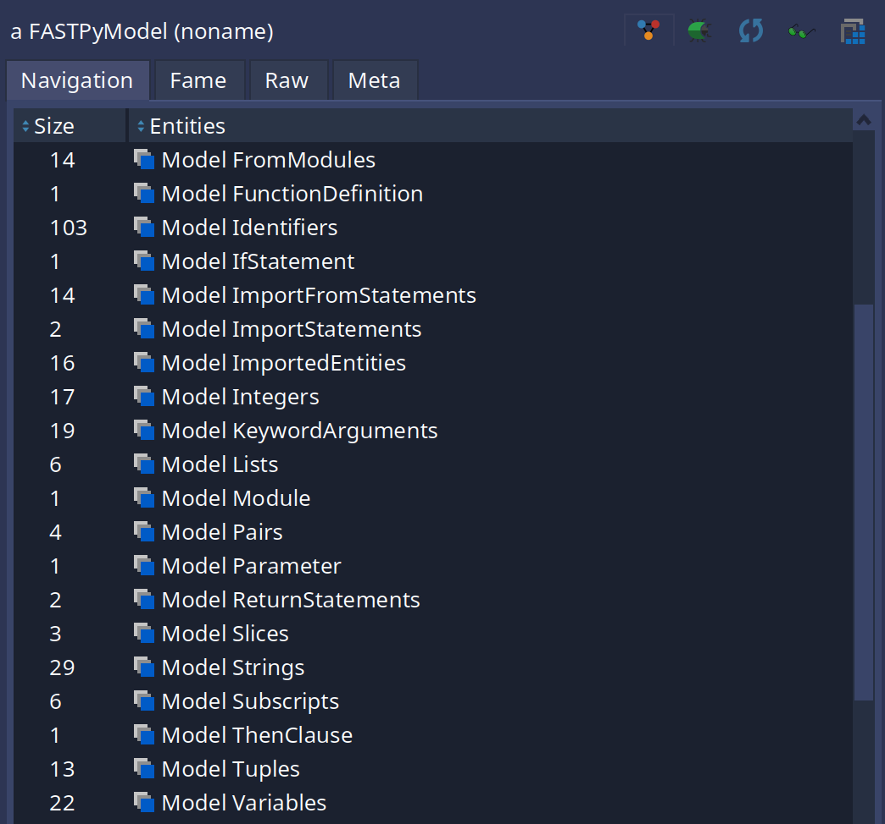
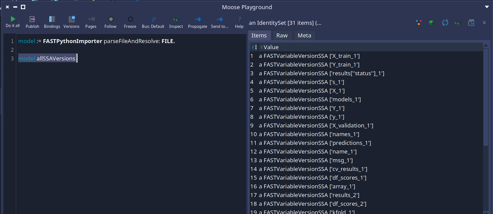

FAST-Python is a [FAST](fast) meta-model used to represent AST of a Python modules.
It comes with a meta-model, an importer, a visitor and tools to manipulate and explore models.

## Importer

### Installation

FAST-Python comes with an importer based on TreeSitter's python parser.
To install it, execute the following script:

```smalltalk
Metacello new
	githubUser: 'moosetechnology' project: 'FAST-Python' commitish: 'main' path: 'src';
	baseline: 'FASTPython';
	load
```

You can add it to xour baseline like this:

```smalltalk
spec
	baseline: 'FASTPython'
	with: [ spec repository: 'github://moosetechnology/FAST-Python:main/src' ]
```

You can replace "main" by the tag you are interested in.

### Quick start

In order to parse a chain of character or a file you can do this:

```st
    FASTPythonImporter parse: 'if x > 0:
    if x < 10:
        1
    else:
        2
else:
    3'
```

Or

```st
    FASTPythonImporter parseFile: myFile
```

## Tools

FAST-Python ships with a set of tools to explore and analyse a model once it is imported. The importer builds a `FASTPyModel` made of `FASTPy*` entities representing the whole AST:



The analysis tools described below can be combined. A typical analysis runs some (or all) of them:
`FAST utilities` → `Local resolution` → `CFG` → `SSA`. Each tool explains what it does, how to use it and what you can do with the result.

### FAST Python visitor

FAST-Python comes with a visitor to walk a model, either used in the form of a trait with `FASTPyTVisitor` or a class to subclass with `FASTPythonVisitor`.

In some usages of the visitor some visit methods need to be overridden to change the visit order. For example, a visitor might need to ensure that function parameters are visited before the statements of the function.

### FAST utilities

Some properties and helpers are available on the freshly imported model, without needing any additional tooling. Examples:

- `FASTPyMethodDefinition>>isStatic` to know if a method is static
- `FASTPyMethodDefinition>>isAbstract` to know if a method is abstract
- `FASTPyMethodDefinition>>selfName` to know the name of the `self` parameter (nil for static methods)
- `FASTPyEntity>>#internalAccess` to know if a node is accessed internally, e.g. via an attribute access (`x.y`) or a subscript (`x[3]`)

### Local resolution

The local resolver (`FASTPythonLocalResolverVisitor`) links each usage of a node to its declaration. This works for all named entities: variables, functions, methods, imports.

It can be run like this:

```smalltalk
FASTPythonLocalResolverVisitor resolve: aModule "could be any behavioral entity of a FASTPython model."
```


Once the resolution is done, you can ask:

- `FASTPyEntity>>#localDeclaration` to get the declaration (the first definition) of an entity, or a `FASTNonLocalDeclaration` if it is not declared in the file
- the declaration's `#localUses` to get all the usages of the entity in the model
- `FASTPyEntity>>#isResolvedVariable` to know if a node resolves to a local variable declaration
- `FASTPyEntity>>#allAccesses`, `#allReadAccesses`, `#allWriteAccesses` to navigate the accesses to a variable
- on the model, `FASTPyModel>>#allResolvedVariables` to get every entity resolving to a variable declaration, or `#allResolvedVariablesByName` to group them by name

### Control Flow Graph (CFG)

The CFG (`FASTPythonCFGVisitor`) builds a control flow graph of a behavioral entity. It is a transparent prerequisite to SSA.

It can be used like this:

```smalltalk
FASTPythonCFGVisitor buildCFGOf: aModel allFunctionDefinitions first.

"or"

aModel allFunctionDefinitions first cfg
```


It can take one of five different entities to build a CFG:
- a `FASTPyModule`
- a `FASTPyFunctionDefinition`
- a `FASTPyMethodDefinition`
- a `FASTPyLambda`
- a `FASTPyClassDefinition`

It is also possible to build a "full" CFG via `FASTPythonCFGVisitor class>>#fullCfg`, returning a dictionary with the CFG of the entity and the CFGs of all definitions found inside it.

For more information on building and visiting a CFG for FAST, see the dedicated [page on the CFG](/developers/fast-cfg).

### Static Single Assignment (SSA)

The SSA (`FASTPythonSSAVisitor`) scopes a variable to the assignments that can impact it (instead of all its assignments), which is used a lot for data-flow analysis. It renames each assignment with a fresh version, and introduces a *phi* version where a value can come from multiple assignments. It requires the local resolution to be done first.

It can be run like this:

```smalltalk
FASTPythonSSAVisitor resolve: model module
```



Another possibility is to import and resolve in one step with `FASTPythonImporter parseAndResolve:` or `parseFileAndResolve:`.

Once the SSA is done, you can ask:

- `FASTPyEntity>>#ssaVersion` to get the current SSA version of a variable (a `FASTVariableVersionSSA` or a `FASTVariablePhiVersionSSA` for a value that can come from multiple assignments)
- `FASTPyEntity>>#allSSAVersions` (and `#allSSABasicVersions`) to get all the versions a variable can get
- `FASTPyEntity>>#versionReadAccesses` / `#versionWriteAccesses` to get the read/write accesses of the current version of a variable
- `FASTPyEntity>>#transitiveAssignedExpressions` to follow the expressions assigned to a variable and to the variables it uses, recursively

## Further reading

This page gives a compact overview. For the full documentation of the tools and the complete list of the available analysis APIs, see the [analysis documentation](https://github.com/moosetechnology/FAST-Python/blob/main/resources/doc/analysis.md).
