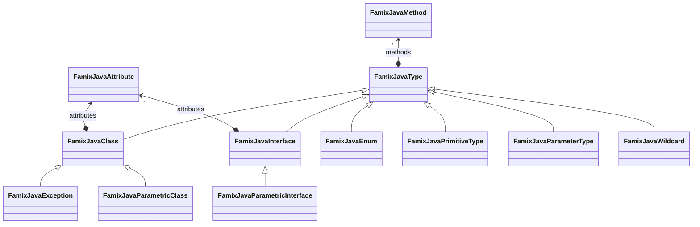

Famix Java is the metamodel included in Moose used to represent any Java application.
As you can imagine, the metamodel is rather than complicated.
For instance, Famix Java uses a lot the [traits concept](/developers/predefinedEntities).

We will present here some incorrect, but simple and useful views to enable beginners to use Famix Java.

## Class neighborhood

Most of the time, you only need to understand these core entities to start analyzing your application.
You can retrieve the main concepts: Packages, Classes, Methods and Attributes.
You'll notice that relation between Methods and Attribute is made from the Access reification, as well as Method invocation through the Invocation concept.

The complete meta-model is not represented here.
For instance, it also includes LocalVariable, Parameters, ParametricClasses and a lot more.

> In Moose, all relation are bi-directional.
> We added the arrow on relation based on common usage, but you can always go the other way around.

## Type neighborhood

Types are the central pieces of Object-Oriented programming languages.
In the FamixJava meta-model, all types are subclass of the FamixJavaType concept.
In addition to the FamixJavaClass previously described, we represent Interface, Enum, PrimitiveType, ParameterType, and Wildcard.

ParameterType and Wildcard are mostly used when looking for parametric type.

Primitive type are made to represent `int`, `double`, `long`, *etc.* in Java, as well as `void` if necessary.

### Focus on Parametric Type

Parametric types are probably the most hard to understand.
We made a [full blog post about this subject](/blog/2023-07-13-parametric).

