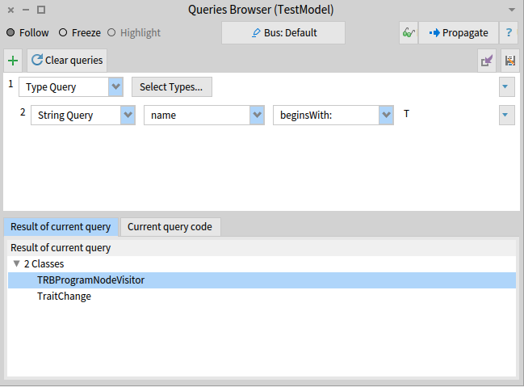

This page aims to present different queries one might want to perform when analyzing a model.
It can be used as a baseline for further analysis.

We present how to perform the queries in a playground or with the visual tool proposed by Moose.

## Queries

### Find entity

#### Class with a specific name

Using the [*Queries Browser*]({{ site.baseurl }}/moose-wiki/Users/moose-ide/browsers#queries-browser): first, we request all the classes of a model.


Then, we create a subquery that selects the class using their name.



Finally, you can select the entity in the bottom panel.

It is also possible to perform the query in an inspector or playground.
The shortest way to find a class with a name is to use the `detect` method.

```smalltalk
classes := model allWithType: FamixStClass.
withPrefix := classes detect: [ :class | class name = #'MyClassName' ].
```

#### Classes with their name beginning with or ending with

When performing queries, it is often useful to start with a substep of classes by looking at their names.
This can be done easily using the `beginWith:` and the `endWith` methods.

```smalltalk
classes := model allWithType: FamixStClass.
withPrefix := classes select: [ :class | class name beginsWith: #'MyPrefix' ].

withSuffix := classes select: [ :class | class name endsWith: #'MySuffix' ]
```

### God classes

[God classes](https://en.wikipedia.org/wiki/God_object) are classes that *knows too much* or *does too much*.
One way to find god classes is to count the number of lines or the number of methods of a class.

Using the [*Queries Browser*]({{ site.baseurl }}/moose-wiki/Users/moose-ide/browsers#queries-browser), one can use the Numeric Query on the classes of a model.


Using a playground, one can perform a query on a model to retrieve the god classes by numbers of lines:

```smalltalk
model allModelClasses select: [ :each | each numberOfLinesOfCode > 150 ]
```

Or by numbers of methods:

```smalltalk
model allModelClasses select: [ :each | each numberOfMethods > 50 ]
```

### God cyclomatic complexity

The [cyclomatic complexity](https://en.wikipedia.org/wiki/Cyclomatic_complexity) presents the complexity of a program.
It basically corresponds to the number of possible branches in a method.
The less cyclomatic complexity for a method, the better it is.

The following script sorts the methods extracted in a model by their cyclomatic complexity.

```smalltalk
((self model allBehaviourals)
    collect: [ :entity | entity -> entity cyclomaticComplexity ]
    thenSelect: [ :assoc | assoc value > 3 ]) asOrderedCollection sort: #value descending
```

### Deprecated methods

Deprecated methods are methods existing in the current version of an application, and that will disappear in the next version.
Such a method should not be used.

In Java, it is possible to retrieve the deprecated methods by searching the method with the `@Deprecated` annotation.

```smalltalk
model allModelMethods
    select: [ :t | 
        t annotationInstances notEmpty
            and: [ t annotationTypes anySatisfy: [ :a | a name = 'Deprecated' ] ] ]
```

### Dead methods

Dead methods are methods that are not invoked by any other methods.

> Be careful; some methods might not be directly called but are referenced thanks to abstraction or are dedicated to be extended by another application.
> It is often the case when dealing with a framework.

```smalltalk
model allModelMethods
    collect: [ :method | method -> method incomingInvocations ]
    thenSelect: [ :assoc | assoc value isEmpty ]) asOrderedCollection
```

### Application tests

```smalltalk
^ (model allModelMethods
    select: [ :t | 
        t annotationInstances notEmpty
            and: [ t annotationTypes anySatisfy: [ :annotation | annotation name endsWith: 'Test' ] ] ])
    asOrderedCollection flattened
```

## Visualizations

### Class hierarchy

The class hierarchy presents the classes of a model with their hierarchy links (*e.g.* superclass, subclasses, ...).
It also includes the methods and attributes of each class.

{: .no-lightense }

The easiest way to visualize a class hierarchy is to use the [*UML browser*]({{ site.baseurl }}/moose-wiki/Users/moose-ide/browsers#uml-browser).

It is also possible to script one UML visualisation of Roassal.


```smalltalk
builder := RSUMLClassBuilder new.
classes := mooseModel allModelClasses.
builder modelDescriptor
        instVars: [ :aFamixClass | aFamixClass attributes ];
        instVarSelector: [:aFamixAttribute | aFamixAttribute name];
        methods: [ :aFamixClass | aFamixClass methods];
        methodSelector: [:aFamixMethod | aFamixMethod name].

builder classes: classes.
builder build.
builder canvas @ RSHierarchyPacker.
builder canvas
```

### Packages cycles

{: .no-lightense }

```smalltalk
tarjan := MalTarjan new.
tarjan nodes: model allModelNamespaces.
tarjan edges: model allModelNamespaces from: #yourself toAll: [ :a | a allProvidersAtScope: FamixTNamespace ].
tarjan run.
tarjan inspect
```

## Developers

### Meta-model UML

It is possible to visualize the meta-model with a class hierarchy.

{: .no-lightense }

```smalltalk
builder := RSUMLClassBuilder new.

classes := FamixJavaModel metamodel classes.

builder modelDescriptor
        instVars: [ :metaDescription | metaDescription primitiveProperties ];
        instVarSelector: [:metaDescription | metaDescription implementingSelector];
        methods: [ :metaDescription | metaDescription complexProperties];
        methodSelector: [:metaDescription | metaDescription implementingSelector].

builder classes: classes.

builder build.
builder canvas @ RSHierarchyPacker.
builder canvas
```

A better solution to explore a meta-model is to use the [*Meta Browser*]({{ site.baseurl }}/moose-wiki/Users/moose-ide/browsers#meta-browser) that provides a detailed view on every important aspects of a meta-model.
